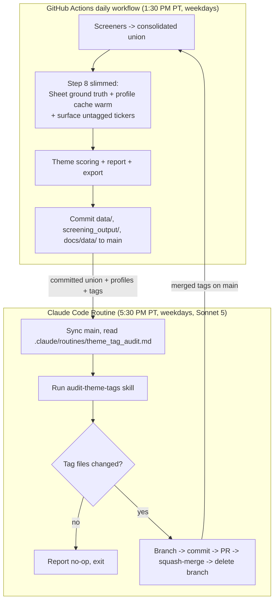
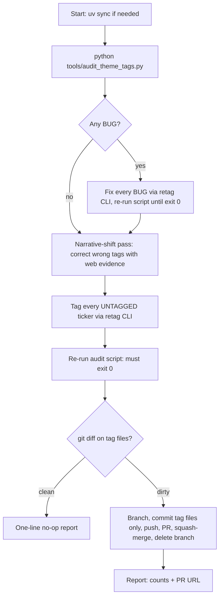

# Replace Gemini Theme Tagging with a Claude Code Routine - Plan

## Goal Capsule

- **Objective:** Remove every Gemini API call from the theme-tagging pipeline and hand all LLM tagging judgment to a weekday Claude Code Routine (Sonnet 5) that runs the `audit-theme-tags` skill, then PRs, merges, and cleans up its own tag changes.
- **Authority hierarchy:** User request > repo governance rules in CLAUDE.md (`git_locked_themes`, retag CLI as sole sanctioned mutation path, no `docs/data/*.json` in code PRs) > this plan.
- **Execution profile:** Code changes land on the current worktree branch and ship as one PR. Routine registration (U7) is an account-level action that happens after the implementation PR merges to main.
- **Stop conditions:**
  - Do not merge the implementation PR to main without the user's go-ahead; opening the PR is in scope, merging it is the user's call.
  - If `/schedule` routine creation fails or lacks a Sonnet 5 model option, deliver exact manual setup instructions instead of blocking or substituting silently.
  - Never commit regenerated `docs/data/*.json`; never force-push.
- **Tail ownership:** After code units are verified, open the PR, then surface U7 (routine registration + supervised first run) as the post-merge step with everything the user needs to trigger it.

---

## Product Contract

### Summary

Replace the daily Gemini theme classification with a two-lane architecture: the GitHub Actions daily workflow keeps only the non-LLM tagging inputs (Google Sheet ground truth, company-profile cache warming, untagged-ticker surfacing), while a weekday Claude Code Routine on Sonnet 5 runs an extended `audit-theme-tags` skill that fixes tag bugs, corrects wrong tags, and classifies untagged tickers — then opens a PR against main, merges it, and deletes its branch.

### Problem Frame

Theme tagging currently depends on the Gemini API inside the daily pipeline. The call sites, pinned during research:

- `src/themes/tag_new_tickers.py` — `_call_gemini_json` (the sole Gemini client call, ~line 125) with two callers:
  - `classify_tickers_with_gemini` ← `sync_screened_ticker_themes` ← `run_daily_workflow.py` step 8 ("Classify new/unclassified screened tickers"). This is the **live** daily path: screened tickers with no tags (or only `Uncategorized`/`Singleton`) that the Google Sheet doesn't cover get batch-classified by `gemini-3-flash-preview`.
  - `validate_tickers_with_gemini` ← `validate_dashboard_ticker_themes` ← `run_daily_workflow.py` step 10 ("Validate dashboard-visible ticker themes"). This path is **dormant**: under `git_locked_themes: true` (current config) it returns before any Gemini call.
- `src/themes/retag.py` — `_classify_with_gemini`, used only when `--paths` is omitted.
- Supporting surface: `llm:` block in `config/workflow_config.yaml`, `GOOGLE_API_KEY` in `config/settings.py` / `.env.example` / `.github/workflows/daily-screening.yml`, and the `google-genai` dependency in `pyproject.toml`.

The `audit-theme-tags` skill (`.claude/skills/audit-theme-tags/SKILL.md`) already covers two of the three capabilities the user wants: it detects mechanical tag bugs (Phase 1–2, via `tools/audit_theme_tags.py` + retag CLI) and corrects wrong tags with evidence-based AI judgment (Phase 3, web-verified narrative shifts). It does **not** tag untagged tickers — that has always been Gemini step 8's job — and neither the skill nor the mechanical script even detects screened-but-untagged tickers today (`tools/audit_theme_tags.py` only audits entries that already exist in `data/ticker_themes.json`). The skill also has no merge/cleanup step (Phase 5 stops at PR creation).

A stale predecessor exists: `.claude/routines/theme_audit_prompt.md` plus `src/themes/prepare_theme_audit.py` / `apply_theme_audit.py` (the "periodic Claude Opus audit" from the pre-taxonomy era, last ran 2026-04-29). It targets the retired flat theme list and defers to "the daily Gemini pipeline", so it is superseded by this change.

### Requirements

**Pipeline replacement**

- R1. The daily GitHub Actions workflow no longer calls the Gemini API: remove the LLM classification from step 8 and remove the dormant step-10 dashboard validation entirely.
- R2. Non-LLM tagging inputs keep running daily in CI: Google Sheet ground-truth application (alias remap → taxonomy validation → git-lock defence) and company-profile cache warming for untagged screened tickers, so the routine finds fresh profiles committed in `data/ticker_company_metadata.json`.
- R3. All Gemini machinery is deleted: classification/validation functions and prompts, `GeminiJSONError` retry/split logic, the `llm:` config block, `GOOGLE_API_KEY` from settings/env/CI, and the `google-genai` dependency. The retag CLI requires explicit `--paths` (its Gemini fallback goes away).

**Skill and audit capability**

- R4. `audit-theme-tags` gains a tagging phase for untagged screened tickers, carrying over the classification discipline currently encoded in the Gemini prompt (L1 = trading narrative, sector consistency, core-business-only, max 3 paths, most-specific path, mandatory L2 for L1s with children, `Singleton` escape hatch). All writes go through the retag CLI.
- R5. `tools/audit_theme_tags.py` mechanically detects screened-but-untagged tickers by diffing the latest committed `screening_output/consolidated/_union_*.txt` against `data/ticker_themes.json`, reporting them as a distinct finding class without changing the BUG-driven exit code.

**Routine**

- R6. A weekday Claude Code Routine (cloud), model Sonnet 5, runs the `audit-theme-tags` skill against the repo on a schedule that lands after the daily screening commit.
- R7. After the audit, the routine diffs the tag files (`data/ticker_themes.json`, `data/theme_review_state.json`, `config/theme_taxonomy.yaml`); when changed it branches, commits, opens a PR, merges to origin main, and deletes the branch; when unchanged it exits with a one-line no-op report.
- R8. The routine's full orchestration prompt is versioned in-repo under `.claude/routines/`; the cloud routine stores only a thin pointer that syncs main and follows the repo file, so behavior changes ship as commits, not routine edits.

**Governance and docs**

- R9. `git_locked_themes` governance is preserved: the retag CLI remains the only sanctioned mutation path for existing canonical tags, and Sheet sync still cannot overwrite them.
- R10. The legacy Opus audit machinery (`.claude/routines/theme_audit_prompt.md`, `src/themes/prepare_theme_audit.py`, `src/themes/apply_theme_audit.py`, the `audit_*` config keys) is retired.
- R11. CLAUDE.md, AGENTS.md, and `.env.example` describe the new architecture; no doc still claims Gemini tags themes.

### Acceptance Examples

- AE1. **New-ticker lifecycle.** Given ticker XYZ first passes a screener on Monday and is not in the Google Sheet: Monday's 1:30 PM workflow surfaces XYZ as untagged (report line + classification audit log) and theme scoring simply doesn't group it; Monday's 5:30 PM routine classifies XYZ via retag with a valid taxonomy path; Tuesday's workflow groups XYZ into its theme. Covers R2, R4, R6, R7.
- AE2. **No-op day.** Given the audit finds zero BUGs, zero corrections, and zero untagged tickers, the routine creates no branch and no PR, and reports "no changes". Covers R7.
- AE3. **Bug gate.** Given `tools/audit_theme_tags.py` reports a `[BUG]`, the routine fixes every BUG via retag and re-runs the script to exit 0 before starting the narrative/tagging passes or opening a PR. Covers R4, R7.
- AE4. **Key-free CI.** Given the workflow no longer consumes `GOOGLE_API_KEY` (env reference removed; deleting the now-unused repo secret is a user-side follow-up), the full daily workflow completes with no step failing for a missing key. Covers R1, R3.

### Scope Boundaries

**In scope:** everything in Requirements, including retiring the legacy Opus audit machinery (R10) — it occupies the same niche the new routine fills and references the Gemini pipeline being deleted.

**Deferred to Follow-Up Work**

- Running `tools/audit_theme_tags.py` as a CI gate on PRs that touch tag/taxonomy files.
- Deleting historical data artifacts (`data/audit/2026-04-29/`, `data/theme_audit_state.json`) — code goes now, data stays as history.
- Discord notification from the routine on completion (EP scans have this pattern; port later if wanted).
- Moving Google Sheet sync out of CI into the routine (would require sheet credentials in the routine environment).

**Outside this product's identity**

- Re-enabling the 30-day auto-revalidation loop (`git_locked_themes` stays `true`).
- Taxonomy restructuring, theme scoring, or dashboard changes.
- EP scan workflows (untouched).

---

## Planning Contract

### Key Technical Decisions

- **KTD1 — Two-lane split: CI keeps data plumbing, the routine owns judgment.** Sheet ground truth and profile-cache warming stay in the daily workflow because `GOOGLE_SHEET_ID` lives in Actions secrets and the profile cache (`data/ticker_company_metadata.json`) is committed by CI, which means the routine needs no Google credentials and no yfinance dependency to reason about companies — it reads committed data and falls back to web search.
- **KTD2 — Full excision, not a feature flag.** The user asked for complete replacement. Delete the classification and validation machinery rather than gating it: the validation path is already dead under `git_locked_themes: true`, and keeping dormant Gemini code invites drift. The retag CLI's `--paths` becomes required — Claude (interactive or routine) supplies the judgment the Gemini fallback used to.
- **KTD3 — Untagged discovery is a mechanical check, not an LLM step.** `tools/audit_theme_tags.py` gains an `[UNTAGGED]` finding class fed by the latest `_union_*.txt`. Definition: screened ticker with no entry, an empty list, or `Uncategorized`-only. `Singleton`-only tickers are *not* flagged (they were deliberately classified; the narrative pass revisits them on evidence) — a deliberate divergence from `identify_tickers_needing_classification`, which re-fed Singletons to Gemini daily. Exit code stays BUG-driven so existing semantics hold.
- **KTD4 — All tag writes go through the retag CLI.** It validates against the taxonomy and appends to the `manual_retags` audit trail, and it works for brand-new tickers (`old_paths=[]`). One write path for corrections and new tags keeps R9 intact.
- **KTD5 — Repo-versioned routine prompt, thin cloud pointer.** The cloud routine's stored prompt only says: work in `kuantumk/theme_dashboard`, sync main, read `.claude/routines/theme_tag_audit.md`, follow it. All real orchestration lives in that repo file, replacing the stale `theme_audit_prompt.md` pattern in the same directory.
- **KTD6 — Schedule: weekdays 5:30 PM Pacific.** The daily screening cron fires 1:30 PM PT weekdays and the run takes ~2.5–3.5 hours: the last 15 daily-report commits all landed between 4:01 and 4:57 PM PT (git history, 2026-06-12 → 2026-07-01). A 5:30 PM PT routine therefore sees the same day's consolidated output and untagged tickers with ~30 minutes of headroom, and its merged tags feed the next day's 1:30 PM run. Same-day report latency (AE1) is accepted. The routine prompt still guards the stale case (late or failed CI run) by noting the worklist date.
- **KTD7 — Routine git flow.** Branch `theme-tags/YYYY-MM-DD`; commit only tag files (`data/ticker_themes.json`, `data/theme_review_state.json`, plus `config/theme_taxonomy.yaml` if a new L2 was added); `git checkout -- docs/data/` before committing per PR convention; squash-merge; delete branch. On any failure after branching: leave branch and PR open for a human, report the last successful step, never force-push.

### High-Level Technical Design

Target architecture — who writes `data/ticker_themes.json` and when:

Routine run lifecycle (the branching gates the prompt must encode):

Diagrams are authoritative for the flow shape; unit prose below carries the detail.

### Assumptions

Un-validated bets made without a synchronous user; each is cheap to redirect before or during execution.

- Sheet ground-truth sync and profile-cache warming remain in CI rather than moving to the routine (KTD1); the user only mandated moving the Gemini tagging.
- Removing the dormant step-10 validation machinery counts as part of "completely replace the current Gemini API theme tagging".
- Up-to-one-trading-day tagging latency for brand-new tickers is acceptable (they appear themeless in the same day's report).
- Weekdays 5:30 PM Pacific is the default slot (derived from observed commit-landing times); trivially adjustable at registration time.
- The legacy Opus audit machinery is retired now rather than left in place (R10); its data artifacts stay.
- The routine may squash-merge its own tag PRs without human review — taken directly from the user's instruction ("create a PR, merge to origin main, and clean up").
- The Claude Code cloud routine environment can run `uv`/Python, use `gh` (or equivalent) to open and merge PRs on this repo, and has web access for the narrative pass. Verified during the supervised first run (U7); the prompt carries fallbacks (report-and-stop) if any capability is missing.

### Sequencing

U1 → U2 (both edit `src/themes/tag_new_tickers.py`; U1 reroutes the pipeline, U2 deletes the dead machinery). U3 is independent and can precede or parallel U1/U2. U4 depends on U3 (references `[UNTAGGED]` output). U5 depends on U4. U6 after U5. U8 last among code units. U7 executes only after the implementation PR merges to main, because the routine's first run pulls main.

---

## Implementation Units

### U1. Slim the daily tagging step to non-LLM inputs

- **Goal:** Step 8 becomes "Sync Sheet ground truth + surface untagged tickers"; step 10 disappears; the pipeline never invokes Gemini.
- **Requirements:** R1, R2, R9
- **Dependencies:** none
- **Files:** `run_daily_workflow.py`, `src/themes/tag_new_tickers.py`, `src/reporting/generate_daily_report.py`, `tests/test_theme_sync.py`
- **Approach:** In `sync_screened_ticker_themes`, keep the Sheet import + `apply_google_sheet_ground_truth` + candidate identification + `ensure_company_profiles(candidates)` (cache warming, R2) + audit-JSON write + save; drop the classification loop. The result should expose the untagged candidates (the old `unresolved_tickers` concept becomes "awaiting routine"). The *reported* untagged list must use the same predicate as KTD3 / the audit script's `[UNTAGGED]` check — missing entry, empty list, or `Uncategorized`-only, with `Singleton`-only excluded — so the report metric matches the routine's actual worklist and converges to zero (note: `identify_tickers_needing_classification` today counts `Singleton` as generic; profile warming may keep that broader set, but the reported list must not). In `run_daily_workflow.py`, remove the step-10 block and the `validate_dashboard_ticker_themes` / `select_dashboard_theme_tickers` imports, renumber step logging, and feed the report the untagged list instead of `new_tickers`. In `generate_daily_report.py`, reword the executive-summary line (e.g. "Untagged tickers awaiting audit: N"). `analyze_theme_strength` needs no change — untagged tickers simply don't group.
- **Patterns to follow:** Existing step logging blocks in `run_daily_workflow.py`; the git-lock defence layering documented in `apply_google_sheet_ground_truth`'s docstring.
- **Test scenarios:**
  - Happy path: slimmed sync with a mixed set (sheet-covered ticker, already-canonical ticker, brand-new ticker) applies sheet ground truth, reports the brand-new ticker as untagged, and writes no classification for it.
  - Definition alignment: a `Singleton`-only ticker in the screened set does not appear in the reported untagged list; an `Uncategorized`-only ticker does.
  - Covers AE4 partially: sync completes with `GOOGLE_API_KEY` unset and no Gemini import executed.
  - Edge: Sheet fetch raises → warning path still returns existing themes and the untagged list (mirrors current behavior).
  - Keep the existing `test_google_sheet_ground_truth_freezes_locked_canonical_tags` green; delete tests of the removed classification loop only in U2 where the machinery goes.
- **Verification:** `uv run python -m unittest tests.test_theme_sync -v` passes; a scratch invocation of the slimmed sync against 2–3 tickers prints sheet/untagged summary without touching Gemini.

### U2. Delete the Gemini machinery, config, secret plumbing, and dependency

- **Goal:** No Gemini code path, config key, env var, or dependency remains.
- **Requirements:** R3
- **Dependencies:** U1
- **Files:** `src/themes/tag_new_tickers.py`, `src/themes/retag.py`, `config/workflow_config.yaml`, `config/settings.py`, `.env.example`, `.github/workflows/daily-screening.yml`, `pyproject.toml`, `uv.lock`, `tests/test_theme_sync.py`
- **Approach:** Delete `_call_gemini_json`, `GeminiJSONError`, both prompt builders, `classify_tickers_with_gemini`, `classify_tickers_with_retries` + split/failure helpers, `validate_tickers_with_gemini`, `validate_dashboard_ticker_themes`, `apply_validation_decisions`, `select_validation_tickers`, `prune_theme_review_state`, and `SECTOR_THEME_BLOCKLIST` / `filter_sector_inconsistent_themes` (their rules migrate into the skill in U4). Keep `load_theme_review_state`/`save_theme_review_state` only if something still uses them — the retag CLI writes the state file directly, so they likely go too. In `retag.py`, make `--paths` required and delete `_classify_with_gemini`. Remove the `llm:` block and the validation-only keys (`llm_batch_size`, `validation_batch_size`, `validation_stale_days`, `validation_confirmation_threshold`) from `config/workflow_config.yaml`; remove `GOOGLE_API_KEY` from `config/settings.py`, `.env.example`, and the `daily-screening.yml` env block; `uv remove google-genai`. Surface to the user that the `GOOGLE_API_KEY` repository secret in GitHub settings can be deleted — an account-side action this plan cannot automate.
- **Test scenarios:**
  - Delete the classification-retry, validation-decision, and sector-filter test classes alongside their machinery; the surviving suite (sheet ground truth + slimmed sync) stays green.
  - Error path: `python -m src.themes.retag --ticker FOO --reason x` without `--paths` exits with an argparse error before touching any file.
  - Covers AE4: repo-wide grep for `genai|GOOGLE_API_KEY|_call_gemini` finds no hits in `src/`, `config/`, `.github/`, `run_daily_workflow.py`.
- **Verification:** `uv run python -m unittest discover -s tests -v` passes; `uv sync --locked` succeeds after the lockfile update; `uv run python run_daily_workflow.py --help`-level import check (module imports cleanly with no `google` import anywhere on the path).

### U3. Untagged-screened detection in the mechanical audit script

- **Goal:** The audit script surfaces exactly which screened tickers need tagging, so the skill/routine has a deterministic worklist.
- **Requirements:** R5
- **Dependencies:** none
- **Files:** `tools/audit_theme_tags.py`, `tests/test_audit_theme_tags.py` (new)
- **Approach:** Add a check that locates the newest `screening_output/consolidated/_union_*.txt` (filename dates are `MMDDYYYY`; sort by parsed date, not lexically), loads its tickers, and reports any with no entry / empty list / `Uncategorized`-only in `data/ticker_themes.json` as a new `[UNTAGGED]` section (count + sorted tickers + a retag command template). Singleton-only is excluded per KTD3. Exit code remains BUG-only. Support a `--themes-file` / `--union-file` override or injectable paths so tests run against temp dirs.
- **Patterns to follow:** The existing per-check function + `main()` reporting structure and severity conventions in `tools/audit_theme_tags.py`.
- **Test scenarios:**
  - Happy path: union with one untagged, one Uncategorized-only, one Singleton-only, one canonical ticker → exactly the first two flagged.
  - Edge: no union files exist → check skips with an informational line, exit code unaffected.
  - Edge: newest-by-date selection picks `_union_01022026.txt` over `_union_12312025.txt` (lexical order would get this wrong).
  - Error path: union file empty → zero findings, no crash.
  - Exit-code contract: `[UNTAGGED]` findings alone exit 0; a `[BUG]` still exits 1.
- **Verification:** New unit tests pass; running the script against real repo data prints the new section and preserves current exit behavior.

### U4. Extend the audit-theme-tags skill with a tagging phase

- **Goal:** The skill covers all three user-required capabilities: find bugs, correct wrong tags, tag the untagged — with the same discipline the Gemini prompt enforced.
- **Requirements:** R4, R9
- **Dependencies:** U3
- **Files:** `.claude/skills/audit-theme-tags/SKILL.md`
- **Approach:** Insert a new phase between the current narrative-shift pass and verification: for each `[UNTAGGED]` ticker from the script, classify using company context from `data/ticker_company_metadata.json` first, WebSearch/WebFetch fallback for cache misses; apply the migrated classification rules (L1 = trading narrative; sector consistency — e.g. an Energy-sector company never lands under Clean Energy; core business only, not HQ geography or customer segment; max 3 paths only for distinct material revenue lines; most-specific path; mandatory L2 when the L1 has children; `Singleton` escape hatch; never invent taxonomy paths — add a new L2 to `config/theme_taxonomy.yaml` first if genuinely needed). Write each tag via `python -m src.themes.retag --ticker T --reason "New ticker classification: ..." --paths "..."`. The same phase also re-evaluates `Singleton`-only tickers that appear in the current screened pool (cross-reference `data/ticker_themes.json` against the latest union file; cap at ~10 per run): rescue a Singleton into a real theme only on clear evidence, never force one — this preserves the legacy audit's singleton-rescue purpose, which the retired machinery (U6) otherwise takes with it; 30 Singleton-only tickers exist today. Also update: the Phase 4 note (dashboard export is optional verification — it needs sheet credentials the routine won't have, and `docs/data` is never committed anyway); the timing anti-pattern (avoid the 1:30–3:30 PM PT CI window instead of the old race wording, since `tag_new_tickers.py` no longer classifies); rule-table row 5's mention of Gemini revalidation.
- **Test scenarios:** Test expectation: none — prose skill document; correctness is exercised by the routine's supervised first run (U7) and the verification checklist below.
- **Verification:** Skill dry-read: every command in the doc is runnable as written from repo root; the phase ordering matches the routine lifecycle diagram; no reference to Gemini classification remains.

### U5. Repo-versioned routine orchestration prompt

- **Goal:** A self-contained orchestration file the cloud routine executes verbatim, encoding the diff-gate → PR → merge → cleanup flow.
- **Requirements:** R7, R8
- **Dependencies:** U4
- **Files:** `.claude/routines/theme_tag_audit.md` (new)
- **Approach:** Structure mirroring the routine lifecycle diagram: (1) environment bootstrap — `uv sync` if `.venv` is absent, verify `python`/`gh` availability, report-and-stop if the environment can't support the run; (2) sync main (`git fetch` / `git checkout main` / `git pull --ff-only`); (3) execute the `audit-theme-tags` skill in full (`.claude/skills/audit-theme-tags/SKILL.md`); (4) diff gate on `data/ticker_themes.json`, `data/theme_review_state.json`, `config/theme_taxonomy.yaml` — clean → one-line no-op report, done; (5) dirty → `git checkout -- docs/data/`, branch `theme-tags/YYYY-MM-DD`, commit only the tag files, push, `gh pr create` with a body summarizing bug fixes / corrections / new tags, `gh pr merge --squash --delete-branch`; (6) report counts + PR URL; on failure after branching, leave branch and PR standing and report the last successful step. Include the guard: if today's union file is missing (holiday, CI failure), run the audit anyway and note the stale worklist date.
- **Patterns to follow:** The stepwise command style of the old `theme_audit_prompt.md` (it was well-shaped operationally; only its theme model is obsolete); branch-then-PR conventions from CLAUDE.md.
- **Test scenarios:** Test expectation: none — prompt document; exercised end-to-end by U7's supervised run.
- **Verification:** Local dry-run of steps 2–5 in a scratch branch (skill execution stubbed to a trivial retag) produces a well-formed PR; no-op path produces no branch.

### U6. Retire the legacy Opus audit machinery

- **Goal:** One tagging-automation system in the repo, not two.
- **Requirements:** R10
- **Dependencies:** U5
- **Files:** `.claude/routines/theme_audit_prompt.md` (delete), `src/themes/prepare_theme_audit.py` (delete), `src/themes/apply_theme_audit.py` (delete), `config/workflow_config.yaml`
- **Approach:** Delete the three files; remove `audit_batch_size`, `audit_stale_days`, `audit_confidence_threshold` and the "Periodic Claude Opus audit" comment from the config. Leave `data/audit/` and `data/theme_audit_state.json` untouched as history. Grep confirms nothing else imports the deleted modules.
- **Test scenarios:** Test expectation: none — pure deletion; the full test suite passing is the regression check.
- **Verification:** `uv run python -m unittest discover -s tests -v` passes; `uv run python run_daily_workflow.py` imports cleanly; repo grep for `prepare_theme_audit|apply_theme_audit|theme_audit_prompt` returns only historical data/log references.

### U7. Register the weekday routine and supervise its first run

- **Goal:** The cloud routine exists, points at the repo prompt, runs Sonnet 5 on weekdays, and has one observed successful run.
- **Requirements:** R6, R7
- **Dependencies:** U5 merged to main (the routine pulls main; registering earlier would execute the old skill without the tagging phase)
- **Files:** none in-repo (account-level action)
- **Approach:** Via the `/schedule` skill: create a routine named for theme-tag auditing, weekdays 5:30 PM Pacific (after the daily commit, which lands 4:01–4:57 PM PT per recent history), model Sonnet 5, prompt = thin pointer ("In kuantumk/theme_dashboard: sync main, read `.claude/routines/theme_tag_audit.md`, execute it exactly"). First list existing routines and disable/delete any registered against the old `theme_audit_prompt.md`. Then trigger a manual run and observe: environment bootstrap works, skill executes, diff gate behaves, PR/merge/cleanup succeed (or the no-op path reports cleanly). If `/schedule` cannot set the model or create the routine, hand the user a copy-paste manual setup block with the exact prompt, cron, and model.
- **Test scenarios:**
  - First supervised run on a day with untagged tickers → PR created, squash-merged, branch deleted, tags valid (audit script exits 0 on main afterwards). Covers AE1, AE3.
  - First supervised run with nothing to do → no branch, no-op report. Covers AE2.
  - Failure drill (acceptable to observe rather than induce): merge blocked → branch + PR left open, failure reported.
- **Verification:** Routine appears in the routine list with the right cadence and model; one observed run matches an acceptance example end-to-end.

### U8. Documentation updates

- **Goal:** CLAUDE.md and AGENTS.md describe the two-lane architecture; no stale Gemini references anywhere in docs.
- **Requirements:** R11
- **Dependencies:** U1–U6 (describes their end state)
- **Files:** `CLAUDE.md`, `AGENTS.md`
- **Approach:** Update in both files (they mirror each other): the pipeline step list (step 8 → "Sheet ground truth + untagged surfacing", step 10 removed, renumbering); the module-layout line for `src/themes/`; the environment-variables line (drop `GOOGLE_API_KEY`); the tech-stack line (drop google-genai, note the routine); the taxonomy section's "Gemini validation" / "30-day Gemini revalidation" phrasing → routine-based audit; add a short "Theme tag audit routine" subsection: cadence, prompt file location, what it does, and that the retag CLI remains the sole mutation path. Mention `tools/audit_theme_tags.py`'s `[UNTAGGED]` check where the periodic-audit paragraph already lives.
- **Test scenarios:** Test expectation: none — documentation; the grep check below is the gate.
- **Verification:** `grep -ri "gemini" CLAUDE.md AGENTS.md` returns only intentional historical notes (e.g. the May 2026 regression story may keep its name) — no line that describes Gemini as a live component.

---

## Verification Contract

| Gate | Command / check | Applies to |
|---|---|---|
| Unit tests | `uv run python -m unittest discover -s tests -v` (stdlib unittest; no pytest in this repo) | U1, U2, U3, U6 |
| Audit script contract | `uv run python tools/audit_theme_tags.py` — `[UNTAGGED]` section renders; exit code still BUG-only | U3 |
| Gemini-free import | Repo grep for `genai\|GOOGLE_API_KEY\|gemini` clean across `src/`, `config/`, `tools/`, `.github/`, `run_daily_workflow.py`; `uv sync --locked` green after dep removal | U2 |
| Pipeline smoke | Scratch invocation of the slimmed `sync_screened_ticker_themes` with 2–3 tickers and no Google API key — completes, reports untagged | U1 |
| Retag guard | `uv run python -m src.themes.retag --ticker FOO --reason x` fails fast demanding `--paths` | U2 |
| Doc grep | `grep -ri gemini CLAUDE.md AGENTS.md` — no live-component claims | U8 |
| Routine end-to-end | One supervised routine run matching AE1/AE2 behavior | U7 |

Local runs must not dirty `docs/data/` — reset with `git checkout -- docs/data/` before committing (repo PR convention).

## Definition of Done

- The daily workflow runs end-to-end with no `GOOGLE_API_KEY` anywhere (AE4), and no Gemini code, config, or dependency remains (R3).
- `audit-theme-tags` demonstrably covers all three capabilities — mechanical bug fixing, evidence-based correction, untagged-ticker classification — with the untagged worklist produced mechanically (R4, R5).
- The routine is registered (weekdays, 4:00 PM PT, Sonnet 5), its orchestration prompt is on main, the legacy routine machinery is gone, and one supervised run has been observed (R6–R8, R10) — or, if registration was blocked by account/environment limits, the user holds exact manual setup instructions and everything else is done.
- Docs updated (R11); full test suite green; no dead or experimental code from abandoned approaches left in the diff.
- Implementation PR opened against main with the plan-referenced summary; merge decision left to the user.
