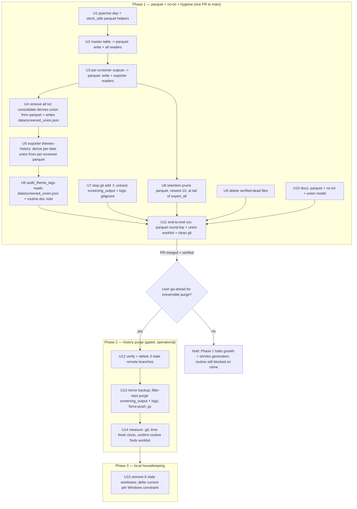

# Repository Slim-Down — Parquet Screening Outputs + No-TXT + Git History Purge - Plan

## Goal Capsule

- **Objective:** Shrink the `theme_dashboard` repository — the ~3.8 GB `.git` object store and the 1.2 GB working tree — and cut the per-run generation footprint, by (a) converting all screening numeric outputs from CSV to **parquet** and updating every downstream reader, (b) **removing all `.txt` outputs** while preserving the screened-ticker union their consumers need, (c) never committing regenerable `screening_output/` again + pruning it locally, then (d) purging its historical blobs from git and force-pushing `main` so the theme-tag-audit cloud routine can clone the repo again. Finish with local git housekeeping (stale worktrees + remote branches).
- **Two user directives driving this revision:** (1) CSV→parquet everywhere, downstream readers updated; (2) remove txt outputs. Directive 2 required a correctness carve-out — see KTD5: the per-screener `.txt` is dead, but the `_union_*.txt` is read by the exporter **and** the tag-audit routine, so its *data* is preserved via parquet-derivation + a tiny committed `data/screened_union.json`.
- **Authority hierarchy:** User request > repo conventions in CLAUDE.md / AGENTS.md (PR discipline; never commit regenerated `docs/data/*.json` in code PRs) > this plan.
- **Execution profile:** Three phases. **Phase 1 (U1–U11)** ships as one PR to `main`: parquet migration, txt removal + union preservation, stop-committing + prune + cleanup, verified end-to-end. **Phase 2 (U12–U14)** is the irreversible history rewrite — gated, run on a fresh clone, explicit go-ahead required. **Phase 3 (U15)** is local worktree housekeeping. Phase 1 stops growth and shrinks generation; only Phase 2 reclaims the existing bloat and fixes the routine's clone timeout.
- **Reference implementation:** the unmerged local `refactor/repo-slim-down` branch already has tested parquet commits (`4406de44` stock_utils helpers, `82da0b12` master→parquet, `3704007b` per-screener→parquet) plus round-trip tests. The parquet units below **reuse that code**; the branch kept `.txt`, so txt-removal + union-preservation (U4–U6) are new here.
- **Stop conditions:**
  - **U13 (history rewrite + force-push `main`) requires explicit user go-ahead at execution time.** It rewrites every commit SHA and force-pushes `main`, invalidating every existing clone and worktree. Never run autonomously.
  - Run U13 on a fresh full clone of `kuantumk/theme_dashboard`, never inside a worktree or a checkout with local changes.
  - U12 (delete stale remote branches) MUST complete before U13's force-push+GC — those branches pin `screening_output` blobs alive on the remote and would defeat the purge.
  - If U11's end-to-end run shows any consumer failing to read parquet, or the tag-audit routine failing to find its union worklist from `data/screened_union.json`, stop and fix before Phase 2.
  - Never commit regenerated `docs/data/*.json` in the Phase 1 PR (repo convention).
- **Tail ownership:** After Phase 1 merges and U11 verifies, present Phase 2 as the gated operational sequence. After U13, confirm recovery (measure `.git`, time a fresh clone, let the next routine fire run or trigger one and confirm it finds its worklist). Phase 3 accounts for the fact that the force-push forces a re-clone anyway.

---

## Product Contract

### Summary

The daily workflow force-commits the regenerable `screening_output/` tree every run (`git add -f screening_output/` in `.github/workflows/daily-screening.yml`), which across ~385 daily commits grew `.git` to ~3.8 GB (3.16 GB pack) with 4,786 tracked files. The working tree is 1.2 GB, dominated by `screening_output/master/` at 927 MB (~6.6 MB CSV × ~140 per-day files). Because every run regenerates the full 180-calendar-day window (`create_master_table.py --days 130`, each `run_screener.py --days 130`), the committed copies are never read as cross-run input. This plan converts those numeric outputs to parquet (~5–10× smaller, cutting both disk and the transient generation), removes all `.txt` outputs while preserving the screened-ticker union for the exporter and the tag-audit routine, stops committing + prunes `screening_output/` locally, and purges the historical blobs so a fresh clone is small enough for the cloud sandbox. Pickle price stores (already gitignored) stay as-is.

### Problem Frame

Root cause, confirmed by measurement in this repo:

- `.git` is **~3.8 GB** (`size-pack: 3.16 GiB`); the working tree is **1.2 GB** across 4,786 tracked `screening_output/` files; `master/` alone is **927 MB**.
- `screening_output/` is gitignored but **force-added every run** (`daily-screening.yml:60`), re-committed on ~385 daily commits — ~97% of the bloat, growing daily while unfixed.
- Every run regenerates the full window: `create_master_table.py:119` loops `range(num_run_days)` writing back-dated `master_<date>.csv`; each screener writes `<screener>_<date>.csv` (`run_screener.py:61`). `export_dashboard_data.py` reads the per-day master + per-screener files only for the window the current run just produced. Nothing depends on the committed copies persisting.
- **`pyarrow` is not a dependency.** The screening consumers already run on pandas 3.x, where parquet string columns round-trip to the same `str` dtype `read_csv` produces (verified by the reference branch).
- **`.txt` outputs — mixed usage.** `run_screener.py:65` writes a per-screener `.txt` into the screener's own dir that **nothing reads** (dead). `run_screener.py:66` writes `consolidated/_<screener>_<date>.txt`, which `consolidate_screener_results` unions into `_union_<date>.txt`. That union is read by **two** consumers: `export_dashboard_data.py` (themes-history backfill) and `tools/audit_theme_tags.py:242` (the tag-audit worklist).
- **The tag-audit routine reads the union from the committed repo.** `.claude/routines/theme_tag_audit.md` only `git pull`s main (no workflow re-run) and relies on "today's consolidated screener output already on main." `audit_theme_tags.py` reads `screening_output/consolidated/_union_*.txt` and **silently skips** the untagged check if it's absent (`:243-244`). So the moment `screening_output/` stops being committed — with or without txt removal — the routine's worklist vanishes unless the union is preserved elsewhere.
- Genuinely dead: `tools/theme_diff_report.py` (unreferenced anywhere), 73 orphaned `logs/theme_classification_audit_*.json` (no writer since the Gemini removal), and the per-screener `.txt` above. `logs/*.json` are untracked-worthy (write-only; `theme_sync_audit_*` written at `tag_new_tickers.py:215`, read by nothing). `tools/migrate_themes.py` is **NOT** dead — `src/themes/legacy_aliases.py` re-exports its `OLD_TO_NEW`.
- Three stale remote branches (`claude/document-tv-widget-quirks`, `claude/mobile-dashboard-layout-7e2jug`, `claude/nifty-noyce-7b6127`) and seven local worktrees exist; the remote branches pin old history that would survive a `main`-only purge.

### Requirements

**Parquet migration**

- R1. All screening numeric outputs are written as parquet: the per-day master table (`create_master_table.py`) and per-screener filtered outputs (`run_screener.py`), via shared `stock_utils` helpers.
- R2. Every downstream reader of those outputs reads parquet: `run_screener.load_master_table`, `run_daily_workflow.py`, `generate_daily_report.py`, `analyze_theme_strength.py`, and all master + per-screener readers in `export_dashboard_data.py` — all `master_*.csv`/`<screener>_*.csv` globs become `*.parquet`.
- R3. `pyarrow` is added as a project dependency and locked.

**Remove txt + preserve the union**

- R4. No `.txt` files are written by the screening pipeline: both `run_screener.py` txt writes are removed, and the consolidation step no longer produces `_union_<date>.txt`.
- R5. The screened-ticker union is preserved for its two real consumers: the exporter's themes-history derives each date's union from that date's per-screener parquet, and the daily workflow writes the latest union to a committed `data/screened_union.json` (`{date, tickers}`) that `audit_theme_tags.py` reads. The tag-audit routine finds its worklist from `main` without any `screening_output/` present.

**Stop committing + local hygiene**

- R6. `screening_output/` is never committed again: the `git add -f screening_output/` force-add is removed, and `screening_output/` stays gitignored and is untracked (`git rm -r --cached`). `data/screened_union.json` **is** committed (it lives in `data/`, already added by CI).
- R7. `screening_output/` stops accumulating locally: a retention prune keeps the newest 10 per-day parquet files per subdir and runs **after** `export_all()` has consumed the window.
- R8. `logs/*.json` are untracked and gitignored; the 73 orphaned `theme_classification_audit_*.json` are deleted; `theme_sync_audit_*.json` keeps being written locally (gitignored). Verified-dead files are removed (`tools/theme_diff_report.py`; `scripts/backfill_ep_scan_history.py` and `.agent/` each verified individually). `tools/migrate_themes.py` is retained.
- R9. `docs/data/` (Pages) and the pickle price stores are left untouched.

**History purge + housekeeping (gated)**

- R10. The three stale remote branches are verified merged-or-superseded and deleted from `origin` **before** the force-push.
- R11. All `screening_output/` and `logs/*.json` blobs are purged from history with `git filter-repo`, `main` is force-pushed (after an off-to-the-side mirror backup), and the object store is GC'd. `docs/data/` history is left intact.
- R12. Stale local worktrees are removed; the current session's own worktree is deferred per the Windows self-delete constraint.

**Verification**

- R13. A full local `run_daily_workflow.py` + `export_dashboard_data.py` run confirms: parquet round-trips through every consumer; `docs/data/*.json` rebuild; no `.txt` is produced; `data/screened_union.json` is written and `audit_theme_tags.py` reads its worklist from it; the working tree is free of stale/committed `screening_output/`. After the purge, `.git` size + fresh-clone timing + a routine run confirm recovery.

### Acceptance Examples

- AE1. **Parquet round-trip.** After a run, `screening_output/master/master_<date>.parquet` and `screening_output/<screener>/<screener>_<date>.parquet` exist (no `.csv`), and `run_screener`, `generate_daily_report`, `analyze_theme_strength`, and `export_dashboard_data` all read them without error to rebuild `docs/data/*.json`. Covers R1, R2, R3.
- AE2. **No txt, union preserved.** After a run, no `.txt` exists under `screening_output/`; `data/screened_union.json` holds the latest `{date, tickers}`; `uv run python tools/audit_theme_tags.py` finds and loads its worklist from it (not a "No consolidated union file found" skip); and `themes_history.json` still spans the full window with correct per-date screened sets. Covers R4, R5.
- AE3. **No new screening_output commits; union committed.** A daily workflow run commits `reports/`, `data/` (including `screened_union.json`), and `docs/data/`, and adds zero `screening_output/` paths. Covers R6.
- AE4. **Local footprint bounded.** After a run + export, `screening_output/master/` holds only the newest 10 parquet files (not ~140), and the persisted tree is a small fraction of the former 1.2 GB. Covers R7.
- AE5. **Dead files gone.** `git ls-files logs/` is empty, `tools/theme_diff_report.py` is absent, and `audit_theme_tags.py` + the unit tests still pass. Covers R8.
- AE6. **Branches cleared, history purged.** After U12/U13, `git ls-remote origin` shows only the intended refs, `du -sh .git` is a small fraction of 3.8 GB, `git log --all -- screening_output` and `-- logs/*.json` are empty, and `docs/data/` history is intact. Covers R10, R11.
- AE7. **Routine recovers.** After U13, a fresh `git clone` completes within the sandbox limit and a routine run (manual or scheduled) pulls main, finds its worklist in `data/screened_union.json`, and reaches the audit steps. Covers R11, R13.

### Scope Boundaries

**In scope:** everything in Requirements — parquet migration + `pyarrow`, txt removal + union preservation (parquet-derived + committed `data/screened_union.json`), stop-committing + untrack + retention prune, dead-file/log hygiene, the history purge, stale remote-branch and worktree cleanup, and end-to-end verification.

**Deferred to Follow-Up Work**

- Reducing `docs/data/*_history.json` churn (rewritten daily, committed for Pages) — a separate, small-object-count growth contributor required live by the dashboard.
- `fetch-depth: 1` shallow checkout on the daily workflow — unnecessary once history is small; the commit step's rebase loop wants real history.

**Outside this product's identity**

- Changing the dashboard data model, the 180-day time-travel window, screener logic, or the pickle price-store format (kept dict-of-DataFrames + `HIGHEST_PROTOCOL`; converting it would force a single-frame layout and rewrite every `daily_price[ticker]` consumer).
- Converting any Pages-served `docs/data/*.json` to parquet (the browser dashboard consumes JSON).

**Product Contract preservation:** N/A — direct planning (`ce-plan-bootstrap`). This revision supersedes the prior delete-based-CSV version of this file per the user's parquet + no-txt directives, and reuses the `refactor/repo-slim-down` branch's parquet commits as reference.

---

## Planning Contract

### Key Technical Decisions

- **KTD1 — Two wins stack, but only the purge revives the routine.** Parquet shrinks disk + generation (R1–R3); stop-committing + purge (R6 + R11) is what clears the ~3.8 GB and the clone timeout. Phase 1 alone leaves history in place. Sequence them; gate Phase 2.
- **KTD2 — Reuse the reference branch's parquet helpers verbatim.** `stock_utils.save_df_to_parquet` / `load_df_from_parquet` (pyarrow engine, `index=False`, pandas-3.x string round-trip) are already written and tested on `refactor/repo-slim-down` (`4406de44`). Cherry-pick or copy them rather than re-deriving; mirror `82da0b12` (master) and `3704007b` (per-screener) for the write/read swaps.
- **KTD3 — Parquet scope is exactly the two numeric writers + their readers.** Writers: `create_master_table.py:97`, `run_screener.py:61`. Readers: `run_screener.load_master_table` (`:29,:34`), `run_daily_workflow.py` (`:198` glob, `:247` read), `generate_daily_report.py` (`:432` glob, `:437` read), `analyze_theme_strength.py` (`:254` glob, `:260` read), and `export_dashboard_data.py` master reads (`:941,:1081,:1851,:1866-67`) + per-screener reads (momentum `:1284`, vars `:1458`, volume/scan `:1521,:1637`, parabolic, denvol). Every `master_*.csv` / `<screener>_*.csv` glob → `*.parquet`. The pickle price stores are untouched.
- **KTD4 — Retention prune targets parquet, newest 10 sessions per subdir, at the tail of `export_all()`.** `export_all()` (`export_dashboard_data.py:1901`, invoked by the `__main__` block at `:2061`) is the last consumer each cycle; in CI it runs as a separate step after `run_daily_workflow.py`, so pruning there (not in the workflow) preserves "export reads the full window, then prune trims." **User-confirmed 2026-07-04: keep newest 10 sessions.** Parquet makes a larger window cheap (~1 MB/file) if this is ever revisited, but 10 stands.
- **KTD5 — Remove all txt; preserve the union two ways by consumer.** The per-screener `.txt` (`run_screener.py:65-66`) is redundant once parquet holds the tickers — remove both writes. The union's two real consumers are served without any txt file: **(a) the exporter** (`export_themes_history` / `_build_themes_snapshot`) derives each date's union from that date's per-screener parquet `ticker` columns — those files exist for the full window at export time (regenerated by `--days 130`), semantically identical to the old union (both come from `filtered_master_df['ticker']`); **(b) the tag-audit routine**, which clones main with no `screening_output/`, reads a small committed `data/screened_union.json` (`{date, tickers}`) that `consolidate_screener_results` writes each run from the current day's per-screener parquet. This is a correctness requirement, not a preference — omitting (b) silently breaks the routine's worklist.
- **KTD6 — `data/screened_union.json` is the only new committed artifact, and it's tiny.** It replaces the committed `_union_*.txt` the routine used, at ~KB. `audit_theme_tags.py` swaps `find_latest_union_file`/`load_union_tickers` to read it (keeping the graceful skip). The routine doc's "newest `_union_*.txt`" note updates to match. No other `screening_output/` path is committed.
- **KTD7 — Untrack with `git rm -r --cached`, keep files on disk; a one-time local delete reclaims 1.2 GB now.** One data commit removes the tracked paths from the index; combined with removing the force-add, they never return. `data/screened_union.json` is added by the existing `git add data/` in CI.
- **KTD8 — Delete stale remote branches before the force-push.** `filter-repo` on a fresh clone rewrites fetched refs, but remote branches left on `origin` still reference pre-rewrite commits with `screening_output` blobs, keeping them un-GC-able. Verify each merged-or-superseded (repo uses squash-merge, so ancestry is unreliable — compare each branch's real diff to `main`), delete, then rewrite.
- **KTD9 — Purge with `git filter-repo --path screening_output/ --path logs/ --invert-paths` on a fresh clone, with an off-to-the-side mirror backup, force-pushed once.** Do NOT push a backup tag/branch to `origin` — a fetchable backup ref would be re-cloned and re-bloat the routine's clone. Re-add `origin`, `git push --force origin main`, then `reflog expire` + `gc --prune=now --aggressive`. Target only `screening_output/` + `logs/` (~97% of the bloat), leaving `docs/data/` untouched. BFG is the fallback.
- **KTD10 — The rewrite is gated and operational, not autonomous.** U13 force-pushes `main`; it runs only after Phase 1 merges, U11 passes, and U12 clears the remote branches, and only with explicit user confirmation. Afterward every local clone/worktree (including this session's) must re-clone or hard-reset.
- **KTD11 — The current session's worktree cannot self-delete mid-session (Windows).** Deregister-then-delete-later; Phase 3 removes the other six worktrees and defers this one to post-session, which the forced re-clone after U13 resolves anyway.

### High-Level Technical Design

Three-phase delivery; the irreversible rewrite is gated behind verification and remote-branch cleanup.

---

## Implementation Units

### U1. Add `pyarrow` + `stock_utils` parquet helpers

- **Goal:** One place for parquet I/O, engine pinned, dtypes preserved.
- **Requirements:** R3.
- **Dependencies:** none.
- **Files:** `pyproject.toml` + `uv.lock` (via `uv add pyarrow`), `src/stock_utils.py`, `tests/test_stock_utils_parquet.py` (new)
- **Approach:** `uv add pyarrow`. Add `save_df_to_parquet(df, file_path)` (mkdir parent, `to_parquet(engine='pyarrow', index=False)`) and `load_df_from_parquet(path)` (`read_parquet(engine='pyarrow')`) — copy verbatim from reference branch `4406de44`.
- **Patterns to follow:** existing `pickle_object_to_file` helpers in `stock_utils.py`; the branch's tested helper.
- **Test scenarios:**
  - Round-trip: a mixed-dtype DataFrame (float, int, string, date-as-string) saves and loads equal, with string columns as `str` dtype (matching `read_csv`).
  - Parent-dir creation: saving to a non-existent subdir creates it.
  - Empty DataFrame: a 0-row frame with columns round-trips without error.
- **Verification:** `uv run python -m unittest tests.test_stock_utils_parquet` green.

### U2. Master table → parquet (write + all readers)

- **Goal:** Master written and read as parquet everywhere.
- **Requirements:** R1, R2.
- **Dependencies:** U1.
- **Files:** `src/screening/create_master_table.py`, `src/screening/run_screener.py` (load_master_table), `run_daily_workflow.py`, `src/reporting/generate_daily_report.py`, `src/themes/analyze_theme_strength.py`, `src/reporting/export_dashboard_data.py` (master reads), `tests/test_master_parquet_roundtrip.py` (new; reuse branch), `tests/backtest_theme_scoring.py` (glob update)
- **Approach:** Write `master_<date>.parquet` via `su.save_df_to_parquet` (mirror `82da0b12`). Swap every master reader listed in KTD3 from `pd.read_csv(...).fillna(0)` to `su.load_df_from_parquet(...).fillna(0)` and every `master_*.csv` glob to `master_*.parquet`. Confirm `master_test/` (screener `--test`) path too.
- **Patterns to follow:** reference branch `82da0b12` changed exactly these sites.
- **Test scenarios:**
  - Round-trip: a workflow-shaped master frame written by `create_master_table` is read identically by `load_master_table`.
  - Integration: `analyze_theme_strength` and `generate_daily_report` load the latest master parquet and produce their outputs unchanged vs a CSV baseline (columns/values equal).
  - Edge: `.fillna(0)` still applies (parquet preserves NaN; readers must keep filling).
- **Verification:** master round-trip test green; a partial local run reads master parquet through report generation.

### U3. Per-screener numeric outputs → parquet (write + exporter readers)

- **Goal:** Per-screener filtered outputs written and read as parquet.
- **Requirements:** R1, R2.
- **Dependencies:** U2.
- **Files:** `src/screening/run_screener.py` (the `to_csv` at `:61`), `src/reporting/export_dashboard_data.py` (momentum/vars/volume/parabolic/denvol per-screener reads + globs), `tests/test_screener_output_parquet.py` (new; reuse branch)
- **Approach:** Write `<screener>_<date>.parquet` via `su.save_df_to_parquet` (mirror `3704007b`). Swap every per-screener reader/glob in the exporter to parquet (`_build_*_snapshot`, `export_momentum_136`, `export_vars`, `export_volume`, `export_parabolic`, denvol). Leave the txt writes for U4.
- **Patterns to follow:** reference branch `3704007b`.
- **Test scenarios:**
  - Round-trip: a filtered screener frame is written and re-read by the exporter's per-scan reader.
  - Integration: `export_momentum_136` / `export_vars` / `export_volume` rebuild their `*_history.json` from parquet across a multi-date window equal to the CSV baseline.
  - Edge: a 0-match screener writes a readable empty parquet; exporter handles 0 rows.
- **Verification:** screener-parquet test green; exporter rebuilds history JSONs from parquet.

### U4. Remove all txt; derive union from parquet; write `data/screened_union.json`

- **Goal:** No `.txt` outputs; the screened union is derived from parquet and the latest is persisted for the routine.
- **Requirements:** R4, R5.
- **Dependencies:** U3.
- **Files:** `src/screening/run_screener.py` (remove `:65` and `:66`), `run_daily_workflow.py` (`consolidate_screener_results`), `config/settings.py` (if a path constant helps), `tests/` (union-derivation test, new)
- **Approach:** Delete both txt writes in `run_screener.py`. Rework `consolidate_screener_results(date_str)` to build the union from the per-screener **parquet** for that date — iterate `CONFIG['screeners']`, read `SCREENING_OUTPUT_DIR/<screener>/<screener>_<YYYY-MM-DD>.parquet`, union the `ticker` column — returning the same set it does today (steps 7–10 keep using it in-process). Additionally write the latest union to `data/screened_union.json` as `{"date": "<YYYY-MM-DD>", "tickers": [...]}`. No `_union_*.txt` is written.
- **Patterns to follow:** existing `consolidate_screener_results` set-building; `ticker` is the column (`run_screener.py:64`).
- **Test scenarios:**
  - Happy path: given per-screener parquet for a date, the union equals the distinct set of all screeners' `ticker` values; `data/screened_union.json` is written with that date + sorted tickers.
  - Edge: a screener with an empty parquet contributes nothing; a date with no screener files yields an empty union and a valid (empty-tickers) json.
  - Regression: no `.txt` file is created anywhere under `screening_output/` after a screener + consolidate run.
- **Verification:** union-derivation test green; a local run produces `data/screened_union.json` and zero txt.

### U5. Exporter themes-history: per-date union from parquet

- **Goal:** `themes_history.json` spans the window using parquet-derived unions, no txt.
- **Requirements:** R5.
- **Dependencies:** U3, U4.
- **Files:** `src/reporting/export_dashboard_data.py` (`export_themes_history`, `_build_themes_snapshot`)
- **Approach:** Replace the `_union_{txt_date}.txt` read (`:1102`) with per-date union derivation from that date's per-screener parquet `ticker` columns (a shared helper reused from U4). `_build_themes_snapshot` takes the derived union set instead of a `union_file` path. The window's per-screener parquet exists at export time (regenerated by `--days 130`).
- **Patterns to follow:** the exporter already iterates per-screener parquet for momentum/vars/volume — reuse that globbing.
- **Test scenarios:**
  - Integration: over a multi-date window, `themes_history.json` per-date screened sets equal the old union-txt-derived sets (parity against a pre-change baseline).
  - Edge: a date whose per-screener parquet is missing is skipped (as the missing-union case was), not crashed.
- **Verification:** themes-history parity check green; `themes_history.json` spans the full window.

### U6. Audit tooling reads `data/screened_union.json`

- **Goal:** The tag-audit worklist comes from the committed union json, so the routine works from a `screening_output`-free clone.
- **Requirements:** R5.
- **Dependencies:** U4.
- **Files:** `tools/audit_theme_tags.py`, `.claude/routines/theme_tag_audit.md` (worklist note), `tests/` (if audit has tests)
- **Approach:** Point `find_latest_union_file`/`load_union_tickers` (or their replacement) at `data/screened_union.json` — read `{date, tickers}`, keep the graceful skip when absent and the session-date labeling (now from the json `date` field, not a filename regex). Update the routine doc's "newest `_union_*.txt`" language to "`data/screened_union.json`".
- **Patterns to follow:** existing `audit_theme_tags.py:242-256` union-load + date-parse + graceful-skip.
- **Test scenarios:**
  - Happy path: given `data/screened_union.json`, the untagged check runs and labels the worklist with the json `date`.
  - Edge: absent/empty json → the existing "no union file" skip message, exit unaffected (`[BUG]`-only exit-1 semantics preserved).
- **Verification:** `uv run python tools/audit_theme_tags.py` loads the worklist from the json; exit code semantics unchanged.

### U7. Stop committing `screening_output/`; untrack it + `logs/*.json`

- **Goal:** Halt future `screening_output/` commits and remove the tracked backlog from the index, while keeping `data/screened_union.json` committed.
- **Requirements:** R6, R8.
- **Dependencies:** none (independent of the parquet units).
- **Files:** `.github/workflows/daily-screening.yml`, `.gitignore`, index change via `git rm -r --cached screening_output/ 'logs/*.json'`
- **Approach:** Remove `git add -f screening_output/` (`:60`); drop `logs/` from the `git add` line (gitignored now); **keep `data/`** in the add so `screened_union.json` commits. `git rm -r --cached` both trees (index-only). `.gitignore`: `screening_output/` already covered; add `logs/*.json` beside `logs/*.log`. Commit as a dedicated hygiene commit.
- **Patterns to follow:** the EP-scan workflows' explicit-path `git add` style; existing `.gitignore` "Generated output" block.
- **Test scenarios:** `Test expectation: none — CI/index/ignore change. Verified in U11/AE3: a run stages zero screening_output paths but does stage data/screened_union.json; git ls-files screening_output and logs/ empty.`
- **Verification:** `git ls-files screening_output/ logs/` empty; a dry-run commit stages `data/screened_union.json` and no `screening_output/`.

### U8. Retention prune (parquet, newest 10) at tail of `export_all()`

- **Goal:** Bound local `screening_output/` to the newest 10 per-day parquet files per subdir.
- **Requirements:** R7.
- **Dependencies:** U3 (prunes parquet).
- **Files:** `src/screening/prune_screening_output.py` (new), `src/reporting/export_dashboard_data.py` (call at end of `export_all()`), `config/workflow_config.yaml` (retention constant, default 10), `tests/test_prune_screening_output.py` (new)
- **Approach:** `prune_screening_output(root=SCREENING_OUTPUT_DIR, keep=10)` — for each subdir (`master/`, each screener), parse the date token, keep the newest `keep` dates' `*.parquet`, delete older. Read `keep` from config. Call once at the very end of `export_all()`, after all history JSONs are written, so export reads the full regenerated window first. Safe no-op on empty/absent tree; never touches non-dated files.
- **Execution note:** Implement test-first — it deletes files; lock the keep/delete boundary before wiring into export.
- **Patterns to follow:** `_history_cutoff` date-token parsing in the exporter; `stock_utils` file helpers.
- **Test scenarios:**
  - Happy path: 25 dated parquet files, `keep=10` → newest 10 kept, 15 deleted.
  - Boundary: `keep` ≥ count is a no-op; `keep=0` deletes all dated parquet.
  - Safety: a non-dated file (stray `.gitkeep`) is never deleted; empty/absent dir returns cleanly.
  - Integration: after `export_all()` on a regenerated window, `themes_history.json` is full AND `screening_output/master/` holds only `keep` files (prune ran last).
- **Verification:** prune tests green; a local export leaves a bounded tree with intact history JSONs.

### U9. Delete verified-dead files

- **Goal:** Remove files confirmed unused; leave anything load-bearing.
- **Requirements:** R8.
- **Dependencies:** none.
- **Files:** delete `tools/theme_diff_report.py`; delete `logs/theme_classification_audit_*.json` (73); evaluate-then-decide `scripts/backfill_ep_scan_history.py` and `.agent/`. Retain `tools/migrate_themes.py`.
- **Approach:** `theme_diff_report.py` — grep-confirmed unreferenced; delete. Orphaned `theme_classification_audit_*.json` — no writer since the Gemini removal; delete (U7 untracks the pattern). `scripts/backfill_ep_scan_history.py` — confirm no CI/doc reference, then delete or keep as a re-runnable utility (Open Question). `.agent/` — confirm accidental vs deliberate vendoring before removing + gitignoring; leave + note if uncertain. `migrate_themes.py` stays (`legacy_aliases` imports `OLD_TO_NEW`).
- **Test scenarios:** `Test expectation: none — deletions. Verified: audit_theme_tags.py exits 0; unittest suite green; legacy_aliases import intact; git grep finds no references to deleted paths.`
- **Verification:** tests + tag audit pass; no import errors.

### U10. Documentation for parquet + no-txt + union model

- **Goal:** Record the parquet outputs, txt removal, `data/screened_union.json` contract, and delete-based `screening_output`.
- **Requirements:** documentation of R1–R7.
- **Dependencies:** U1–U8.
- **Files:** `CLAUDE.md`, `AGENTS.md`, `.gitignore` (comments), `config/workflow_config.yaml` (retention comment)
- **Approach:** Update "Data Flow", "Key Data Stores", the volume/VARS export notes, the theme-taxonomy audit-worklist note, and "PR convention": screening numeric outputs are parquet; no `.txt` is written; the screened union is derived from parquet and the latest is committed to `data/screened_union.json` (the tag-audit worklist source); `screening_output/` is regenerated each run, never committed, pruned to 10 newest per subdir after export. Remove stale "force-add", CSV, and `_union_*.txt` references.
- **Test scenarios:** `Test expectation: none — docs.`
- **Verification:** docs match shipped behavior; no stale CSV/txt/force-add references.

### U11. End-to-end verification run (Phase 1 gate)

- **Goal:** Prove parquet, txt-removal, union preservation, and hygiene all work with nothing extra committed.
- **Requirements:** R13.
- **Dependencies:** U1–U10.
- **Files:** none (operational); reset `docs/data/` after per convention.
- **Approach:** `uv run python run_daily_workflow.py` then `uv run python -m src.reporting.export_dashboard_data`. Confirm: only `.parquet` under `screening_output/` (no `.csv`/`.txt`); `docs/data/*.json` rebuilt (incl. `themes_history.json` spanning the window); `data/screened_union.json` written; `uv run python tools/audit_theme_tags.py` finds its worklist from it; `screening_output/` bounded to 10 per subdir; `git status` stages `data/screened_union.json` but zero `screening_output/`/`logs/*.json`. Then `git checkout -- docs/data/` before the PR.
- **Test scenarios:** `Covers AE1–AE5. Happy path: clean git for screening_output/logs, union json present + readable by audit, bounded local tree, intact history JSONs. Failure path: any parquet read error or an audit "no union file" skip halts Phase 2.`
- **Verification:** AE1–AE5 pass; PR opened without `docs/data/` churn.

### U12. Verify and delete stale remote branches (Phase 2 prerequisite)

- **Goal:** Remove remote branches that pin `screening_output` blobs.
- **Requirements:** R10.
- **Dependencies:** Phase 1 merged; gated on user go-ahead for Phase 2.
- **Files:** none (remote refs).
- **Approach:** For each of `claude/document-tv-widget-quirks`, `claude/mobile-dashboard-layout-7e2jug`, `claude/nifty-noyce-7b6127`, decide merged-or-superseded by diffing against `main` (squash-merge makes ancestry unreliable): `document-tv-widget-quirks` looks superseded (main's CLAUDE.md has a fuller TV-widget section), `nifty-noyce` obsolete (edits the removed Coiled tab), `mobile-dashboard-layout` changes `docs/style.css` and needs a real check the mobile sizing is in `main`. Delete confirmed ones with `git push origin --delete <branch>`; keep any still-wanted branch and note it — but a kept branch still pins blobs, so it must join U13's rewrite (add its ref) or the purge won't fully reclaim.
- **Test scenarios:** `Test expectation: none — ref deletion. Verified: git ls-remote origin lists only intended refs.`
- **Verification:** `git ls-remote origin` shows the intended remaining refs only.

### U13. Purge history and force-push `main` (gated, irreversible)

- **Goal:** Reclaim the ~3.8 GB by removing `screening_output/` + `logs/*.json` from all history.
- **Requirements:** R11.
- **Dependencies:** U12 complete; explicit user go-ahead at execution.
- **Files:** none (operates on a fresh clone).
- **Approach:** On a **fresh full clone** of `kuantumk/theme_dashboard` (never a worktree/dirty checkout). **First keep a rollback copy:** a local `git clone --mirror` of the current remote, off to the side — do NOT push a backup tag/branch to `origin` (a fetchable backup ref would be re-cloned and re-bloat the routine's clone). Then `git filter-repo --path screening_output/ --path logs/ --invert-paths`; re-add `origin`; `git push --force origin main`; then `git reflog expire --expire=now --all && git gc --prune=now --aggressive`. Leave `docs/data/` untouched. Pause or time the rewrite around the daily 1:30 PM Pacific `daily-screening.yml` schedule so a scheduled run doesn't commit onto pre-rewrite history mid-purge. BFG is the fallback. Do not proceed if U11 flagged any consumer failure; discard the mirror backup only after U14 confirms recovery.
- **Execution note:** Irreversible stop-condition step — confirm go-ahead immediately before running; announce that all existing clones/worktrees become invalid.
- **Test scenarios:** `Covers AE6. Verified: git log --all -- screening_output and -- logs/*.json empty; du -sh .git a small fraction of 3.8 GB; docs/data/ history intact.`
- **Verification:** history clean of the purged paths; `.git` dramatically smaller; Pages history intact.

### U14. Post-purge recovery verification

- **Goal:** Confirm the routine clones AND finds its worklist from the rewritten remote.
- **Requirements:** R11, R13.
- **Dependencies:** U13.
- **Files:** none (operational).
- **Approach:** Time a fresh `git clone` (within sandbox limit); measure `.git`; trigger the tag-audit routine (manual dispatch or next schedule) and confirm it pulls main, reads `data/screened_union.json`, and reaches the audit steps (not a "no union file" skip). Optionally run one daily workflow from the fresh clone to confirm parquet regeneration + export + `screened_union.json` write still work.
- **Test scenarios:** `Covers AE7. Happy path: fast small clone; routine finds its worklist. Failure path: if the routine skips for no union, or the clone still times out, escalate (union json missing from main, or GitHub GC lag).`
- **Verification:** AE7 passes; routine reaches the audit phase with a real worklist.

### U15. Local worktree housekeeping

- **Goal:** Remove stale worktrees; handle the current session's worktree per the Windows constraint.
- **Requirements:** R12.
- **Dependencies:** best after U13 (the force-push forces a re-clone regardless); the six non-current worktrees can be cleared anytime.
- **Files:** none (git worktrees).
- **Approach:** `git worktree remove` (or deregister + delete dir) the six non-current worktrees, then `git worktree prune`. The `sad-mclean-696768 [refactor/repo-slim-down]` worktree stays available until this plan's parquet units are landed (it's the reference implementation); remove it + delete the local branch afterward. The current `eager-goodall-30148f` worktree cannot self-delete mid-session; deregister now and delete the directory post-session — the U13 re-clone supersedes it anyway.
- **Test scenarios:** `Test expectation: none — worktree ops. Verified: git worktree list shows only the intended set.`
- **Verification:** `git worktree list` reduced to the intended set.

---

## Alternatives Considered

- **Delete-based, keep CSV (the prior revision of this file).** Don't persist screening_output; keep CSV. **Superseded by the user's parquet directive** — parquet also shrinks the ~950 MB transient generation to ~100–150 MB, which the CSV approach left as deferred.
- **Remove the union entirely (take directive 2 literally).** Rejected on evidence — the union is read by the exporter and the tag-audit routine; deleting it silently breaks the routine's worklist. KTD5 preserves the union's data without any txt file.
- **Keep committing the union as `_union_*.txt` (gitignore exception).** Rejected — contradicts "no txt" and keeps a `screening_output/` path committed. `data/screened_union.json` is the cleaner committed carrier.
- **Move pickle price stores to parquet.** Rejected — forces a single-frame layout and rewrites every `daily_price[ticker]` consumer; keep pickle + `HIGHEST_PROTOCOL`.
- **Stop-the-bleeding only (no history purge).** Rejected — the clone timeout is caused by the existing ~3.8 GB, which Phase 1 doesn't touch.
- **Retention = 180-day window instead of 10 sessions.** Cheap now that outputs are parquet, but the user confirmed 10; left as a note in KTD4.

---

## Risk Analysis & Mitigation

- **Silently breaking the tag-audit routine's worklist.** Stopping committing `screening_output` removes the union the routine reads. *Mitigation:* KTD5/R5 — the workflow commits `data/screened_union.json`; U6 points the audit tooling at it; U11 verifies the audit finds a real worklist; U14 confirms it on the rewritten remote.
- **Parquet read/write mismatch across consumers.** A missed reader still globs `*.csv` and finds nothing. *Mitigation:* KTD3 enumerates every site; U2/U3 reuse the reference branch's tested diffs; round-trip + parity tests; U11 end-to-end.
- **Irreversible history rewrite (U13).** *Mitigation:* gated on explicit go-ahead; fresh clone; off-to-the-side `--mirror` backup (not pushed to origin); U12 clears pinning branches first; announce the re-clone requirement; time around the daily CI schedule.
- **Prune ordering deletes the window before export reads it.** *Mitigation:* prune only at the tail of `export_all()`; U8 tests assert full history JSONs after prune; U11 verifies end-to-end.
- **Deleting a not-actually-dead file** (`.agent/`, `backfill_ep_scan_history.py`). *Mitigation:* U9 verifies each individually; uncertain items left + moved to Open Questions.
- **Remote branch deleted while still wanted.** *Mitigation:* U12 diffs each branch vs `main` before deletion; keep-and-note if unmerged (and fold into U13).
- **GitHub-side GC lag** after force-push. *Mitigation:* U14 confirms clone time/size; allow GC time or open a support request; fresh-clone timing (not raw remote size) is the success signal.

---

## Operational Notes

- **One-time local backlog reclaim:** after U7 untracks the tree, a one-time `rm -rf screening_output/*` (or a first prune run) reclaims the 1.2 GB immediately; the next run regenerates the window as parquet. Do it on the main checkout, not a worktree with in-flight work.
- **PR discipline:** Phase 1 is one code PR; reset `docs/data/` with `git checkout -- docs/data/` before committing. `data/screened_union.json` **is** part of the PR (new committed contract).
- **Phase 2 is operational, not a PR:** U12–U14 are gated git/remote operations run outside the normal PR flow.

---

## Open Questions

- **`.agent/` bundled skills (1.5 MB):** deliberate vendoring or accidental commit? U9 leaves them if unconfirmed; confirm to include in deletion + the U13 purge.
- **`scripts/backfill_ep_scan_history.py`:** delete (one-off, done) or keep as a re-runnable utility?
- **Retention depth:** resolved — newest 10 sessions per subdir (KTD4). Noted only because parquet makes a wider window cheap if ever revisited.

---

## Definition of Done

- Phase 1 PR merged: screening numeric outputs are parquet and every reader reads parquet (`pyarrow` locked); no `.txt` is written; the union is derived from parquet for the exporter and committed to `data/screened_union.json` for the routine; `screening_output/` + `logs/*.json` untracked + gitignored (but `data/screened_union.json` committed); the daily CI no longer force-adds `screening_output/`; retention prune shipped + tested at the tail of `export_all()`; verified-dead files deleted; docs updated; U11 end-to-end run clean (AE1–AE5).
- Phase 2 completed with go-ahead: stale remote branches cleared (AE6), `screening_output/` + `logs/*.json` purged from history, `main` force-pushed (mirror backup taken), `.git` reduced to a small fraction of 3.8 GB, `docs/data/` intact, and a fresh clone + routine run confirmed to find its worklist within the sandbox limit (AE7).
- Phase 3: stale worktrees removed; current worktree deferred per the Windows constraint and resolved by the post-U13 re-clone.
