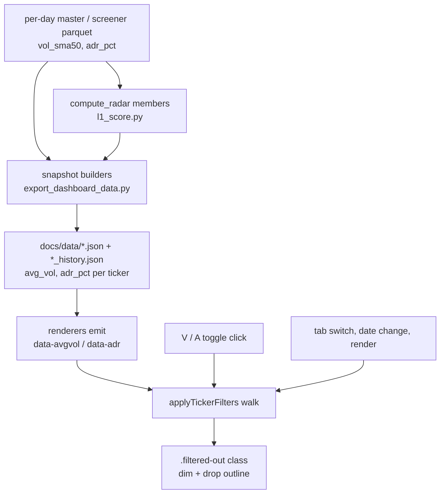

# Ticker Filter Toggles - Plan

## Goal Capsule

- **Objective:** add two small toggle buttons — `V` (average volume) and `A` (ADR%) — to the right of each in-scope tab's time-travel bar, dimming tickers below 1M average volume or below 4% ADR when armed.
- **Authority:** this plan's Product Contract governs behavior; `docs/style.css` conventions govern visual treatment; the Verification Contract governs proof.
- **Execution profile:** front-end feature with a small export-pipeline prerequisite. The two metrics do not exist in the dashboard JSON today, so the Python export units land before the JS units can be verified against real data.
- **Stop conditions:** stop and surface if the metric a toggle needs is absent from a tab's per-day parquet, or if dimming a leaf would require re-scoring it.
- **Tail ownership:** standalone — `ce-work` owns commit, branch, and PR.

---

## Product Contract

### Summary

Two view-level filter toggles let the user grey out tickers that fail a liquidity floor (50-day average share volume ≥ 1M) or a volatility floor (20-day ADR% ≥ 4%) without leaving the tab or losing the ticker from view. The toggles ship on the five stock-list tabs whose rows come from the screening pipeline — Themes, VARS, Momentum, Volume, Parabolic — sharing one state across tabs, and the filter never re-scores, re-sorts, or hides anything.

### Problem Frame

Every stock tab mixes tradeable names with names that fail the user's own entry floors. The floors already exist in the pipeline, but each screener applies its own, so what survives to a tab varies: the Themes tab (L1 Radar) is screener-independent and admits anything over a 750k share floor with a $40M dollar-volume exemption and no ADR floor at all; the VARS screener admits ADR down to 2%; `denvol` admits share volume down to 300k. Scanning a leaf's chip row today means holding "is this one liquid enough, is it moving enough" in your head per ticker.

The floors are also not worth hard-coding into the screeners. A 1M/4% cut is the right lens some sessions and the wrong one others — the VARS ADR floor was deliberately set to 2% because a higher floor ejected PANW/FTNT-class leaders exactly when post-run tightening compressed their ADR, and the radar's share floor carries a dollar-volume exemption for the same reason. The filter belongs in the view, where it is reversible in one click, not in the scoring path.

### Requirements

**Toggle controls**

- R1. Each in-scope tab's time-travel bar carries two square toggle buttons labelled `V` and `A`, sitting side by side to the right of the date buttons and the `+ more` dropdown.
- R2. `V` armed dims every ticker whose 50-day average share volume is below 1,000,000.
- R3. `A` armed dims every ticker whose 20-day ADR% is below 4%.
- R4. Both toggles armed dims a ticker failing either floor.
- R5. Toggle state is shared across tabs — arming `V` on the VARS tab leaves it armed when the user switches to Themes — and resets on page reload.
- R6. Toggling re-applies the dim to the tab currently on screen without a data refetch.

**Visual treatment**

- R7. A dimmed ticker renders in the same grey as an unscreened radar chip, with the chip's square outline dropped.
- R8. On the Themes tab a dimmed chip is visually distinct from both a screened chip (blue outline, bold) and an unscreened chip (grey, outline kept).
- R9. On table tabs the dimmed treatment covers the whole row, not the ticker cell alone.
- R10. A dimmed ticker stays clickable and still opens its chart.

**Data coverage**

- R11. Every ticker payload on an in-scope tab carries its 50-day average share volume and its 20-day ADR% for the session being displayed.
- R12. The metrics are point-in-time — a ticker viewed on a past session through time travel is filtered against that session's values, not today's.
- R13. A ticker whose metric is missing is not dimmed.

**Non-effects**

- R14. Filtering does not change any leaf, L1, or theme score, breadth count, rank, or sort order.
- R15. Filtering does not remove tickers from the DOM, so the radar's `+N more` chip-clamp count is unaffected.

### Scope Boundaries

- Out: the four network Viz tabs (Theme, VARS, Momentum, Volume Viz). Node dimming runs through Cytoscape stylesheets, a separate rendering path with its own state.
- Out: Industry ETF and Leverage ETF tabs. Their rows come from an on-the-fly yfinance fetch, not the screening parquet, and a 4% ADR floor would grey out nearly the whole ETF list.
- Out: the EP Scanner tab. Its JSON comes from the separate EP scan pipeline, which carries neither metric and already screens on average volume > 1M upstream.
- Out: the Overview tab (no ticker lists).
- Out: user-editable thresholds. 1M and 4% are constants.

#### Deferred to Follow-Up Work

- Persisting armed toggles across page reloads. The repo uses no browser storage today; adding it is a separate decision.
- A third toggle for price or dollar-volume floors.

---

## Planning Contract

### Key Technical Decisions

- KTD1. **Filter as a DOM class pass, not a re-render.** Each rendered ticker element carries `data-avgvol` and `data-adr` attributes; one `applyTickerFilters()` walk over the active tab toggles a `filtered-out` class. Five render paths across two visual shapes (radar chips, table rows) already exist — threading filter state into each renderer would touch all five and would fight `syncRadarClamps`, which measures chip `offsetTop` against a CSS clamp and must not see chips appear or disappear. A class pass leaves the renderers untouched apart from emitting two attributes, and satisfies R14/R15 by construction.
- KTD2. **Metrics ship in the exported JSON, read from the same per-day parquet row as the rest of the payload.** Rejected: deriving them client-side (price history is not in the browser) and piggybacking on `load_ticker_color_flags`, which builds a latest-bar map applied to every historical snapshot — that would stamp today's liquidity onto every time-travel session and violate R12.
- KTD3. **"Average volume" is `vol_sma50` with a straight 1M cut and no dollar-volume exemption.** The radar's universe floor waives its 750k share floor at ≥ $40M average dollar volume; this toggle deliberately does not. It is a user-armed view lens, not a scoring gate — the exemption exists to stop the radar blinding itself to high-priced liquid leaders, whereas a user arming `V` is asking for share liquidity specifically.
- KTD4. **Missing metric fails open (R13).** Matches `build_radar_universe`, which lets NaN `vol_sma50` (IPOs under 25 sessions) through on dollar-floor-only gating. It also makes the toggles harmless against the currently-published `docs/data/*.json`, which lacks both fields until the next daily run rewrites history from parquet.
- KTD5. **One shared state pair, no persistence.** Two module-level booleans in `docs/app.js` alongside `activeSessionDate`, which already models cross-tab shared view state. No `localStorage` — the repo uses none today.
- KTD6. **Toggle markup lives in `docs/index.html` as a sibling of `.time-travel-dates`, with one delegated click handler.** `renderTimeTravelBar` rewrites `.time-travel-dates` innerHTML on every date change; toggles placed inside it would be destroyed and rebound on each time-travel click. Explicit markup on the five in-scope bars also keeps "which tabs have filters" greppable rather than encoded in a JS tab allowlist.
- KTD7. **Armed toggles render amber, not the bar's accent blue.** The active date button and the active `+ more` dropdown both render accent blue and sit immediately to the left; a third adjacent blue-active control reads as part of the date group. Amber is already the dashboard's secondary emphasis colour (`--amber`, used for radar ranks).

### High-Level Technical Design

The only new runtime path is `applyTickerFilters`. It is called from three places — after any tab render, on tab switch, and on toggle click — and is idempotent, so an extra call is harmless.

### Assumptions

These are agent bets made without confirmation. Each is cheap to redirect before implementation.

- The five in-scope tabs are the right coverage. The toggles have the most bite on Themes (no ADR floor, 750k share floor with exemption), then `A` on VARS (2% ADR floor) and `V` on Volume (`denvol` admits 300k shares) and Momentum (750k shares). On Parabolic and the `volspike` half of Volume both floors are already met upstream, so the toggles are near no-ops there — they are included for uniform behaviour, not because they filter much.
- Table rows dim in full (R9) rather than the ticker cell alone.
- Armed state uses amber (KTD7).
- Thresholds are compile-time constants rather than config-driven.

---

## Implementation Units

### U1. Carry avg volume and ADR% into the screener-backed snapshots

- **Goal:** every ticker dict in the momentum_136, VARS, Volume, and Parabolic payloads gains `avg_vol` and `adr_pct` for that session.
- **Requirements:** R11, R12, R13
- **Dependencies:** none
- **Files:**
  - `src/reporting/export_dashboard_data.py`
  - `tests/test_filter_metrics.py` (new — covers all four builders in one place)
  - `tests/test_parabolic.py`
- **Approach:**
  1. Add a small shared helper next to `_round_or_none` that reads `vol_sma50` and `adr_pct` off a parquet row and returns `(int | None, float | None)`, rounding volume to a whole number and ADR to 4 decimal places.
  2. Call it in the `per_ticker` loops of `_build_momentum_136_snapshot`, `_build_vars_snapshot`, and `_build_volume_snapshot`, and in `_parabolic_item_from_row`.
  3. `_parabolic_item_from_row` already emits `adr_pct` — add `avg_vol` only, and do not rename the existing key.
  4. Note that `_build_momentum_136_snapshot`, `_build_vars_snapshot`, and `_build_volume_snapshot` call `.fillna(0)` on the frame. A ticker with no `vol_sma50` therefore arrives as `0`, not NaN, which would dim it under R13. Emit `None` when the source value is zero-or-missing so fail-open holds.
- **Patterns to follow:** the existing per-row extraction in `_build_vars_snapshot`'s `per_ticker` loop; `_round_or_none` / `_int_or_none` for null-safe numeric emission.
- **Test scenarios:**
  - A VARS snapshot built from a fixture frame carrying `vol_sma50` and `adr_pct` emits both values on each ticker dict, volume as an integer and ADR at 4 decimal places.
  - A fixture ticker whose `vol_sma50` is absent from the frame emits `avg_vol: None`, not `0`.
  - A fixture ticker whose `vol_sma50` is present but zero emits `avg_vol: None` (the `fillna(0)` path).
  - The momentum_136 snapshot carries both metrics on each ticker, with the zero case emitting `None`.
  - The Volume snapshot carries both metrics on each ticker, with the zero case emitting `None`.
  - The Parabolic snapshot gains `avg_vol` while its existing `adr_pct` key and value are unchanged.
  - Two snapshots built from two different session parquets carry that session's own values, not a shared latest-bar value.
- **Verification:** `uv run python -m unittest discover -s tests` passes; a local `uv run python -m src.reporting.export_dashboard_data` produces `docs/data/vars.json` whose first ticker carries both keys.

### U2. Carry the metrics through the radar member payload

- **Goal:** radar chips on the Themes tab carry the same two metrics.
- **Requirements:** R11, R12, R13
- **Dependencies:** U1 (shares the helper)
- **Files:**
  - `src/themes/l1_score.py`
  - `src/reporting/export_dashboard_data.py`
  - `tests/test_l1_score.py`
  - `tests/test_export_radar.py`
- **Approach:**
  1. In `compute_leaf_scores`, extend the member dict with `vol_sma50` and `adr_pct` read from the master row, using the same `pd.notna` guard the existing `vars` and `price` legs use.
  2. In `_build_radar_snapshot`, map those onto the emitted ticker dict as `avg_vol` / `adr_pct` using U1's helper, alongside `score`, `rs`, `vars`, `price`, `is_screened`.
  3. These fields ride into `radar_history.json` as well as `radar.json`. History entries cap chips at `radar.tickers_per_leaf`, so the added bytes are bounded; `radar.json` is uncapped and grows by two numbers per member.
- **Patterns to follow:** the `vars_val = row.get('vars')` / `pd.notna` guard already in `compute_leaf_scores`'s member append; the ticker-dict construction in `_build_radar_snapshot`.
- **Test scenarios:**
  - `compute_leaf_scores` over a fixture master frame emits `vol_sma50` and `adr_pct` on each member dict.
  - A member whose master row has NaN `vol_sma50` (the IPO case the radar universe already admits on dollar-floor-only gating) emits `None` and still scores normally.
  - `_build_radar_snapshot` emits `avg_vol` and `adr_pct` on every chip in both the uncapped and the `tickers_per_leaf`-capped shape.
  - Radar scores, leaf breadth, boost, and ranks are byte-identical to a pre-change run over the same fixture — the new fields are payload-only.
- **Verification:** `uv run python -m unittest discover -s tests` passes; `uv run python tools/validate_radar.py --episodes tools/radar_episodes.yaml` still passes.

### U3. Filter state and toggle controls

- **Goal:** two armed/disarmed toggles per in-scope bar, sharing one cross-tab state.
- **Requirements:** R1, R5, R6
- **Dependencies:** none for the controls themselves. The handler's call into the dim pass is completed in U4, which introduces `applyTickerFilters` — U3 defines it as a no-op stub so the toggles are clickable and inert until U4 fills it in.
- **Files:**
  - `docs/index.html`
  - `docs/app.js`
- **Approach:**
  1. In `docs/index.html`, add a `tt-filters` block holding the two buttons as a sibling of `.time-travel-dates`, inside the `.time-travel-bar` of the five in-scope tabs: Themes, VARS, Momentum, Volume, Parabolic. Leave the Viz, Industry, Lev ETF, and EP bars untouched.
  2. Give each button a stable data attribute naming which filter it arms, plus `aria-pressed` and a `title` stating the floor in words.
  3. In `docs/app.js`, add module-level state next to `activeSessionDate` holding the two booleans.
  4. Add one delegated click handler that flips the matching boolean, syncs the armed class and `aria-pressed` on *every* instance of that button across all bars (state is shared, so all five must agree), then calls `applyTickerFilters`. Define `applyTickerFilters` as a no-op in this unit; U4 replaces the body.
- **Patterns to follow:** `activeSessionDate` / `hasUserSelectedSession` as the precedent for shared cross-tab view state; `initTabs`'s delegated listener style; `applyTimeTravelDate`'s "update state, re-sync all bars, then re-render" ordering.
- **Test scenarios:** no automated harness — the repo has no JS test tooling. Verify in a browser: arming `V` on VARS shows it armed on Themes after a tab switch; clicking a date button leaves both toggles armed and correctly styled; the Viz, ETF, and EP bars show no toggles.
- **Verification:** loading `docs/index.html` locally, both toggles appear only on the five in-scope tabs, flip on click, and stay in sync across tabs and across time-travel date changes.

### U4. Emit filter attributes and apply the dim

- **Goal:** the armed toggles actually dim the right tickers on all five tabs.
- **Requirements:** R2, R3, R4, R6, R10, R13, R14, R15
- **Dependencies:** U1, U2, U3
- **Files:**
  - `docs/app.js`
- **Approach:**
  1. Emit `data-avgvol` and `data-adr` on the ticker element in each in-scope render path: the chip span in `renderThemes`, and the `<tr>` in `renderVARS`, `renderMomentum`, `renderVolume`, and `renderParabolicTable`. Omit the attribute entirely when the value is null so the fail-open branch is a simple presence check.
  2. Add `applyTickerFilters(root)`: walk `[data-avgvol], [data-adr]` under the active tab content, compute pass/fail against the two armed booleans and the 1M / 4% constants, and toggle the `filtered-out` class. Treat an absent or unparseable attribute as passing.
  3. Call it at the end of each in-scope render function, from the tab-switch handler, and from the toggle handler added in U3.
  4. Do not call it from `syncRadarClamps` and do not let it change chip layout — the class only alters colour, opacity, and border colour, so clamp measurements are unaffected (R15).
- **Patterns to follow:** the `data-sym` / `data-nm` attributes already emitted on `.tn-link` and `.radar-chip`; the tab-switch hook in `initTabs` that already re-runs `syncRadarClamps`.
- **Test scenarios:** no automated harness. Verify in a browser against real exported data:
  - Arming `V` on the Themes tab dims chips whose `data-avgvol` is under 1M and leaves the rest untouched.
  - Arming `A` on the VARS tab dims rows under 4% ADR; VARS admits ADR down to 2%, so this tab must show a visible effect.
  - Both armed dims the union, not the intersection.
  - A chip carrying no `data-avgvol` stays undimmed.
  - Leaf `N=`, raw→boosted scores, theme header counts, and row order are identical armed and disarmed.
  - The radar `+N more` count is identical armed and disarmed.
  - Clicking a dimmed ticker still opens its chart.
  - Time-travelling to an older session with toggles armed dims against that session's values.

### U5. Toggle and dim styling

- **Goal:** the controls and the dimmed state match the mock and the dashboard's existing visual language.
- **Requirements:** R1, R7, R8, R9
- **Dependencies:** none (pairs with U3/U4)
- **Files:**
  - `docs/style.css`
- **Approach:**
  1. Add a `.tt-filters` flex container that pins to the right edge of the bar, so the toggles stay at the far right regardless of how many date buttons a tab renders.
  2. Add a square toggle button rule matching `.tt-date-btn`'s border, font, and sizing conventions, with an armed state using `--amber` (KTD7) and a dim resting state using `--text3`.
  3. Add the dimmed treatment: on a radar chip, reduce opacity, drop the border colour to transparent, and shift the text colour, so it reads distinctly from both `.chip-screened` and `.chip-quiet` (R8). On a table row, dim the whole row and flatten the ticker's dotted underline (R9). Change no layout-affecting property — in particular do not alter `font-weight` on a dimmed screened chip: weight changes chip width, which rewraps the chip rows and changes the measured `+N more` count, breaking R15.
  4. Keep the dimmed rule specific enough to win over `.chip-screened`'s border colour without `!important`.
- **Patterns to follow:** `.tt-date-btn` and `.tt-date-select` for control styling; `.radar-chip.chip-quiet` for the dim precedent; the existing `--amber` usage on `.radar-rank`.
- **Test scenarios:** visual verification only — a dimmed screened chip must not keep its blue outline, and a dimmed row's ticker must stay legible enough to read.
- **Verification:** rendered output matches the mock at the dashboard's normal left-panel width and at a narrow panel width.

### U6. Document the toggles

- **Goal:** `CLAUDE.md` records the filter's semantics so future work does not reinvent or contradict them.
- **Requirements:** R2, R3, R14
- **Dependencies:** U1–U5
- **Files:**
  - `CLAUDE.md`
- **Approach:** add a short subsection near the Day-pattern Ticker Coloring block covering: which tabs carry the toggles, that `V` reads `vol_sma50` at a straight 1M with no dollar-volume exemption (contrasting the radar's exemption), that `A` reads `adr_pct` at 4%, that the filter is view-level and never re-scores, and that a missing metric fails open.
- **Test expectation:** none — documentation.
- **Verification:** the subsection states the thresholds, the source columns, and the no-re-scoring guarantee.

---

## Verification Contract

| Gate | Command / action | Applies to |
|---|---|---|
| Python unit tests | `uv run python -m unittest discover -s tests` | U1, U2 |
| Radar acceptance | `uv run python tools/validate_radar.py --episodes tools/radar_episodes.yaml` | U2 |
| Export smoke | `uv run python -m src.reporting.export_dashboard_data`, then confirm `avg_vol` and `adr_pct` appear on a ticker in `docs/data/vars.json`, `volume.json`, `momentum_136.json`, `radar.json`, `parabolic.json` | U1, U2 |
| Browser verification | Load `docs/index.html` and walk the U3/U4 test scenarios on all five in-scope tabs | U3, U4, U5 |
| Export noise reset | `git checkout -- docs/data/` before committing — regenerated dashboard JSON is never part of a code-fix PR | all |

The repo has no JavaScript test tooling, so U3–U5 are proved by browser verification against real exported data rather than by an automated suite.

---

## Definition of Done

**Global**

- Both toggles appear on Themes, VARS, Momentum, Volume, and Parabolic, and on no other tab.
- Arming a toggle dims exactly the tickers failing its floor on the session currently displayed, on every in-scope tab.
- Scores, breadth counts, ranks, sort order, and the radar `+N more` count are identical armed and disarmed.
- All Python tests and the radar acceptance check pass.
- `docs/data/` is reset before the commit; no regenerated dashboard JSON in the diff.
- No dead-end or experimental code from abandoned approaches remains in the diff.

**Deployment ordering.** The committed `docs/data/*.json` carries neither metric, and the fail-open rule (R13) means every ticker passes while they are absent. The toggles therefore render but dim nothing on the deployed dashboard until the next daily workflow run republishes the data. Verify against freshly exported data locally, not against the committed JSON, and expect a one-run lag before the controls do anything in production.

**Per unit**

| Unit | Done when |
|---|---|
| U1 | Four snapshot builders emit `avg_vol` and `adr_pct`; zero and missing both emit `None`; tests cover the fail-open path |
| U2 | Radar members and chips carry both metrics; radar scores and ranks are unchanged against a fixture |
| U3 | Toggles render on the five in-scope bars, share one state, and survive a time-travel date change |
| U4 | Dim applies correctly on both visual shapes, fails open on missing data, and leaves layout and counts untouched |
| U5 | Dimmed chips are distinct from screened and unscreened chips; armed toggles are distinct from the accent-blue date controls |
| U6 | `CLAUDE.md` states the thresholds, source columns, and the no-re-scoring guarantee |
