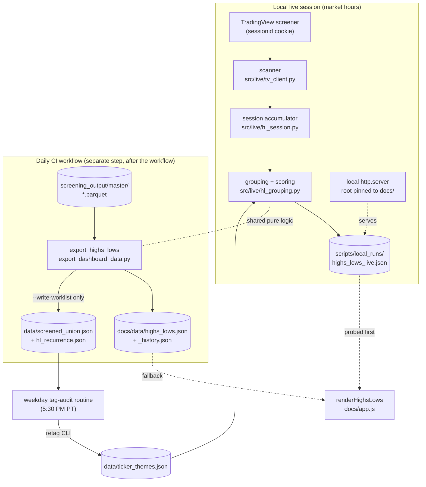
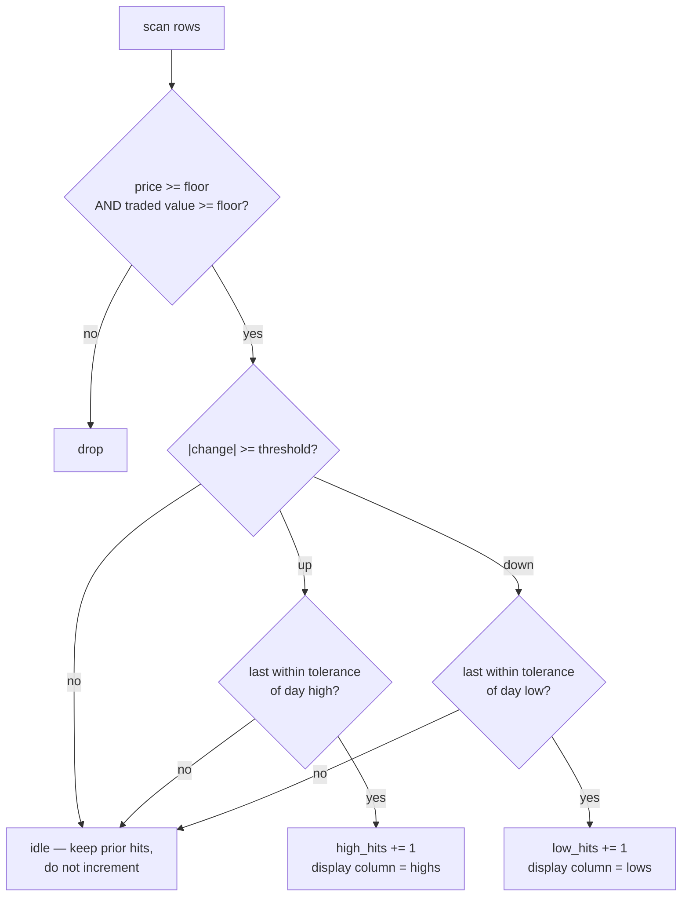
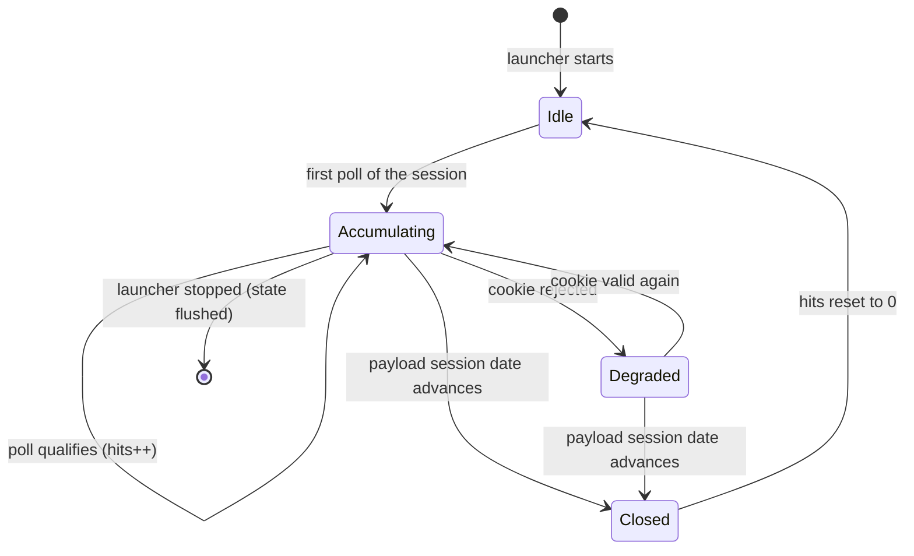

# Highs / Lows Tab - Plan

## Goal Capsule

- **Objective:** add a live "Highs / Lows" tab immediately right of Overview that reads intraday market strength and weakness — two columns of theme-grouped rows, each row carrying its member tickers, a per-ticker persistence count ("hits"), and the row's summed score.
- **Authority:** this Product Contract governs behavior. `CLAUDE.md` governs pipeline and dashboard conventions; `docs/style.css` governs visual treatment; the Verification Contract governs proof.
- **Execution profile:** one renderer, two producers. A local polling loop produces full-fidelity live data during market hours; the daily CI workflow produces an end-of-day fallback from the master parquet. One new dependency (`tradingview-screener`), one new local runtime, one new dashboard tab.
- **Stop conditions:** stop and surface if the adopted hit rule fails its back-test bar (U3), or if the recurrence gate pushes the tag-audit worklist materially beyond its current size. *(The U2 real-time gate cleared 2026-08-08.)*
- **Tail ownership:** standalone — `ce-work` owns commit, branch, and PR.

**Product Contract preservation:** restructured, no scope change to R1–R36. Added R37–R41 (tag-audit feedback loop) and revised KD-4's end-of-day producer from a TradingView call to the master parquet — both user-directed during planning. A 2026-08-08 document review further revised R1, R5, R9, R12, R18, R21, R25, R31, R35 and R37 for correctness; each change is noted at its requirement.

---

## Product Contract

### Summary

A dashboard tab that answers "where is the money going *right now*" during the session. Every ~90 seconds it scans the liquid US universe, splits it into names making new highs and names making new lows, groups them under our theme taxonomy, and scores each group by the accumulated persistence of its members. Groups sort by score, so the strongest and weakest trading narratives of the session rise to the top of their column on their own.

The tab runs live from a local launcher during market hours and falls back to an end-of-day snapshot on the public GitHub Pages dashboard. Untagged names that keep appearing feed back into the weekday tag-audit routine, so the taxonomy grows toward what the market is actually trading.

### Problem Frame

Every existing tab is a **daily** lens: the pipeline runs once at 1:30 PM Pacific, and every tab reads parquet built from completed daily bars. Nothing in the dashboard shows what is happening while the market is open. Theme rotation is often decided intraday — a group of five names all breaking together at 10:30 AM is the signal, and by the time the 1:30 PM run scores it the move is a day old.

This tab is the missing intraday lens. It is deliberately *not* structural: it does not care whether a stock is at a 52-week high, only whether it is moving hard and holding right now, and which theme its co-movers belong to.

### Reverse-Engineering Findings

The source tool was reverse-engineered from a single screenshot captured **2026-08-07 between 13:17 and 15:29 ET** (pinned via the status bar: OC at $156.93 / +4.20% is exactly the prior close 150.60 × 1.042, against an actual close of 157.10).

**The lists are session-scoped, with no multi-day structure.** Verified against 5/10/21/42/63/126/252-day highs and lows:

- SIMO appears in the *lows* column while making a 5-day daily high.
- VSH, CBRS, RMBS, MPWR, AXON, HONA and KTOS appear in the *highs* column while at a new high on **no** window, not even 5-day.
- NOC, CACI and LDOS are at 5–6 month highs and are **absent** from Aerospace & Defense.
- The 75 sampled highs-column names moved a **median +7.8% that day, 99% positive**; the 50 sampled lows-column names **median −3.8%, 94% negative**.

**A group's number is the exact sum of its members' numbers.** Semiconductors: 142+100+85+…+22 = **754**, matching the row's "754 hits". Verified on eight groups (Aerospace & Defense 740, Health Information Services 300, Software–Application 396, Gold 253, Biotechnology 216, Medical Devices 192, Engineering & Construction 191, Utilities–IPP 183). A group therefore scores on **breadth × persistence**, which is why a 15-name Semiconductors row outranks a row carrying one 159-hit name.

**The per-ticker number is dwell time, not magnitude.** It rank-correlates **+0.84 with the day's % change** and +0.76 with intraday range, but with a decisive exception: TWLO closed **+24.9% yet earned only 76 hits** because it faded to mid-range (0.52 of its daily range), while TSEM's steadier **+12.4% earned 100** holding at 0.88. Nothing in the entire screenshot exceeds **164** (FIVN), with WOLF 142, TNDM 141 and CRSR 136 clustered beneath.

**Poll cadence is bounded, not pinned.** The 164 ceiling combined with the 13:17–15:29 capture window (227–359 minutes since the open) places the source's interval at **no more than 83–131 seconds**, and only if the top name qualified on every cycle — which the clustering is consistent with but does not prove. That range excludes the 3-minute original but does not establish 90 seconds. The default is chosen inside the range, not derived to a point.

**The universe floor is dollar volume, not market cap — and the observed value is an upper bound.** Across all 129 readable tickers, that day's dollar volume bottoms at **$83.8M** (2nd percentile $99M) and price bottoms at **$5.03**. Average volume and average dollar volume show no clean edge, so the binding constraint is traded value. But the sample is drawn from names the source *displayed*, which its own display floor already truncated toward high-persistence, high-liquidity names — so $83.8M is the highest the true floor can be, not an estimate of it. The corroborating population count (a ±3% move over this universe yields **342** names against the screenshot's **328**) holds the $80M fixed and tunes only the move threshold, so it is a one-parameter fit to one number, not two independent constraints agreeing.

**Falsified definitions — do not re-tread these.** Each was tested against the observed hit counts and rejected:

| Candidate | Result |
|---|---|
| New high over an N-day daily window (N = 5…252) | Rejected — the counter-examples above |
| Count of minute bars setting a new high of day | Rejected — WOLF 142 observed vs 35 computed; MCHP 42 vs 45 |
| Minutes spent above an N-day high | Rejected — best Spearman 0.39 across all N and cutoffs |
| Minutes with last price at the running high of day | Rejected — negative rank correlation at every epsilon |
| **±3% gate AND at-day-high, sampled at poll cadence (adopted)** | **Untested — U3 back-tests it before U4–U8 build on it** |

The adopted rule is a gated variant of the fourth rejected candidate: the same at-extreme mechanic, but with a move threshold in front of it and sampled at poll cadence rather than per minute. That combination is what explains TWLO (up 24.9% but faded off its high, so it stopped accruing at 76) while the ungated version could not. It has **not** been scored against the screenshot, and U3 does that before the rest of the plan depends on it.

The source's exact membership rule is not recoverable from OHLC data alone; it likely depends on tick data or a vendor alert feed. What is recovered — and what this contract adopts — is its **semantics**: a per-poll dwell counter, capped by cycles elapsed, summed per group, over a dollar-volume-floored universe.

Note the source groups by the **Yahoo/Finviz** industry taxonomy ("Software - Infrastructure", "Utilities - Independent Power Producers"), not TradingView's, which names TEAM "Packaged Software".

### Requirements

**Data acquisition**

- R1. Each scan queries the TradingView screener for the US market in a single request, selecting at minimum: ticker, last price, % change, volume, traded value, relative volume, market cap, sector, industry, day high/low, **plus `update_mode` and `last_bar_update_time`**. Those two are not optional — KTD5's entitlement detection reads `update_mode`, and R8's session rollover reads the timestamp. Neither is derivable from price fields.
- R2. The scan authenticates with a TradingView `sessionid` cookie read from `.env`, which entitles the user's Premium subscription to real-time data.
- R3. The cookie is copied from the browser by hand. The system never performs a programmatic TradingView login — automated login triggers CAPTCHA and risks account flagging. `TRADINGVIEW_SESSIONID` is a **full account session token**, not a scoped data key: anyone holding it can act as the account, it is revoked only by logging out of TradingView, and it must never be logged, shared, or stored as a CI or repo secret.
- R4. When the cookie is absent, expired, or rejected, the scan continues against the 15-minute delayed feed and the tab states its degraded status on screen. An expired cookie never crashes the loop or produces an empty tab. Failure reasons are drawn from a **fixed enumerated set** (`auth_rejected`, `network_error`, `schema_error`, `rate_limited`) — raw exception text is never serialized or logged, because it can carry request headers and the session cookie into a file whose schema is shared with the published snapshot.
- R5. Scan parameters are configurable in `config/workflow_config.yaml`: poll interval (90s), price floor ($5), traded-value floor ($80M), move threshold (3%), live display floor (12% of cycles elapsed), end-of-day display floor (3% move), at-extreme tolerance, and the recurrence window.

**Scan semantics**

- R6. The universe for a scan is every US name with last price ≥ the price floor and today's traded value ≥ the traded-value floor.
- R7. A ticker qualifies for the **highs** list in a given poll when it is up at least the move threshold on the session **and** is printing a new high of day at that moment, where "at the day high" means within the configured at-extreme tolerance of it. The **lows** list mirrors this exactly.
- R8. Each poll in which a ticker qualifies increments its hit count by one. Hits accumulate across the session and reset at the next session open, detected from the payload's own session date rather than the local clock.
- R9. A ticker displays in only one column per session — the one it most recently qualified for — but **hits are tracked per column**, and a group's score counts only hits earned in that group's own column. Carrying a morning's high-side hits into the lows column would let a reversal day's leading lows group reflect the buying that preceded it, inverting S4.
- R10. A group's score is the sum of its member tickers' hits in that column.
- R11. Groups sort by score descending within their column; tickers sort by hits descending within their group.
- R12. Tickers below the display floor are hidden, and a hidden ticker's hits are excluded from its group's displayed score — matching the source, where displayed member numbers sum exactly to the displayed group total. In live mode the floor is a **fraction of poll cycles elapsed**, not an absolute count: an absolute floor of 20 cannot be met until ~30 minutes into the session, which would blank the tab through exactly the window it exists for. In end-of-day mode the floor is expressed in move-percent, matching that mode's per-ticker unit.

**Grouping**

- R13. A ticker groups under its theme leaf from `data/ticker_themes.json` when tagged.
- R14. An untagged ticker groups under the industry reported by the live feed for that ticker, so no qualifying mover is ever dropped.
- R15. A group row visually distinguishes theme-derived groups from industry-fallback groups, so the user can tell curated vocabulary from vendor vocabulary at a glance.
- R16. A ticker carrying more than one theme leaf appears under each, and its hits count toward each of those groups' scores. The session-strength counts in R19 count distinct tickers, not memberships.

**Display**

- R17. The tab is labelled "Highs / Lows" and sits immediately right of Overview in the tab bar.
- R18. The tab renders two columns side by side — highs left, lows right — each a list of group rows showing the group name, its summed score, and its member tickers as chips carrying ticker and hit count. Side-by-side is the source's visual identity and is preserved, which requires this tab to carry a **wider default left panel** than the dashboard's 470px floor so each column gets roughly the proven single-column width; the resize handle still lets the user trade list width for chart width.
- R19. A session-strength header shows the split between the two columns as both counts and percentages, with a proportional bar.
- R20. Highs chips render green, lows chips red, consistent with `docs/style.css`.
- R21. The display floor is adjustable from the tab without a page reload, and adjusting it re-derives visible tickers and group scores immediately. The control is labelled in the unit of the mode currently rendered — cycle-fraction live, move-percent end-of-day — because the two are not comparable.
- R22. Each column offers a one-click copy of its full qualifying ticker list to the clipboard, with a visible confirmation that the copy succeeded.
- R23. Clicking a ticker chip opens that ticker in the dashboard chart, matching every other tab.
- R24. The tab carries a time-travel bar with one entry per session, following the existing 180-calendar-day retention convention.
- R25. The tab shows the timestamp of the most recent successful scan, whether the data is real-time or delayed, **and when accumulation for the session began plus how many poll cycles it covers**. Hits are only meaningful relative to cycles elapsed, so a session launched at 11 AM must not present its compressed scores as a full session's.
- R26. The tab carries no `V`/`A` filter toggles — the traded-value floor is already stricter than the `V` threshold, following the precedent that the EP tab carries none because it screens on volume upstream.

**Live local mode**

- R27. A `launch_new_hl.bat` in `scripts/` starts the local session on double-click: it starts the polling loop, serves the dashboard over HTTP locally, and opens the browser to the tab.
- R28. The dashboard must be served over HTTP rather than opened from the filesystem, because the page acquires its data by `fetch`.
- R29. The local loop writes its output to a **gitignored** local path, never to any git-tracked tree. This follows the existing convention — `scripts/ep_scan_morning_local.bat` passes `--out-dir scripts\local_runs` for exactly this reason — and a loop rewriting a tracked file every 90 seconds would otherwise leave the working tree permanently dirty and collide with every CI publish.
- R30. The tab probes for local live data first and falls back to the published end-of-day file when absent, so the same renderer serves both modes with no conditional build. The probe uses a same-origin relative path, and is suppressed when the page is not served from localhost so the public dashboard does not emit a failed request on every load.
- R31. The page refreshes its data on the poll interval while the tab is open, without a full page reload, preserving the user's display-floor setting, scroll position, and any expanded chip-overflow toggles. This is the first tab that re-renders while being actively read.
- R32. Closing the launcher stops the loop cleanly and leaves no partially written output.

**End-of-day published mode**

- R33. The daily CI workflow writes an end-of-day version of the tab's data to `docs/data/`, so the public dashboard tab is never empty. Its purpose is post-session review of the day's strongest and weakest theme groups — deliberately bounded against the existing daily-lens tabs, which rank individual tickers rather than theme groups by breadth.
- R34. The end-of-day version scores groups from closing moves and breadth rather than hits, because hits can only be accumulated by a process that polled through the session. Its per-ticker value is the absolute close-to-close move in percent, carried in the same snapshot key so grouping and the exact-sum property work unchanged. The tab labels this scoring difference rather than presenting the two as the same metric.
- R35. The published path uses only end-of-day data derived from the daily pipeline's own master parquet. No TradingView call runs in CI, and intraday data obtained under the user's personal Premium entitlement is never committed **anywhere in the repository** — `data/` is as public as `docs/data/` and CI commits both.
- R36. Per repo convention, code-fix PRs do not include regenerated `docs/data/` files.

**Tag-audit feedback loop**

- R37. The end-of-day producer identifies qualifying movers that are untagged per `theme_registry.is_untagged` and promotes them into the tag-audit worklist at `data/screened_union.json`, merged with the screener union already written there. Qualification for this purpose uses the session's **intraday extremes as well as its close**, so a name that runs hard at the highs and fades into the close still accrues toward promotion — otherwise the population the tab surfaces and the population the gate measures would differ, and the intraday-only cohort could never be classified.
- R38. A mover is promoted only after it qualifies on at least 3 separate sessions within the trailing 10-session window. One-day gappers never reach the worklist.
- R39. The worklist's existing `{date, tickers}` contract is preserved exactly, so `tools/audit_theme_tags.py` reads it unchanged. Provenance is carried in an additive, optional key rather than by changing the shape of `tickers`.
- R40. Recurrence state persists across runs in a committed file, so the window survives the pruning of `screening_output/` and a fresh CI clone.
- R41. `CLAUDE.md` and `.claude/routines/theme_tag_audit.md` are updated to state that the worklist is now the screener union **plus** recurring untagged movers, since both currently describe it as the screener union alone.

### Key Decisions

- **KD-1. Faithful intraday replica over a structural read.** A structural alternative — "new high" meaning above the 21-session high, live — would fit Qullamaggie-style swing trading more directly and reuse indicators the dashboard already computes. The user chose the faithful replica: this tab is a session lens, and the structural lens is what the rest of the dashboard already provides. *(session-settled: user-directed — chosen over a structural or user-switchable window: the session lens is the gap in the dashboard.)* Governs R6, R7, R8.
- **KD-2. TradingView screener as the feed.** Whole-market coverage in one ~4-second unauthenticated request, returning industry and traded value directly. Verified live: 1,111 US names matched the fitted filter. Premium cookie authentication lifts the default 15-minute delay. *(session-settled: user-directed — chosen over Alpaca SIP: the user holds a TradingView Premium real-time subscription.)* Governs R1, R2.
- **KD-3. Theme grouping with industry fallback.** Theme tags cover 91% of the screenshot's movers against 52% for stored Yahoo industry metadata, but this tab ranges over the whole market while tags are curated for ~2,300 screened names, so fresh movers arrive untagged. *(session-settled: user-approved.)* Governs R13, R14, R15.
- **KD-4. End-of-day producer reads the master parquet, not TradingView.** The daily pipeline already computes `price_chg_pct0`, `close`, `high`, `low` and `volume` for the full download, so CI can build the EOD view with no new dependency, no cookie as a repo secret, and no vendor data on the public site. *(session-settled: user-directed — chosen over a delayed TradingView call in CI and over a yfinance metadata backfill.)* Governs R33, R34, R35.
- **KD-5. The tag-audit routine is the metadata backfill.** Rather than backfilling industry metadata mechanically, recurring untagged movers are promoted into the existing weekday audit worklist and classified with judgment. *(session-settled: user-directed — chosen over a yfinance industry backfill in the daily run.)* Governs R37, R38.
- **KD-6. Local live plus CI end-of-day, one renderer.** Every existing tab is already `fetch(docs/data/X.json)` → render, so live and static are not two systems — they are one renderer with two producers writing the same contract. *(session-settled: user-directed — chosen over a local-only tab with nothing published, and over CI polling through the session.)* Governs R30, R33.
- **A separate repo is unnecessary.** The tab shares the styling, the chart, the theme taxonomy, and the tab-switching machinery, and gains nothing from isolation.

---

## Planning Contract

### Key Technical Decisions

- **KTD1. New `src/live/` package, with an import-free `__init__`.** The scanner is a long-running loop with a local HTTP server — a different runtime shape from the one-shot scripts in `src/reporting/`. But `hl_session` and `hl_grouping` are pure logic shared by *both* producers, and the CI exporter imports `hl_grouping`. So `src/live/__init__.py` must not eagerly import `tv_client`. The concern is import *time*, not availability — `uv sync --locked` installs `tradingview-screener` in CI regardless — but an eager import makes a vendor schema break or an upstream API change fail the daily workflow rather than just the local tab. The alternative boundary — a shared-core package plus a runtime package — was weighed and rejected as more structure than four modules justify, on condition the `__init__` stays inert.
- **KTD2. The session accumulator is a pure, serializable object.** Qualification, hit accumulation, per-column counters and session reset are pure functions over a scan payload and prior state, with no network or filesystem access. This is what makes R6–R12 testable without a live feed, and it lets the loop persist and resume state if the launcher restarts mid-session.
- **KTD3. Local HTTP server uses stdlib `http.server` on a background thread, with a pinned document root.** No framework, no dependency, one process to start and stop. The handler is constructed with `directory=<repo>/docs` — never `os.chdir` — and the live JSON is exposed at exactly one hardcoded route resolving to the `--out-dir` file. An unpinned root would serve `.env` (TradingView, Alpaca and IBKR credentials) to any local process on `http://127.0.0.1:PORT/.env`. *(Governs R27, R28, R29, R32.)*
- **KTD4. The page probes the live URL and falls back on any failure.** `loadHighsLowsData()` fetches the local live path first; any non-OK response or parse failure falls through to the published EOD file. Same-origin relative path, suppressed off-localhost. No build flag, no environment detection, no separate local `index.html`. *(Governs R30.)*
- **KTD5. Entitlement is read from `update_mode`, not inferred.** The screener self-describes its feed. Verified 2026-08-08 against the live endpoint: unauthenticated returns `delayed_streaming_900` — 900 seconds, exactly the documented 15-minute delay — and the authenticated cookie pair returns **`streaming`**. Classification is therefore a string check on a requested field rather than a wall-clock heuristic: simpler, unambiguous, and valid outside market hours since the field describes entitlement rather than live tick flow. Treat any unrecognised value as delayed. `last_bar_update_time` provides a staleness backstop. `tools/verify_hl_feed.py` implements the check.
- **KTD6. Recurrence state is a committed JSON sidecar, not derived.** `screening_output/` is pruned to 10 sessions and never committed, and CI clones fresh, so a 10-session recurrence window cannot be derived at runtime. *(Governs R40.)*
- **KTD7. The union file gains an additive `sources` key.** `tools/audit_theme_tags.py` reads `tickers` via `payload.get("tickers", [])` and ignores unknown keys, so leaving that key's shape untouched means the audit tool, the routine, and `load_screened_union` need no change at all, while `sources` carries provenance for humans reading the diff. *(Governs R39.)*
- **KTD8. Worklist writes are opt-in, not a side effect of exporting.** `export_dashboard_data.py` is a standalone command documented in `CLAUDE.md` and run locally to verify unrelated fixes. Recurrence tracking and the union merge sit behind a `--write-worklist` flag, set only by the CI invocation, so a local export never mutates `data/screened_union.json` or `data/hl_recurrence.json`. The repo's documented cleanup (`git checkout -- docs/data/`) would not undo those. *(Governs R37, R40.)*

### High-Level Technical Design

Producer/consumer shape — two producers, one renderer, one shared JSON contract:

Per-poll qualification and accumulation (R6–R9):

Session lifecycle (R8, R32):

### Requirements Traceability

| Requirement group | Units |
|---|---|
| R1–R5 data acquisition | U1, U2 |
| R6–R12 scan semantics | U3 |
| R13–R16 grouping | U4 |
| R17–R26 display | U6 (R24's history data is produced by U7) |
| R27–R32 live local mode | U5 |
| R33–R36 end-of-day mode | U7 |
| R37–R41 feedback loop | U8 |

---

## Implementation Units

### U1. Add the screener dependency and configuration

**Goal:** `tradingview-screener` is installed and every tunable in R5 is readable from config, so later units have no hardcoded thresholds.

**Requirements:** R5, R2, R3.

**Dependencies:** none.

**Files:**
- ~~`pyproject.toml`, `uv.lock`~~ — **already done 2026-08-08**: `tradingview-screener==3.2.1` added via `uv add` (one package; its pandas/requests deps were already present)
- `config/workflow_config.yaml` — new `highs_lows:` block
- `.env.example` — document `TRADINGVIEW_SESSIONID` and `TRADINGVIEW_SESSION_SIGN`
- `config/settings.py` — load both cookies from the environment

**Approach:**
1. ~~Add the dependency.~~ Done. Note the observed version is 3.2.1 — worth recording in any future incident, since the library wraps an undocumented endpoint.
2. Add a `highs_lows:` block alongside the other tab blocks (`vars_tab:`, `radar:`) carrying `poll_seconds: 90`, `min_price: 5`, `min_traded_value: 80000000`, `move_threshold_pct: 3.0`, `display_floor_pct: 12`, `display_floor_eod_pct: 3.0`, `at_extreme_tolerance_pct: 0.15`, `recurrence_sessions: 3`, `recurrence_window: 10`, `enabled: true`.
3. Load `TRADINGVIEW_SESSIONID` and the sign cookie in `config/settings.py` next to the existing Alpaca keys. Absent is a normal state, not an error — R4 covers it. Accept both `TRADINGVIEW_SESSION_SIGN` and `TRADINGVIEW_SESSIONID_SIGN` spellings, as `tools/verify_hl_feed.py` does; the cookie is `sessionid_sign` but the shorter env name reads better and is what `.env` already uses.
4. The `.env.example` entry carries R3's warning: full account session token, revoked only by logging out, never a CI or repo secret.

**Patterns to follow:** the `radar:` and `vars_tab:` config blocks; the Alpaca key loading in `config/settings.py` and `src/reporting/ep_scan_common.py`.

**Test scenarios:**
- The `highs_lows` config block loads and every documented key is present with the defaulted value.
- A missing `TRADINGVIEW_SESSIONID` yields an empty/None value rather than raising.

**Verification:** `uv sync --locked` succeeds and the config block reads back with expected defaults.

---

### U2. TradingView scanner client

**Goal:** one function returns a normalized scan payload for the whole qualifying universe, reporting whether the feed was real-time or delayed, and never leaking the session cookie.

**Requirements:** R1, R2, R3, R4, R6, KTD5.

**Dependencies:** U1.

**Files:**
- `src/live/__init__.py` — must not import `tv_client` (KTD1)
- `src/live/tv_client.py`
- `tests/test_tv_client.py`

**Approach:**
1. Build one `Query().set_markets('america')` selecting `name`, `close`, `change`, `volume`, `Value.Traded`, `high`, `low`, `relative_volume_10d_calc`, `market_cap_basic`, `sector`, `industry`, `update_mode`, `last_bar_update_time`, with the universe floors from config applied as `where` clauses. All fourteen are confirmed available on the live endpoint (2026-08-08); `update_mode_seconds` exists but returns null and must not be relied on.
2. Pass `cookies={'sessionid': ...}` when the cookie is present. Column arithmetic is **not** supported by the library — filter on the precomputed `Value.Traded` field rather than composing `close * volume`, which raises `TypeError`.
3. Normalize each row to a plain dict keyed by bare ticker (strip the `NASDAQ:`/`NYSE:`/`AMEX:` exchange prefix the library returns on `ticker`). Return a payload-level header of `{feed, scanned_at, session_date, error_reason}` alongside the rows, with `session_date` derived from the payload timestamp in US/Eastern so U3's rollover reads it rather than the loop's local clock.
4. Classify the feed by testing whether `update_mode` starts with `delayed`; `tools/verify_hl_feed.py` already implements this and is the reference. Treat any unrecognised value as delayed — failing safe means a mislabelled banner, while failing open would silently present 15-minute-old prices as live.
5. Map every caught exception to one of the enumerated reasons in R4. Never serialize or log raw exception text, request headers, or the cookie value — HTTP client exceptions routinely embed the request URL and sometimes the cookie jar, and this payload's schema is shared with the published snapshot.

**Execution note:** this unit's stop condition has **already cleared** — `tools/verify_hl_feed.py` returned PASS on 2026-08-08 (`streaming` vs the `delayed_streaming_900` baseline), so A4 is resolved and U3 onward may proceed. Keep the script as a regression check: re-run it whenever the tab reports delayed unexpectedly, which is the signature of an expired cookie.

**Patterns to follow:** `_alpaca_get` / `_fetch_alpaca_bars` in `src/reporting/ep_scan_common.py` for the credentialed-fetch-with-graceful-degradation shape.

**Test scenarios:**
- A stubbed screener response normalizes to bare tickers with the exchange prefix stripped (`NASDAQ:WOLF` → `WOLF`).
- Universe floors are applied — rows below the price floor or the traded-value floor are absent from the result.
- The payload header carries `session_date` derived from the payload timestamp in US/Eastern, not from the local clock.
- With no cookie configured, the client still returns rows and classifies the feed as delayed.
- A rejected/expired cookie returns rows classified delayed with reason `auth_rejected`, and does not raise.
- A network exception returns an empty payload with reason `network_error`, not an exception.
- The `sessionid` value never appears in the returned payload or in captured log output, including when the underlying exception text contains it.
- Feed classification returns real-time when the update-mode field and timestamp agree, delayed otherwise.

**Verification:** an authenticated scan during market hours returns >500 rows and classifies as real-time; the same call with the cookie removed classifies as delayed.

---

### U3. Session accumulator

**Goal:** a pure, serializable object that turns a sequence of scan payloads into per-column hit counts, validated against the source screenshot before anything builds on it.

**Requirements:** R6, R7, R8, R9, KTD2.

**Dependencies:** U2.

**Files:**
- `src/live/hl_session.py`
- `tests/test_hl_session.py`
- `tools/backtest_hl_rule.py` — the back-test harness

**Approach:**
1. `HLSession` holds the session date and a map of ticker → `{high_hits, low_hits, column, last_price, change_pct, day_high, day_low, traded_value, industry}`, plus session-level `coverage_start` and `cycles` for R25.
2. `apply(payload)` evaluates each row against R7 and increments the counter for the qualifying column by exactly one, regardless of how far the name moved. `column` is set to the most recently qualifying side (R9), but the opposite side's counter is left untouched.
3. "At the extreme" uses `at_extreme_tolerance_pct` from config. Too tight and hits collapse toward zero; too loose and every name up 3% qualifies every poll and the persistence-vs-magnitude distinction disappears. The default is a starting point, not a derived value — the non-degeneracy test below is what defends it.
4. `to_dict()` / `from_dict()` give the loop crash-resume and let U5 flush state on shutdown.
5. Session rollover: a payload whose `session_date` differs resets all counters to zero and restarts `coverage_start`.
6. **Back-test gate.** `tools/backtest_hl_rule.py` resamples 2026-08-07 1-minute bars to the configured poll cadence, replays R7's exact rule, and reports Spearman correlation against the screenshot's ~50 observed hit counts. The adopted rule must clear **ρ ≥ 0.6** — comfortably above the 0.39 that got "minutes above an N-day high" rejected, and below the 0.84 that raw % change achieves without capturing persistence. If it fails, stop and surface rather than proceeding to U4.

**Execution note:** run the back-test before implementing U4. It is cheap (one script over cached bars) and it is the only check on whether the reconstruction is sound.

**Patterns to follow:** the snapshot-builder shape of `_build_volume_snapshot` in `src/reporting/export_dashboard_data.py` — build a plain serializable dict, no side effects. `tests/backtest_radar.py` for back-test harness shape.

**Test scenarios:**
- A row up 5% and at its day high increments `high_hits` by one; applying the same payload twice yields two.
- A row up 5% but 2% below its day high does not increment — the TWLO fade case that distinguishes persistence from magnitude.
- A row up 2% (below threshold) and at its day high does not increment.
- A row down 4% at its day low increments `low_hits` and sets column to lows.
- A ticker with 120 `high_hits` that later qualifies for lows has `low_hits == 1`, column lows, and `high_hits` still 120 — the lows column scores it as 1.
- A last price a hair below the day high, inside tolerance, still counts as at-extreme.
- Non-degeneracy at the configured tolerance: over a synthetic 100-payload session the qualifying-per-poll rate for up-movers sits strictly between collapse and saturation, and the steady mover still outscores the fader.
- Applying a payload with a new `session_date` resets every counter and `coverage_start`.
- `from_dict(to_dict(session))` round-trips counters, columns and metadata exactly.
- Hit counts never exceed the number of payloads applied — the ceiling property observed in the source.
- The back-test harness reports a Spearman value against the screenshot's observed counts.

**Verification:** the back-test clears ρ ≥ 0.6; replaying a synthetic 100-payload session produces counts bounded by 100 with the steady mover outscoring the fader.

---

### U4. Grouping and scoring

**Goal:** turn an accumulated session into ranked group rows under the theme taxonomy, with industry fallback and the display floor applied.

**Requirements:** R10, R11, R12, R13, R14, R15, R16.

**Dependencies:** U3.

**Files:**
- `src/live/hl_grouping.py`
- `tests/test_hl_grouping.py`

**Approach:**
1. Load `data/ticker_themes.json` once per process; for each ticker emit one membership per theme leaf (R16), falling back to the scan row's `industry` when `theme_registry.is_untagged` reports the ticker untagged (R14).
2. Tag each group with its origin (`theme` or `industry`) so U6 can render R15's distinction.
3. Resolve the display floor for the mode: live mode derives an absolute hit threshold as `ceil(display_floor_pct/100 × cycles_elapsed)`; end-of-day mode uses `display_floor_eod_pct` against the move-percent value. Apply it **before** summing (R12) — drop sub-floor tickers, then sum the survivors into the group score. This is what makes displayed member numbers sum exactly to the displayed group total.
4. A group's score sums only the counter matching its own column (R9).
5. Sort groups by score descending, tickers by hits descending (R11).
6. Emit the snapshot dict: `{report_date, scanned_at, coverage_start, cycles, feed, error_reason, scoring_mode, highs: [...], lows: [...], counts: {...}, catchall_share}`. Ship it **unfiltered** so U6's floor control is instant and needs no refetch.

**Patterns to follow:** `theme_registry.is_untagged` and `filter_untagged` in `src/themes/theme_registry.py`; `theme_taxonomy.resolve_l1` for defensive display-layer parsing; `_build_radar_snapshot` for snapshot shape.

**Test scenarios:**
- A tagged ticker groups under its theme leaf, marked theme-origin.
- An untagged ticker groups under its scan-row industry, marked industry-origin.
- A ticker carrying two theme leaves appears under both, and its hits count toward both group scores.
- A ticker whose only tag is `Uncategorized` takes the industry fallback; one whose only tag is `Singleton` does not, matching `is_untagged`.
- Displayed member hits sum exactly to the displayed group score, at floor 0 and at the default floor, in both scoring modes.
- The live floor scales with cycles: at cycle 5 it admits tickers an absolute floor of 20 would hide, and at cycle 164 it resolves to ~20.
- Raising the floor removes sub-floor tickers and lowers their group's score correspondingly, and may reorder groups.
- A group in the lows column scores from `low_hits` only, even when its members carry larger `high_hits`.
- A ticker with no theme tag and no industry lands in a named catch-all group rather than being dropped, and contributes to `catchall_share`.

**Verification:** grouping a synthetic session reproduces the exact-sum property at every floor setting and in both modes.

---

### U5. Live loop, local server, and launcher

**Goal:** a double-clickable launcher that polls, writes the live JSON to a gitignored path, serves the dashboard safely, and shuts down cleanly.

**Requirements:** R27, R28, R29, R31, R32, KTD3.

**Dependencies:** U4.

**Files:**
- `src/live/hl_serve.py`
- `scripts/launch_new_hl.bat`
- `tests/test_hl_serve.py`

**Approach:**
1. `hl_serve.py` takes `--out-dir` (default `scripts/local_runs`), `--port`, and `--poll-seconds`, mirroring the `--out-dir` convention `ep_scan_morning.py` established for local runs. Refuse any `--out-dir` resolving inside a git-tracked tree — `docs/data/` and `data/` both, since CI commits both.
2. Poll loop on a background thread: scan → `session.apply` → group → write JSON atomically (temp file in the same directory, then replace) so a mid-write fetch never reads a truncated file.
3. `http.server` with the handler constructed as `directory=<repo>/docs` — never `os.chdir` — bound to loopback, exposing the live JSON at exactly one hardcoded route resolving to the `--out-dir` file. Reject anything resolving outside those two.
4. Open the browser to the tab on startup.
5. Handle `KeyboardInterrupt` / console close: stop the loop, flush session state, exit non-zero only on real failure.
6. The `.bat` sets `PYTHONPATH=.`, locates the repo via `%~dp0`, and invokes through `uv run` — the repo's documented invocation. The existing `ep_scan_morning_local.bat` hardcodes a stale absolute path and a system Python; do not copy those parts.

**Execution note:** mostly runtime wiring — prefer a launch-and-observe smoke check over unit coverage for the server and browser-open paths, except the path-traversal tests below, which must be real.

**Patterns to follow:** `scripts/ep_scan_morning_local.bat` for launcher shape and the `--out-dir` gitignored-sandbox convention.

**Test scenarios:**
- `/.env`, `/data/ticker_themes.json`, and `/../.env` all return 404 against the running server.
- The live JSON route returns the `--out-dir` file and no other path resolves to it.
- The writer produces a complete parseable JSON file; no partial file is observable mid-write.
- A scan failure mid-session leaves the last good JSON in place rather than truncating it.
- `--out-dir` pointed at `docs/data` or `data` is refused.
- `Test expectation:` the browser-open path is covered by the launch smoke check, not unit tests.

**Verification:** double-clicking `launch_new_hl.bat` during market hours opens a populated tab within one poll interval, and `git status` is clean afterward.

---

### U6. Dashboard tab

**Goal:** the "Highs / Lows" tab renders both columns from either producer, with a working floor control, copy buttons, chart click-through, and the feed banner.

**Requirements:** R17–R26, R30, R31, KTD4.

**Dependencies:** U4.

**Files:**
- `docs/index.html` — tab button right of Overview, `content-highslows` pane with a chart area and resize handle
- `docs/app.js` — data URLs, `loadHighsLowsData`, `renderHighsLows`, chart registration, click routing
- `docs/style.css` — two-column layout, wider default panel, chips, strength bar, floor control
- `tests/test_dashboard_highs_lows.py`

**Approach:**
1. Add the tab button immediately after `tab-macro` in `docs/index.html:42` and a matching `.tab-content` pane. The pane carries a `time-travel-bar` with a `time-travel-dates` container and **no** `tt-filters` block (R26), plus a right-hand `chart-area` with `id="highslows-chart-area"` and a `resize-handle`, mirroring the `content-volume` markup.
2. Wire chart click-through properly — three separate steps, all required:
   - register the tab id in `activeCharts` (`docs/app.js:52`),
   - add the pane's branch to the pane-id → tab-id chain in `initTickerClicks` (`docs/app.js:211`), which ends in `else return;` and will otherwise swallow every chip click silently,
   - include the `highslows-chart-area` element `openChart` requires.
3. Give this tab a wider default left panel than the shared 470px floor so two side-by-side columns each get roughly the proven single-column width. `CLAUDE.md` records that a ~250px panel forced the VARS tab off tables into wrapping chip rows; halving 470px would reproduce that. The resize handle still lets the user trade width for chart.
4. Clamp each group's chip row to a fixed line count with a measured `+N more` toggle, reusing the radar leaf pattern (`--radar-chip-rows`, `syncRadarClamps`) — a 15-member group like Semiconductors otherwise blows out the column. Resync from the same tab-switch, resize-handle, `window.resize` and `ResizeObserver` hooks radar uses, plus on floor change.
5. `loadHighsLowsData` fetches the live URL first (same-origin relative, suppressed off-localhost), falling back to `data/highs_lows.json` on any non-OK or parse failure, then merges `highs_lows_history.json` for time travel as `loadThemeData` does.
6. Pass every scan-row string — group name from the industry fallback, ticker, feed and error labels — through the existing `escHtml` / `escAttr` helpers before it enters an `innerHTML` template. This is the first tab whose row labels come from an external vendor rather than `theme_taxonomy.yaml`.
7. The floor control re-derives visible chips and group scores client-side from the unfiltered snapshot, and is labelled in the current mode's unit (cycle-fraction live, move-percent EOD) per R21.
8. On the poll-interval refresh, preserve scroll position, expanded `+N more` toggles, and the floor setting (R31).
9. Banner shows scan time, coverage start, cycles accumulated, and real-time/delayed — or the EOD label and scoring mode when the fallback file is in use.

**Patterns to follow:** `loadThemeData` (`docs/app.js:690`) for the current+history fetch pair; `renderTimeTravelBar` (`docs/app.js:926`); `syncRadarClamps` (`docs/app.js:1768`) for the chip clamp; the `content-volume` pane markup (`docs/index.html:439`) minus the `tt-filters` block.

**Test scenarios:**
- The tab button exists, sits immediately after the Overview button, and its `data-tab` matches the pane id.
- The pane carries a time-travel dates container, a `highslows-chart-area`, and no `tt-filter-btn` elements.
- The tab id is registered in the `activeCharts` map **and** appears in the `initTickerClicks` pane-id routing chain.
- Ticker chips use the `tn-link` class.
- An industry string containing markup renders inert rather than as HTML.
- `Test expectation:` layout, floor control, clamp behavior and copy buttons are verified by launching the dashboard against a fixture snapshot, matching how `tests/test_dashboard_chart_config.py` asserts structure rather than rendering.

**Verification:** loading the dashboard against a fixture snapshot renders both columns; the floor control changes visible chips and group scores together; clicking a chip opens the chart; a poll refresh leaves scroll position and expanded toggles intact.

---

### U7. End-of-day export

**Goal:** the daily workflow publishes an EOD snapshot in the same shape, built from the master parquet with no external call.

**Requirements:** R33, R34, R35, R36, and R24's history data (the time-travel bar itself is U6's).

**Dependencies:** U4.

**Files:**
- `src/reporting/export_dashboard_data.py` — `_build_highs_lows_snapshot`, `export_highs_lows`, call site in `export_all`
- `tests/test_export_highs_lows.py`

**Approach:**
1. Read the per-day master parquet and select rows where `close >= min_price`, `close * volume >= min_traded_value`, and the session qualified on **either** its close **or** its intraday extremes: `abs(price_chg_pct0) >= move_threshold_pct/100`, or `high/prev_close - 1 >= threshold`, or `low/prev_close - 1 <= -threshold`. The intraday legs are what let R37's recurrence gate see the same population the live tab shows. `price_chg_pct0` is a fraction, not a percentage — convert once, explicitly.
2. Exclude index and benchmark rows. `create_master_table.py` seeds the table with `daily_price['^GSPC']` relabelled `ticker = 'SPX'`, and this is the first export to read the frame raw — `_build_radar_snapshot` intersects with the theme map first and dodges it incidentally. An unexcluded SPX would surface as a mover on any 3% index day and then accumulate toward the tag-audit worklist.
3. Per-ticker value is the absolute close-to-close move in percent (R34), carried in the same snapshot key so U4's grouping and the exact-sum property work unchanged. Mark `scoring_mode` so U6 can label it.
4. Industry fallback in CI comes from `data/ticker_company_metadata.json`. That cache is warmed only for screened tickers — roughly 1,600 entries against an ~8,000-ticker download — so a substantial share of whole-market EOD movers will land in the catch-all. Report `catchall_share` in the snapshot so the gap is visible on the tab rather than silent.
5. Iterate the per-day master parquet files inside the 180-calendar-day window and rewrite `highs_lows_history.json` from scratch each run, matching `export_radar` / `export_volume`.
6. Call `export_highs_lows` from `export_all` **before** `prune_screening_output`, for the same reason `export_radar` carries that constraint.

**Patterns to follow:** `export_radar` / `_build_radar_snapshot` (`src/reporting/export_dashboard_data.py:1287`) for the history-window rebuild and pre-prune ordering; `_history_cutoff` for the cutoff anchored to the newest available session.

**Test scenarios:**
- Universe floors are applied against master-parquet columns; a row below the price or traded-value floor is excluded.
- `price_chg_pct0` is read as a fraction — 0.031 qualifies against a 3% threshold, 0.029 does not.
- A row that closed +1% but whose `high` was +8% off the prior close qualifies via the intraday leg.
- An `SPX` row at −4% is not emitted into either column.
- Both a strong up-mover and a strong down-mover land in their respective columns.
- The emitted snapshot shape matches U4's live shape, key for key, with `scoring_mode` set to end-of-day.
- An untagged mover present in `ticker_company_metadata.json` groups under that industry; one absent lands in the catch-all and is counted in `catchall_share`.
- History is rebuilt from scratch and carries only sessions inside the 180-day window.
- The export runs before `prune_screening_output` in `export_all`.

**Verification:** a local `export_dashboard_data` run writes both JSON files with a plausible session population; `git checkout -- docs/data/` afterward per R36.

---

### U8. Tag-audit feedback loop

**Goal:** recurring untagged movers reach the weekday audit routine's worklist without changing the contract the audit tool reads, and without local runs mutating tracked state.

**Requirements:** R37, R38, R39, R40, R41, KTD6, KTD7, KTD8.

**Dependencies:** U7.

**Files:**
- `src/reporting/export_dashboard_data.py` — `--write-worklist` flag, recurrence tracking, union merge
- `data/hl_recurrence.json` — new committed state file
- `CLAUDE.md`, `.claude/routines/theme_tag_audit.md` — worklist description
- `.github/workflows/daily-screening.yml` — pass `--write-worklist` on the export step
- `tests/test_hl_recurrence.py`

**Approach:**
1. Gate everything in this unit behind `--write-worklist`, default off (KTD8). Only the CI invocation sets it.
2. Collect qualifying movers (R37's widened definition) that are untagged per `theme_registry.is_untagged` against `data/ticker_themes.json`.
3. Update `data/hl_recurrence.json`: append today's session date to each untagged mover's list, prune entries outside the trailing 10-session window, and drop tickers that have since been tagged.
4. Promote tickers with ≥ `recurrence_sessions` (3) appearances in the window.
5. Merge promotions into `data/screened_union.json`: union the promoted tickers into `tickers`, preserve `date`, add an additive `sources: {screeners: [...], highs_lows: [...]}` key. **`tickers` keeps its exact existing shape** so `load_screened_union` and `tools/audit_theme_tags.py` need no change.
6. Update `CLAUDE.md`'s data-store table and `.claude/routines/theme_tag_audit.md`'s worklist note — both currently describe the union as the screener union alone (R41).

**Approach note on ordering:** `consolidate_screener_results` writes the union inside `run_daily_workflow.py`; `export_dashboard_data.py` then runs as a **separate CI step afterwards** (`.github/workflows/daily-screening.yml:51`), not as a step inside the workflow. This unit therefore *amends* an existing file rather than writing it, and must amend idempotently. CI commits `data/` as well as `docs/data/` (`daily-screening.yml:62`), so both the merged union and `data/hl_recurrence.json` land on main. `.gitignore`'s `data/` rules are file-specific, so no new allowlist entry is needed.

**Patterns to follow:** `consolidate_screener_results` in `run_daily_workflow.py:102` for the union file's contract; `theme_registry.is_untagged` for the untagged test.

**Test scenarios:**
- A default `export_all()` run without `--write-worklist` leaves `data/screened_union.json` and `data/hl_recurrence.json` byte-identical.
- A mover appearing in 1 or 2 sessions of the window is not promoted; 3 promotes.
- A mover that qualified only on its intraday extremes still accrues appearances.
- A mover that appeared 3 times but is now tagged is dropped from the recurrence file and not promoted.
- Appearances older than the 10-session window are pruned and stop counting.
- The merged union preserves every screener ticker and the original `date`, and `tickers` stays a flat sorted list of strings.
- `tools/audit_theme_tags.py` reads the merged file and reports the promoted tickers as `[UNTAGGED]`.
- Running the merge twice over the same session is idempotent.
- A missing or malformed `hl_recurrence.json` is treated as empty state rather than raising.

**Verification:** `uv run python tools/audit_theme_tags.py` against a merged union lists promoted movers under `[UNTAGGED]` and still exits 0 when there are no `[BUG]` findings.

---

## Verification Contract

- `uv run python -m unittest discover -s tests` passes.
- `uv run python tools/audit_theme_tags.py` exits 0 (no `[BUG]` findings) after the U8 merge.
- The U3 back-test clears ρ ≥ 0.6 against the screenshot's observed hit counts.
- `uv run python tools/verify_hl_feed.py` exits 0 during market hours with the cookie in `.env`.
- `/.env` and `/../.env` return 404 against the running local server.
- `scripts/launch_new_hl.bat` opens a populated tab within one poll interval and leaves `git status` clean.
- A local `export_dashboard_data` run without `--write-worklist` leaves `data/` untouched.
- Displayed member hits sum exactly to the displayed group score at every display-floor setting, in both scoring modes.

## Definition of Done

- The tab renders live during market hours from the local launcher and from the published EOD snapshot otherwise, with the feed state and coverage window labelled correctly in both.
- All 41 requirements are implemented or explicitly deferred in Open Questions.
- The tag-audit worklist carries recurrence-gated movers, and `CLAUDE.md` plus the routine doc describe it accurately.
- The Verification Contract passes end to end.
- No TradingView call exists in any CI workflow, and no intraday-derived data is committed anywhere in the repository.

---

## Risks & Dependencies

- ~~The real-time claim is unverified (A4).~~ **Cleared 2026-08-08** — the authenticated feed reports `streaming`. What remains is operational, not architectural: the cookie can expire (A3), and a silently-delayed feed must surface on the tab rather than in a log.
- **The adopted hit rule is unvalidated (A2).** It is a gated variant of a rule that failed ungated. U3's back-test gate is what turns that from an assumption into a measurement, and it runs before U4.
- **The `sessionid` cookie's lifetime is unknown (A3).** R4's degraded path bounds the damage to a labelled delayed feed.
- **Polling cadence may trip rate limits or account review.** Roughly 260 authenticated scanner calls per session day under a personal Premium cookie is a materially different pattern from interactive use. If TradingView flags the account, the user loses both the tab and the paid tool it depends on. On repeated `rate_limited` or `auth_rejected` responses the loop backs off to the unauthenticated delayed feed and surfaces the degraded banner rather than retrying at cadence.
- **The library wraps an undocumented endpoint.** TradingView can change the scanner's schema or field names without notice. U2 returns an empty payload with an enumerated reason rather than raising, so a schema break degrades the tab instead of the workflow — but the reason must be **visible on the tab**, not just logged. This is the same failure class as the Finviz ticker-mangling bug in `CLAUDE.md`, which stayed hidden for three weeks precisely because it failed quietly.
- **Worklist growth is bounded by the recurrence gate, not by design.** If the gate lets through more than a few names a day, the audit routine's uncapped Phase 4 will feel it. Carried as a Goal Capsule stop condition.
- **`tests/test_dashboard_chart_config.py` invariants are untouched** — this plan adds no chart study and must not alter the `studies` array.

## Assumptions

- **A1.** The poll interval defaults to 90 seconds, chosen inside the 83–131s range the ceiling argument bounds rather than derived to a point. Configurable per R5.
- **A2.** The ±3% move threshold reproduces one screenshot's population (342 modelled vs 328 observed) but is a one-parameter fit, not a proven rule.
- **A3.** The TradingView `sessionid` cookie is long-lived enough for practical daily use. Actual lifetime unverified.
- **A4. RESOLVED 2026-08-08.** An authenticated Premium session does lift the screener's delay: `update_mode` reads `delayed_streaming_900` unauthenticated and **`streaming`** with the cookie pair, verified via `tools/verify_hl_feed.py`. Because the field describes entitlement rather than live tick flow, the result holds outside market hours. Verified with `sessionid` **and** `sessionid_sign` together; whether either alone suffices was not isolated.
- **A5.** The master parquet's ~8,000-ticker download covers the qualifying universe adequately for the EOD view. The live view is whole-market via TradingView, so the two populations may differ slightly.
- **A6.** The $80M traded-value floor is fitted from a display-truncated sample and is therefore an **upper bound** on the true floor. It may be too high, excluding movers the source would have shown. Re-check the sensitivity once live sessions are observed.
- **A7.** The EOD industry fallback covers only the screened-ticker profile cache, so roughly half of whole-market EOD movers land in the catch-all group. The live path has full coverage from the scan row, so the two producers agree on shape but not on grouping fidelity. `catchall_share` makes this visible rather than silent.

## Non-Goals

- Audio alerts on list entry (the source's speaker control).
- Any multi-day or structural high mode, including a window selector.
- Replayable intraday history *within* a session — current state plus one end-of-day snapshot per day.
- Changes to the existing daily pipeline's scoring, screeners, or theme taxonomy.
- Reproducing the source's exact hit rule, which is not recoverable from available data.
- Triggering the tag-audit routine from CI. The loop is a data contract, not an RPC — see Q4.

### Deferred to Follow-Up Work

- The tag-audit routine's cron is `30 0 * * 1-5` UTC, which fires Sunday–Thursday evenings Pacific rather than the Monday–Friday its own doc describes. Tracked separately; it affects the loop's latency but not its correctness.

## Success Criteria

- **S1.** During market hours, the local launcher opens to a populated tab within one poll interval of a double-click, with no manual steps beyond having the cookie in `.env`.
- **S2.** On a session resembling 2026-08-07, the tab's qualifying population lands within roughly 10% of the ~330 names the fitted spec predicts. This confirms the implementation matches the fit; it does not confirm the fit is right, which is A2 and A6's job.
- **S3.** Displayed member hits sum exactly to their displayed group score, at any display-floor setting.
- **S4.** A group visibly leading its column corresponds to a theme the user recognises as that session's real mover in that direction — the tab's actual job.
- **S5.** A local session leaves `git status` clean.
- **S6.** With no local session running, the public dashboard tab renders the most recent end-of-day snapshot and says so.
- **S7.** Within two weeks, movers that recur under R37's qualification appear as classified tags rather than industry-fallback groups.

## Open Questions

- **Q1.** Should a group's score weight breadth and persistence separately? Pure summation lets one high-hit name outweigh four moderate ones, which reads as one stock rather than a theme move. Deferred until the tab has been used on live sessions.
- **Q2.** Does the ±3% threshold hold across regimes? On a high-volatility session it may admit far more than ~330 names. A breadth-adaptive threshold is possible but unproven.
- **Q3.** Should end-of-day snapshots feed anything upstream — the L1 Radar, the daily report — or remain display-only?
- **Q4.** If the recurrence gate proves too slow a feedback path, the routine *can* be fired on demand via `POST /v1/code/triggers/trig_012HE215YzcQ9x3fw4qzXf3y/run`. That needs a claude.ai credential as a repo secret and couples routine firing to CI success, so it is deliberately out of scope — recorded so the option is not re-researched.
- **Q5.** What promotion rate is too low? The Goal Capsule carries a stop condition for too many promotions but no signal for too few, and a near-zero rate would mean KD-5's bet that the audit routine is the metadata backfill is not paying off.
- **Q6.** When a live session is running and the user time-travels to a prior date, should the banner report the live producer's feed state or the historical entry's scoring mode?

## Sources & Research

- Screenshot analysis and empirical fitting performed in-session against yfinance daily and 1-minute bars, 2026-08-07.
- `tradingview-screener` verified live: unauthenticated query returned 1,111 US names in ~4s for the fitted universe filter.
- Real-time-vs-delayed behavior: [TradingView-Screener discussion #42](https://github.com/shner-elmo/TradingView-Screener/discussions/42) — cookies required for entitlement-level data.
- [TradingView-Screener README](https://github.com/shner-elmo/TradingView-Screener/blob/master/README.md) — `get_scanner_data(cookies={'sessionid': ...})`; programmatic login risks CAPTCHA and account flagging.
- Document review 2026-08-08: 7 personas (coherence, feasibility, product-lens, design-lens, security-lens, scope-guardian, adversarial). 18 findings applied.
- Feed probe 2026-08-08 against the live endpoint: `update_mode`, `time`, `last_bar_update_time`, `pricescale`, `market`, `type`, `subtype` all available; `update_mode_seconds` present but null.
- **Entitlement verified 2026-08-08** via `tools/verify_hl_feed.py`: unauthenticated `update_mode = delayed_streaming_900`; authenticated with the `sessionid` + `sessionid_sign` pair, `update_mode = streaming`. 500 rows returned on both. A4 resolved, KD-2 confirmed.
