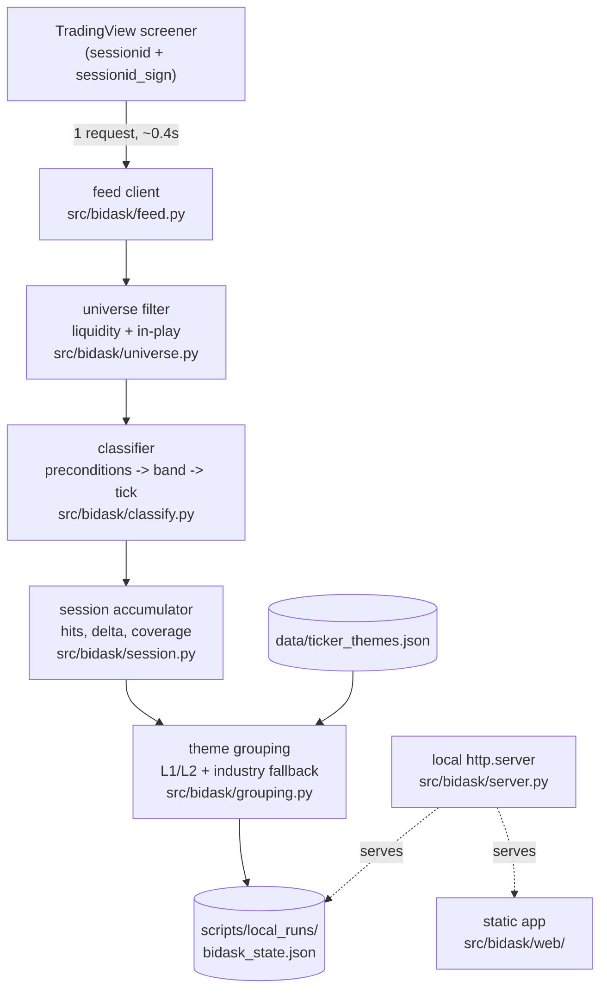
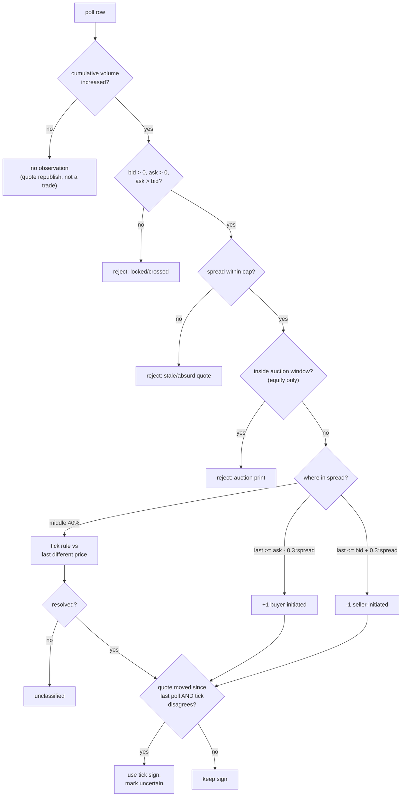
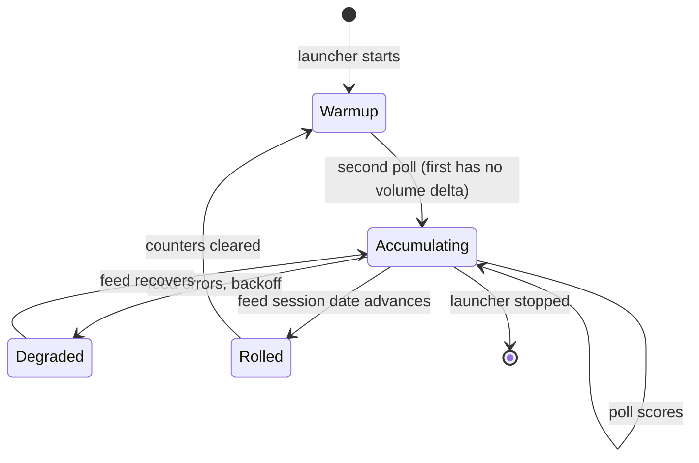

# Bid/Ask Tape Pressure Dashboard - Plan

## Goal Capsule

- **Objective:** a standalone local app that reads the tape's strength and weakness live — polling authenticated TradingView quotes, classifying each observation as buyer- or seller-initiated, accumulating pressure per ticker since session start, and splitting the market into a strong-tape column and a weak-tape column grouped under the existing L1/L2 theme taxonomy.
- **Authority:** this plan governs. `CLAUDE.md` governs repo conventions; `docs/style.css` governs visual language. The trade-classification rules in KTD2/KTD3 are grounded in published market-microstructure method and must not be simplified away.
- **Execution profile:** new self-contained package plus its own static frontend and local HTTP server. Shares only `data/ticker_themes.json` and the CSS design tokens with the existing dashboard; touches no existing pipeline code.
- **Stop conditions:** stop and surface if equity `bid`/`ask` remain null during US market hours (the whole equity path depends on them), or if classification coverage falls below 50% of polls.
- **Tail ownership:** standalone — `ce-work` owns commit, branch, and PR.

---

## Problem Frame

The existing dashboard is a daily lens — one pipeline run at 1:30 PM Pacific, every tab built from completed daily bars. It cannot answer "which themes are being *bought* right now."

Price-based intraday measures were tested against a competitor tool's published output and all failed: new-high counting, bar-over-bar higher highs, dwell-above-threshold, and ranked leaderboards each either produced near-constant values across tickers or were dominated by plain % change (see `docs/plans/2026-08-07-001-feat-highs-lows-tab-plan.md` for the full falsification record).

Order flow is the mechanism underneath price rather than a restatement of it. A live probe confirmed this empirically: over a 4-minute window with prices essentially flat (all moves under ±0.15%), per-symbol ask-hit rates spanned 33%–88%, and the rate correlated only ρ 0.24 with the price move. That is the property every price-derived candidate lacked — it measures pressure *before* it becomes price.

## Requirements

**Universe and filters**

- R1. Every filter is configurable without editing code: today's dollar volume (default ≥ $1M), average dollar volume (default ≥ $10M), average share volume (default ≥ 750K), and the averaging window.
- R2. The averaging window is selectable from what the feed actually populates — 10, 30, 60, or 90 days — defaulting to 30. TradingView's `average_volume_20d_calc` field exists but returns null, so the requested 20-day window is not obtainable from this feed.
- R3. Dollar-volume filters that the feed cannot express server-side (the library rejects column arithmetic) are applied client-side after fetch, without a second request.
- R4. An "in play" gate narrows the polled universe to what is worth displaying: relative volume ≥ 1.5 **or** absolute change ≥ 3%, both configurable and independently disableable.

**Classification**

- R5. A ticker produces at most one classified observation per poll, and only when its cumulative session volume increased since the previous poll — proof a trade actually printed rather than a quote merely being re-published.
- R6. An observation is buyer-initiated when the last price sits within 30% of the spread below the ask, and seller-initiated when it sits within 30% of the spread above the bid. Exact equality against the quote is never used: sub-penny price improvement means an exact test would essentially never fire on US equities.
- R7. Prints inside the middle 40% of the spread are classified by the tick rule — compared against the most recent *different* last price — and left unclassified when no different prior price exists.
- R8. When the quote changed between polls and the tick rule contradicts the quote rule, the tick rule wins and the observation is marked uncertain. This is the mitigation for quote-drift inversion (KTD3), the dominant failure mode.
- R9. An observation is rejected outright when the market is locked or crossed (`ask <= bid`), when either side is missing or non-positive, or when the spread exceeds a configurable cap relative to the midpoint.
- R10. Equity observations are rejected during the opening auction window (first 15 minutes) and closing window (last 5 minutes), when quotes do not meaningfully bracket auction prints. Crypto trades continuously and is exempt.
- R11. Buyer-initiated means the offer was lifted, which is **buying** pressure and renders green. Seller-initiated means the bid was hit, which is **selling** pressure and renders red. This mapping is asserted by a dedicated test.

**Accumulation and scoring**

- R12. Per ticker the app accumulates, since session start: ask-side hit count, bid-side hit count, and a volume-weighted delta that signs each poll's volume increment.
- R13. The volume increment per poll is winsorized at a configurable cap so a single block or auction print cannot dominate a session.
- R14. The app reports a normalized imbalance ratio per ticker alongside raw counts, because a fixed poll cadence gives every ticker the same number of observations — raw counts partly measure cadence rather than flow and are not comparable across tickers on their own.
- R15. When the count-based and volume-weighted signals disagree in sign for a ticker, the app flags it. That divergence is the single-print-artifact detector.
- R16. The app reports classification coverage — the share of polls that produced a usable observation — so a degraded feed is visible rather than silent.
- R17. Accumulators reset when the session date changes, detected from feed data rather than the local clock.

**Display**

- R18. Tickers split into two columns: strong tape (ask hits exceed bid hits) on the left, weak tape on the right, each sorted by the margin between them.
- R19. Each ticker shows its ask and bid hit counts.
- R20. Tickers group under their L1/L2 theme leaf from `data/ticker_themes.json`, falling back to the feed's industry when untagged. Groups sort by summed member margin so the strongest themes rise to the top of each column.
- R21. Each ticker carries a new-high or new-low badge when its last price exceeds its 1-month, 3-month, 6-month, or 52-week extreme, showing the longest horizon satisfied. No feed flag exists for this; it is computed from the high/low fields.
- R22. A market-wide pressure header shows the split between ask-side and bid-side observations across the whole universe, as counts and percentage with a proportional bar.
- R23. A display floor hides tickers below a configurable minimum hit count, and a per-column cap bounds how many render.
- R24. The interface reuses the existing dashboard's visual language — the `:root` design tokens from `docs/style.css`.
- R25. The app never presents its output as a measured share of buying volume. Labels state it is an approximation, because the method has known systematic bias (KTD3) and its accuracy is unquantified on this data shape.

**Crypto**

- R26. A crypto tab runs the same pipeline against the crypto screener, working outside US market hours. It is a permanent feature, not a test harness.
- R27. Crypto skips theme grouping (the taxonomy is equities-only) and renders a flat ranked list, and skips the auction-window rejection in R10.

**Runtime**

- R28. `scripts/launch_bid_ask_dash.bat` starts the app on double-click: poll loop, local HTTP server, browser opened to the app.
- R29. The server binds to loopback only and serves only the app's own static directory plus its state endpoint. It never serves the repository root, which would expose `.env`.
- R30. All state is written to a gitignored path. The app never writes to `docs/data/`, `data/`, or any tracked file.
- R31. Poll cadence is configurable and defaults to 10 seconds. On repeated feed errors the loop backs off rather than retrying at cadence.
- R32. The page refreshes on the poll cadence without a full reload, preserving scroll position and the user's filter settings.

---

## Planning Contract

### Key Technical Decisions

- **KTD1. Snapshot polling is an approximation of trade classification, and the plan says so.** The app sees last price, bid, ask, and cumulative volume — not individual trades. Published algorithms (Lee-Ready, EMO, CLNV) classify *per trade* against a contemporaneous quote and report 78–90% accuracy. This app compares one last price against a quote that may be up to a full poll interval *newer*, and extrapolates one sign across the interval. That is closest to the "bulk tick rule" in the literature. It is a usable pressure signal used relatively — ticker against its own history, or ranked cross-sectionally on the same cadence — and R25 forbids presenting it as a measured volume share.
- **KTD2. Classification uses a CLNV-shaped tolerance band, not equality.** Buyer-initiated within 30% of spread below the ask, seller-initiated within 30% above the bid, middle 40% to the tick rule. Exact-equality tests fail on US equities because retail wholesaler fills print at sub-penny improvements off the quote, so `last == ask` would almost never be true. *(session-settled: user-directed — the user rejected the initial equality-based definition and required the standard be researched before building.)* Governs R6, R7.
- **KTD3. Quote drift is the dominant failure mode and gets an explicit override.** When a buyer lifts the offer, the book often ratchets up before the next poll, leaving `last` at the *new bid* — classifying a buy as a sell. The bias is systematic and concentrated in fast moves, which for a momentum tool inverts the signal exactly when it matters. Mitigation per R8: when the quote moved between polls and the tick rule disagrees, prefer the tick rule, which degrades far less under quote churn. Governs R8.
- **KTD4. Both count-based hits and volume-weighted delta are computed.** Industry tools (Sierra Chart, Bookmap, Jigsaw) define delta as buy *volume* minus sell *volume*, and volume weighting restores cross-ticker comparability. But volume weighting also amplifies each misclassification from one count to a whole interval's shares, with no within-bar netting to cancel it. Counts bound each error at 1 and match the source tool's presentation. Computing both costs almost nothing and their disagreement is diagnostic (R15). Governs R12, R14, R15.
- **KTD5. Poll cadence defaults to 10 seconds.** A fetch costs ~0.4s, so faster is technically affordable, but 10s holds ~360 requests/hour against an undocumented endpoint under a personal account. Faster polling does not sample more trades — the R5 volume gate means a poll with no new print scores nothing regardless. Governs R31.
- **KTD6. One request per poll covers the entire universe.** The screener returns all ~2,300 filtered tickers in 0.37s / 545KB in a single call, verified. No per-ticker fan-out, no batching, no rate-limit exposure at this cadence. This is why R4's in-play gate exists for *display relevance* rather than throughput.
- **KTD7. The app owns its own static directory and duplicates the CSS token block.** Serving the repo root would expose `.env` (R29). Rather than refactoring the shared stylesheet — which would touch the existing dashboard, explicitly out of scope — the app's stylesheet copies the ~35-line `:root` token block from `docs/style.css` with a comment naming that file as the source of truth. Drift risk is accepted and noted.
- **KTD8. Alpaca is the documented upgrade path, not this build.** The repo already holds Alpaca credentials and uses its SIP feed for extended-hours bars. Alpaca exposes per-trade and per-quote endpoints on the same credentials, which would permit real Lee-Ready classification at literature-grade accuracy and eliminate the entire KTD1/KTD3 problem class. Deferred because it is a different data architecture and the user wants a working tool now; recorded so it is not rediscovered later.

### High-Level Technical Design

Poll pipeline — one request in, one rendered state out:



Classification decision path (R5–R11). Every reject exits without producing an observation:



Session lifecycle (R17):



### Output Structure

```text
src/bidask/
├── __init__.py          # import-free; never pulls the feed client
├── config.py            # loads the highs config block + cookies
├── feed.py              # TradingView screener client (equity + crypto)
├── universe.py          # liquidity filters + in-play gate
├── classify.py          # trade classification (the core)
├── session.py           # accumulators, winsorization, session roll
├── grouping.py          # L1/L2 grouping + industry fallback
├── highs.py             # new high/low computation
├── server.py            # poll loop + loopback HTTP server
└── web/
    ├── index.html       # two-column layout, equity + crypto tabs
    ├── app.js           # fetch, render, filter controls
    └── style.css        # :root tokens copied from docs/style.css
scripts/
└── launch_bid_ask_dash.bat
tests/
├── test_bidask_classify.py
├── test_bidask_session.py
├── test_bidask_universe.py
└── test_bidask_grouping.py
```

### Requirements Traceability

| Requirements | Units |
|---|---|
| R1–R3 config and filters | U1, U3 |
| R4 in-play gate | U3 |
| R5–R11 classification | U2 |
| R12–R17 accumulation | U4 |
| R18–R25 display | U6 |
| R21 new high/low | U5 |
| R20 grouping | U5 |
| R26–R27 crypto | U3, U6 |
| R28–R32 runtime | U7 |

---

## Implementation Units

### U1. Package scaffold and configuration

**Goal:** the package exists with every tunable readable from config, so no later unit hardcodes a threshold.

**Requirements:** R1, R2, R31.

**Dependencies:** none.

**Files:**
- `src/bidask/__init__.py`, `src/bidask/config.py`
- `config/workflow_config.yaml` — new `bidask:` block
- `.env.example` — document the TradingView cookie pair

**Approach:**
1. Add a `bidask:` block with poll cadence, the three liquidity floors, the averaging-window selector, in-play thresholds, spread cap, winsorization cap, display floor, per-column cap, and auction-window minutes.
2. Load the cookie pair, accepting both `TRADINGVIEW_SESSION_SIGN` and `TRADINGVIEW_SESSIONID_SIGN` spellings as `tools/verify_hl_feed.py` already does.
3. Keep `__init__.py` import-free of `feed.py` so nothing else in the repo can pull the TradingView dependency transitively.
4. Validate the averaging window against {10, 30, 60, 90} and fail loudly on 20 — R2's constraint should surface as a clear error, not a silent null column.

**Patterns to follow:** the `radar:` and `vars_tab:` blocks in `config/workflow_config.yaml`; cookie loading in `tools/verify_hl_feed.py`.

**Test scenarios:**
- The config block loads with every documented key at its default.
- An averaging window of 20 raises a clear error naming the valid set.
- A missing cookie yields empty values rather than raising.

**Verification:** config round-trips with expected defaults; an invalid window fails loudly.

---

### U2. Trade classifier

**Goal:** a pure function turning one poll observation into a signed classification or an explicit rejection, implementing the researched method exactly.

**Requirements:** R5, R6, R7, R8, R9, R10, R11.

**Dependencies:** U1.

**Files:**
- `src/bidask/classify.py`
- `tests/test_bidask_classify.py`

**Approach:**
1. Take the current row, the prior row for that ticker, and market context (session type, elapsed session time). Return a result carrying sign, certainty, and — when rejected — the reason.
2. Apply preconditions in order: volume increased, quote present and not crossed, spread within cap, outside auction windows for equities. Each failure returns a distinct reason so U4 can report coverage by cause.
3. Compute the band as 30% of the spread. Buyer-initiated at or above `ask - band`; seller-initiated at or below `bid + band`; otherwise tick rule against the most recent *different* last price, unclassified when none exists.
4. Apply the KTD3 drift override last: if either quote side moved since the prior poll and the tick rule contradicts the band result, return the tick sign marked uncertain.
5. Keep this module free of accumulation, I/O and configuration lookups — it receives thresholds as arguments.

**Execution note:** write the directional-mapping test first and make it fail before implementing. Getting R11 backwards inverts the entire product while looking plausible, and it is the one error no amount of downstream testing would catch.

**Test scenarios:**
- A print at the ask with volume increased classifies buyer-initiated — the R11 mapping assertion, with hardcoded values.
- A print at the bid with volume increased classifies seller-initiated.
- A print one tick below the ask, inside the 30% band, still classifies buyer-initiated (the sub-penny case that equality would miss).
- A print at the exact midpoint with a higher prior different price classifies buyer-initiated by tick rule.
- A print at the exact midpoint with no prior different price returns unclassified.
- Unchanged cumulative volume returns rejected with the no-trade reason, even when the price sits at the ask.
- `ask <= bid` returns rejected as crossed.
- A spread exceeding the cap returns rejected as stale.
- An equity poll inside the opening window returns rejected as auction; the same poll for crypto is accepted.
- Quote moved up between polls with `last` now at the bid and a rising tick returns buyer-initiated marked uncertain — the quote-drift inversion case.
- Quote unchanged between polls with tick and band disagreeing keeps the band result.

**Verification:** the full scenario set passes, including the drift-override and midpoint cases.

---

### U3. Feed client, universe filters, and in-play gate

**Goal:** one request per poll returns the filtered, in-play universe for either market.

**Requirements:** R1, R3, R4, R26, R27.

**Dependencies:** U1.

**Files:**
- `src/bidask/feed.py`, `src/bidask/universe.py`
- `tests/test_bidask_universe.py`

**Approach:**
1. Build one screener query selecting name, close, bid, ask, change, volume, traded value, the selected average-volume field, the high/low fields for U5, relative volume, sector, industry, and `update_mode`.
2. Apply server-side only what the library supports — the traded-value and average-share-volume floors. The library rejects column arithmetic, so average *dollar* volume is computed and filtered client-side after fetch.
3. Normalize tickers to bare symbols, stripping the exchange prefix the library returns.
4. The crypto path uses the dedicated crypto screener builder rather than `set_markets('crypto')`, which returns zero rows because the default query carries a hardcoded stocks-only type filter.
5. Apply the in-play gate after the liquidity filters, and make each leg independently disableable.
6. Classify the feed as real-time or delayed from `update_mode`, treating any value beginning `delayed` as degraded so the UI can say so.

**Patterns to follow:** `tools/verify_hl_feed.py` for query construction and feed classification; `tools/probe_bidask.py` for the crypto builder and deduplication by base currency.

**Test scenarios:**
- A stubbed response normalizes exchange-prefixed tickers to bare symbols.
- Rows below the traded-value floor are absent.
- Average dollar volume is computed as average share volume times price, and rows below the floor are dropped client-side.
- The in-play gate admits a row on relative volume alone and on change alone.
- Disabling both in-play legs leaves the liquidity-filtered set intact.
- `update_mode` beginning `delayed` marks the payload degraded.
- The crypto path returns rows and deduplicates to one row per base currency.

**Verification:** an authenticated equity fetch returns the expected order of magnitude and reports streaming; a crypto fetch returns majors.

---

### U4. Session accumulator

**Goal:** cumulative per-ticker pressure since session start, with winsorization, divergence detection, and coverage reporting.

**Requirements:** R12, R13, R14, R15, R16, R17.

**Dependencies:** U2, U3.

**Files:**
- `src/bidask/session.py`
- `tests/test_bidask_session.py`

**Approach:**
1. Hold per ticker: ask hits, bid hits, signed volume delta, uncertain-observation count, and the prior row needed by U2.
2. Winsorize each poll's volume increment at the configured cap before signing it, so one block print cannot dominate.
3. Derive the normalized imbalance ratio per R14, and expose it alongside raw counts rather than instead of them.
4. Flag a ticker when the count margin and the volume delta disagree in sign (R15).
5. Track rejection reasons and compute coverage as the share of polls yielding a usable observation (R16).
6. Roll the session when the feed's session date advances, clearing counters and prior rows. Never key this off the local clock — a machine in a different timezone or a session left running overnight would roll at the wrong moment.
7. Keep the accumulator serializable so the server can write state without a second representation.

**Test scenarios:**
- Repeated buyer-initiated observations increment ask hits and leave bid hits at zero.
- A volume increment above the winsorization cap contributes only the capped amount to delta.
- A ticker whose counts favor the ask while volume delta is negative is flagged as divergent.
- The imbalance ratio is bounded to [-1, 1] and is zero when hits are balanced.
- Coverage falls as rejections rise, and rejection reasons are tallied by cause.
- A payload whose session date advances clears all counters and prior rows.
- Hit counts never exceed the number of polls applied.
- Round-tripping the accumulator through its serialized form preserves counters exactly.

**Verification:** a synthetic session produces bounded counts, correct winsorization, and an accurate coverage figure.

---

### U5. Theme grouping and new high/low

**Goal:** tickers grouped and ranked under the existing taxonomy, each carrying its extreme-badge.

**Requirements:** R20, R21.

**Dependencies:** U4.

**Files:**
- `src/bidask/grouping.py`, `src/bidask/highs.py`
- `tests/test_bidask_grouping.py`

**Approach:**
1. Load `data/ticker_themes.json` once per process; emit one membership per theme leaf, falling back to the feed's industry when `theme_registry.is_untagged` reports the ticker untagged.
2. Score a group by the summed margin of its members within that column, and sort groups descending.
3. Compute the extreme badge by comparing last price against the 1M, 3M, 6M and 52-week high and low fields, reporting the longest horizon satisfied.
4. Crypto skips grouping entirely and returns a flat ranked list (R27).

**Patterns to follow:** `theme_registry.is_untagged` and `filter_untagged` in `src/themes/theme_registry.py`; `theme_taxonomy.resolve_l1` for defensive parsing of display labels.

**Test scenarios:**
- A tagged ticker groups under its theme leaf and is marked theme-derived.
- An untagged ticker groups under its feed industry and is marked industry-derived.
- A ticker whose only tag is `Uncategorized` takes the industry fallback; one tagged only `Singleton` does not.
- A ticker carrying two leaves appears under both and contributes to both group scores.
- Groups sort by summed member margin within their column.
- A last price above the 52-week high badges 52W rather than 1M.
- A last price above the 1-month high but below the 3-month high badges 1M.
- A last price below the 1-month low badges a new low.
- The crypto path returns a flat list with no group structure.

**Verification:** grouping a synthetic accumulator reproduces expected group ordering and badges.

---

### U6. Frontend

**Goal:** the two-column tape view, theme groups, badges, market-wide header, and crypto tab, in the existing visual language.

**Requirements:** R18, R19, R22, R23, R24, R25, R26, R32.

**Dependencies:** U5.

**Files:**
- `src/bidask/web/index.html`, `src/bidask/web/app.js`, `src/bidask/web/style.css`

**Approach:**
1. Copy the `:root` token block from `docs/style.css` into the app stylesheet with a comment naming the source (KTD7), then build layout on those tokens so the app reads as part of the same family.
2. Two columns — strong tape left, weak tape right — each a list of group blocks containing ticker rows showing symbol, ask hits, bid hits, and the extreme badge.
3. Green for ask-side, red for bid-side, matching the existing `--green`/`--red` tokens and R11's mapping.
4. Market-wide header with the ask/bid split as counts, percentage, and a proportional bar (R22).
5. Controls for the display floor and the in-play toggles, re-deriving the view client-side from the full state payload without a refetch.
6. Tabs switch between equity and crypto against the same renderer.
7. A status line reports scan time, real-time vs delayed, session coverage, and an explicit note that the reading is an approximation (R25).
8. On the poll-cadence refresh, preserve scroll position and control settings (R32).
9. Escape every feed-sourced string — industry labels and symbols — before it enters markup. These come from an external vendor, unlike the repo-controlled taxonomy.

**Patterns to follow:** the `:root` block and component classes in `docs/style.css`; the tab-switching and render structure in `docs/app.js`.

**Test scenarios:**
- `Test expectation: none` — this unit is markup, styling, and rendering. It is verified by launching against a fixture state file, per the Verification Contract.

**Verification:** the app renders both columns from a fixture, the floor control changes what is visible without a refetch, tabs switch, and a refresh preserves scroll and settings.

---

### U7. Poll loop, server, and launcher

**Goal:** double-click to a running dashboard, and a clean shutdown that leaves the repo untouched.

**Requirements:** R28, R29, R30, R31, R32.

**Dependencies:** U6.

**Files:**
- `src/bidask/server.py`, `scripts/launch_bid_ask_dash.bat`
- `tests/test_bidask_server.py`

**Approach:**
1. Poll loop on a background thread: fetch, filter, classify, accumulate, group, write state atomically via temp-file-then-replace so a mid-write fetch never reads a truncated file.
2. Serve the app's own `web/` directory with the handler's document root pinned to it — never `os.chdir`, never the repo root — plus one state route. Bind to loopback only (R29).
3. Refuse any configured output path that resolves inside a git-tracked tree (R30).
4. Back off on repeated feed errors instead of retrying at cadence, and surface the degraded state in the payload rather than only in logs.
5. Open the browser on startup; on interrupt, stop the loop and exit cleanly.
6. The `.bat` locates the repo via `%~dp0`, sets `PYTHONPATH=.`, and invokes through `uv run`. Do not copy the stale absolute path or system-Python invocation in `scripts/ep_scan_morning_local.bat`.

**Patterns to follow:** `scripts/ep_scan_morning_local.bat` for launcher shape and the gitignored-output convention.

**Test scenarios:**
- Requests for `/.env`, `/../.env`, and a repo-root path all return 404.
- The state route returns the written file and no other path resolves to it.
- A mid-write fetch never observes a partial file.
- An output directory inside a tracked tree is refused.
- Repeated feed failures trigger backoff rather than cadence retries, and the payload reports degraded.

**Verification:** double-clicking the launcher opens a populated crypto view within two poll intervals, and `git status` is clean afterward.

---

## Verification Contract

- `uv run python -m unittest discover -s tests` passes.
- The R11 directional-mapping test passes with hardcoded fixtures.
- `/.env` and `/../.env` return 404 against the running server.
- `scripts/launch_bid_ask_dash.bat` opens a populated crypto view within two poll intervals and leaves `git status` clean.
- Classification coverage on a live crypto run exceeds 50%, with rejection reasons tallied.
- Count-based and volume-weighted signals are both present, and divergence is flagged where they disagree.

## Definition of Done

- The crypto tab runs live outside market hours and shows both columns populated with accumulating hit counts.
- The equity tab runs during market hours, or degrades visibly per R25/R16 if quotes are unavailable.
- All 32 requirements are implemented or explicitly deferred in Open Questions.
- The Verification Contract passes end to end.
- Nothing is written to any tracked file, and no repository path is reachable from the server.

---

## Risks & Dependencies

- **Equity bid/ask is unverified in-session.** The fields exist but return null out of session. If they stay null on Monday, the equity path has no signal and only crypto works. The crypto tab is the hedge, and R16's coverage metric makes the failure visible rather than silent.
- **Quote-drift inversion is mitigated, not eliminated.** KTD3's override reduces a systematic anti-momentum bias; it does not remove it. This is the single largest correctness risk and the reason R25 forbids overstating the output.
- **Accuracy on this data shape is unquantified.** Published figures are for per-trade classification against contemporaneous quotes. Nothing in the literature measures snapshot-polled classification, and this plan does not validate against ground truth — an explicit choice by the user, who wants an intuition tool rather than a statistically validated instrument.
- **Raw hit counts are cadence-dependent.** Every ticker gets identical observation counts regardless of how much it trades, so counts are not comparable across tickers without the R14 ratio. The UI shows counts because they match the source tool; the ratio must accompany them.
- **Undocumented vendor endpoint.** TradingView can change the screener's schema without notice, as the Finviz precedent in `CLAUDE.md` shows. Failures must surface in the UI, not just logs.
- **CSS token duplication will drift** from `docs/style.css` (KTD7). Accepted to avoid touching the existing dashboard.

## Assumptions

- **A1.** The `sessionid`/`sessionid_sign` pair remains valid for extended polling sessions. Verified for 28 consecutive polls; longer-run expiry behavior is untested.
- **A2.** The 30% CLNV band and 10-second cadence are starting points, not tuned values. Both are configurable and expected to change with use.
- **A3.** Crypto's `high`/`low` fields are 24-hour rolling rather than session-scoped, so crypto extreme badges mean something different from equity ones. Labelled accordingly rather than silently conflated.
- **A4.** `data/ticker_themes.json` covers roughly 91% of active movers; the rest take the industry fallback.

## Non-Goals

- Any change to the existing dashboard, its pipeline, or its exports.
- Historical replay or backfill — the app accumulates only from launch.
- Persisting accumulator state across restarts.
- Publishing anything to GitHub Pages. This app is local-only.
- Statistical validation against a labelled ground truth.

### Deferred to Follow-Up Work

- Alpaca per-trade and per-quote classification (KTD8), which would replace the approximation with literature-grade Lee-Ready and remove the KTD1/KTD3 risk class.
- Bulk Volume Classification as an alternative to hard ±1 signing — it is designed for exactly this data shape (interval volume plus interval-end price) and degrades continuously rather than flipping.

## Open Questions

- **Q1.** Does the 30% band suit low-priced, wide-spread names, or should the band scale with price? Deferred until live equity data exists.
- **Q2.** Should group scores use summed margin, mean margin, or a breadth-weighted blend? Summed margin favours large groups; the right answer needs live sessions to judge.
- **Q3.** What coverage floor should trigger a visible warning rather than a quiet number? R16 reports it; the threshold is unset.

## Sources & Research

- Trade classification research conducted 2026-08-08 — full findings in the conversation record. Key sources: Lee & Ready (1991) *Journal of Finance* 46(2); Ellis, Michaely & O'Hara (2000) *JFQA*; Chakrabarty, Li, Nguyen & Van Ness (2007) for the CLNV 30% band; Jurkatis (2019) Bank of England WP 896 for algorithm accuracy at coarse timestamps; Chakrabarty, Pascual & Shkilko (2015) *JFM* 25:52–79 on bulk classification.
- Industry practice: [Sierra Chart Cumulative Delta](https://www.sierrachart.com/index.php?page=doc%2FStudiesReference.php&ID=292), [Bookmap CVD](https://bookmap.com/knowledgebase/docs/Addon-CVD), [TradingView CVD](https://www.tradingview.com/support/solutions/43000725058-cumulative-volume-delta/) — all define delta as volume-based, informing KTD4.
- Feed capabilities verified live 2026-08-08 via `tools/verify_hl_feed.py` and `tools/probe_bidask.py`.
- Falsification record for price-based alternatives: `docs/plans/2026-08-07-001-feat-highs-lows-tab-plan.md`.
