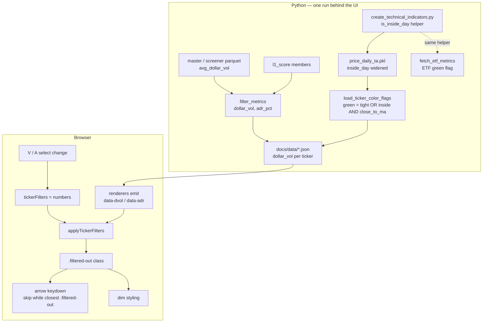

# Filter Dropdowns, Nav Skip, Yellow Selection, New Inside Day - Plan

## Goal Capsule

- **Objective:** four related dashboard changes — turn the `V`/`A` toggle buttons into always-on cutoff dropdowns (dollar volume and ADR%), make arrow-key navigation skip greyed-out tickers, switch the selected-ticker highlight from blue to yellow, and widen the `inside_day` definition to candle-engulf or body-engulf.
- **Authority:** this plan's Product Contract governs behavior. The prior plan [2026-07-24-001-feat-ticker-filter-toggles-plan.md](docs/plans/2026-07-24-001-feat-ticker-filter-toggles-plan.md) established the view-level filter architecture this one extends; its KTD1 (class pass, never a re-render) and KTD4 (missing metric fails open) still hold and are not reopened. `CLAUDE.md`'s "V / A Filter Toggles" section is the doc that must be rewritten, not obeyed — item 1 deliberately reverses its share-volume rule.
- **Execution profile:** front-end feature with two Python prerequisites. The dollar-volume metric does not exist in the dashboard JSON today, and the `inside_day` change lives in the indicator pipeline, so both Python units land before their JS/visual effects can be seen against real data.
- **Stop conditions:** stop and surface if `avg_dollar_vol` is absent from a per-screener parquet frame (U1), or if the new `inside_day` definition would need to differ between the pipeline path and the ETF path.
- **Tail ownership:** standalone — `ce-work` owns commit, branch, and PR.

---

## Product Contract

### Summary

The V/A filter, shipped in July as two on/off buttons at fixed 1M-share and 4%-ADR floors, becomes two always-on dropdowns whose cutoff the user picks: dollar volume at $10M / $50M / $100M (default $50M) and ADR% at 2.5% through 5% in half-point steps (default 4%). Because the controls are wider than the buttons they replace, the time-travel bar drops from three visible date buttons to one, dates bear left and the two dropdowns bear right. Greyed-out tickers stop absorbing arrow-key presses — up/down now jump between tickers that pass the filter. The selected ticker highlights yellow instead of blue. Separately, `inside_day` widens from strict range containment to "current candle engulfed by the previous candle, **or** current body engulfed by the previous body", which broadens the green day-pattern coloring.

### Problem Frame

The July toggles proved the view-level filter works but hard-coded the user's floors into the code. A 1M-share / 4%-ADR cut is one lens; some sessions call for a tighter liquidity screen and some for a looser volatility one, and today changing either means editing `docs/app.js`. Share volume was also the wrong metric to fix: 1M shares means something different at $4 than at $400, and every screener in the repo already gates on `avg_dollar_vol` instead.

Two smaller frictions compound with the filter. Arrow-key navigation walks every `.tn-link` in the panel including the ones the filter just greyed, so on the Themes tab — where the radar universe admits down to $10M average dollar volume — holding the down arrow spends most of its presses on tickers the user has explicitly declared uninteresting. And the selected-ticker highlight is `--accent` blue, the same colour as the active date button, the active `+ more` dropdown, and the screened-chip outline; the one thing that should be unmistakable on a dense panel is the same colour as four decorations.

`inside_day` is a separate matter of correctness. The strict form (`high < prev_high and low > prev_low`) rejects a bar that ties the prior high or low, and rejects a tight-bodied bar whose wicks poke outside the prior range — both of which are the coiled setups the green colouring exists to surface.

### Requirements

**Filter controls**

- R1. The `V` and `A` toggle buttons are replaced by two `<select>` dropdowns in the same position — right edge of the time-travel bar, on the same five tabs (Themes, VARS, Momentum, Volume, Parabolic) and no others.
- R2. The V dropdown offers $10M, $50M, $100M and starts at $50M.
- R3. The A dropdown offers 2.5%, 3%, 3.5%, 4%, 4.5%, 5% and starts at 4%.
- R4. Both filters are always active — there is no off position. The dashboard dims against $50M / 4% from first paint.
- R5. `V` filters on **20-day average dollar volume**, not share volume. This reverses the July rule and the `CLAUDE.md` paragraph documenting it.
- R6. `A` filters on the 20-day `adr_pct`, unchanged in meaning.
- R7. A ticker failing either cutoff is dimmed; both cutoffs apply as a union, as today.
- R8. Cutoff selections are shared across tabs — changing V on VARS leaves it changed on Themes — and reset to the defaults on page reload.
- R9. Changing a cutoff re-applies the dim to the tab on screen without a data refetch.

**Time-travel bar layout**

- R10. Every time-travel bar shows **one** date button (the newest session) plus the `+ more` dropdown, which reaches every remaining session in the 180-day window as it does today.
- R11. This applies to all tabs that carry a bar, not just the five filtered ones.
- R12. On the five filtered tabs the date controls sit at the left of the bar and the two cutoff dropdowns at the right, on one row at the panel's default width.

**Arrow-key navigation**

- R13. `ArrowDown` / `ArrowUp` move to the next/previous ticker that is **not** dimmed, skipping over any number of consecutive dimmed tickers.
- R14. When no undimmed ticker exists in the travel direction, the selection does not move.
- R15. Clicking a ticker still syncs the navigation position, so a subsequent arrow press continues from the clicked ticker.
- R16. A dimmed ticker remains clickable and still opens its chart — only keyboard travel skips it.

**Selection highlight**

- R17. The selected ticker's text and underline render yellow instead of `--accent` blue.
- R18. The selected table row's background tint and outline render yellow instead of blue.
- R19. Hovering the selected ticker does not flip it back to blue.

**Inside day**

- R20. `inside_day` is true when the current bar's range is contained in the previous bar's range **inclusive of ties**: `high <= prev_high and low >= prev_low`.
- R21. `inside_day` is *also* true when the current bar's **body** is contained in the previous bar's body: `max(open, close) <= max(prev_open, prev_close) and min(open, close) >= min(prev_open, prev_close)`.
- R22. The two conditions are OR'd. The first bar of a series, with no previous bar, is not an inside day.
- R23. The definition is identical in the indicator pipeline and in the dashboard's standalone ETF path.
- R24. The green day-pattern rule is otherwise unchanged: `(tight_day OR inside_day) AND close_to_ma`.

**Non-effects**

- R25. Filtering still never re-scores, re-ranks, re-sorts, or removes anything from the DOM — leaf `N=`, L1 scores, and the radar's `+N more` count are identical at every cutoff.

### Scope Boundaries

- Out: the four network Viz tabs. They keep no cutoff dropdowns, their node dimming does not exist, and their selected node is already gold (`#ffd700`) — item 3 is effectively already true there.
- Out: Industry ETF, Leverage ETF, and EP tabs for the cutoff dropdowns. Their rows do not come from the screening parquet. They **do** get the one-date-button bar (R11), and the ETF tabs do get the new `inside_day` via their standalone recompute (R23).
- Out: user-editable cutoff *lists*. The three V values and six A values are compile-time constants.
- Out: re-selecting the current ticker when a cutoff change dims it. The selection stays where it is; only subsequent arrow presses respect the filter.
- Out: the radar's `+N more` chip clamp interacting with navigation. Arrow keys already visit chips hidden behind the clamp; that predates this work.

#### Deferred to Follow-Up Work

- Persisting cutoff selections across reloads. The repo uses no browser storage; adding it is a separate decision.
- A share-volume lens. Dropping `avg_vol` from the payload (KTD2) forecloses it until re-added.
- Making the cutoff option lists config-driven from `workflow_config.yaml`.

---

## Planning Contract

### Key Technical Decisions

- KTD1. **Filter state becomes two numbers, not two booleans; the dim pass keeps its shape.** `tickerFilters = { vol: 50e6, adr: 0.04 }` replaces `{ vol: false, adr: false }`, and `applyTickerFilters` compares the ticker's attribute against the current number rather than against a constant gated on a boolean. Everything the July plan's KTD1 bought — one class pass, no re-render, `syncRadarClamps` untouched — is preserved unchanged.
- KTD2. **`avg_vol` is replaced by `dollar_vol` in the payload, not joined by it.** The V filter no longer reads share volume, so keeping `vol_sma50` in every ticker dict on five tabs plus `radar_history.json` would be dead bytes in the largest JSON files the repo publishes. Rejected: emitting both for a future share-volume lens — that lens is deferred, and re-adding one number later is cheap.
- KTD3. **The source column is `avg_dollar_vol` (20-day rolling mean of `volume × close`, `min_periods=10`).** It already exists in `create_technical_indicators.py`, is present in the master parquet, and is the column every screener and the radar universe floor already gate on, so the toggle now measures the same thing the pipeline does. Rejected: deriving `vol_sma50 × close` client-side — that is a 50-day share average times one day's close, which is not the same number and would disagree with every screener gate.
- KTD4. **Always-on filtering is safe on first deploy precisely because of fail-open.** The published `docs/data/*.json` carries no `dollar_vol` until the next daily run, and a ticker with no attribute passes. So the dropdowns render and dim nothing for one run rather than dimming everything — the same one-run lag the July toggles had, but now benign instead of alarming.
- KTD5. **Cutoff dropdowns are amber-accented `<select>`s styled from `.tt-date-select`, not a new control shape.** The July KTD7 rationale survives the shape change: the active date button and the active `+ more` dropdown are both accent blue and sit immediately to the left, so a third adjacent blue control reads as part of the date group. Amber keeps the two lenses visually separate from the date group. Since they are always on, they are always amber — there is no armed/disarmed state to signal.
- KTD6. **`VISIBLE` drops from 3 to 1 as a single constant in `renderTimeTravelBar`, applying to every bar.** Per-bar visible counts would mean threading a parameter through eleven call sites to make six tabs look different from five for no functional reason. One constant, one consistent bar.
- KTD7. **Arrow-key skip scans the existing full link array rather than building a filtered one.** `navIndices[tabId]` is an index into `getTickerLinksForTab`'s full array and the click-sync handler writes into it with `links.indexOf(link)`. Keeping the index space intact and stepping until an undimmed link is found means the click handler needs no change (R15) and the state cannot drift between the two entry points. Rejected: filtering the array — then the stored index means something different depending on which cutoff is active, and a cutoff change silently repoints the selection.
- KTD8. **`link.closest('.filtered-out')` is the single dimmed test.** The class lands on the `<tr>` for table tabs and on the chip element itself for radar chips. `closest` matches self-or-ancestor, so one expression covers both shapes without branching on tab.
- KTD9. **One shared scalar `inside_day` helper, imported by both call sites.** The definition currently exists twice — vectorized in `create_technical_indicators.py:147` and scalar in `export_dashboard_data.py:765` — and the two are already an edit away from disagreeing. A shared helper in the indicators module, called by the ETF recompute, makes R23 structural rather than a convention someone has to remember.
- KTD10. **Yellow is `#ffd700`, added as `--yellow` / `--ydim`.** It is already the dashboard's selected-ticker colour in the Cytoscape viz stylesheet (`docs/app.js:1716`), so the DOM tabs converge on the viz rather than introducing a fourth accent. Rejected: reusing `--amber` (#ffb300) — the cutoff dropdowns are amber and sit in the same panel, and the two meanings should not share a hue.

### High-Level Technical Design

Two independent Python edits (the metric and the indicator) feed one browser-side change that already had its plumbing built in July. The only genuinely new runtime path is the skip loop in the keydown handler; everything else is a substitution into an existing path.

### Assumptions

Agent bets, each cheap to redirect before implementation.

- The user's stated body-engulf formula contains two transcription slips — `max(previous_open, previous_low)` and a right-hand side repeating the current bar — and the intended comparison is against the previous bar's body on both sides. R21 states the corrected form, which matches the plain-English gloss given ("current candle body is engulfed by previous candle body").
- Dropping `avg_vol` from the payload rather than keeping both metrics (KTD2).
- Yellow is `#ffd700` matching the viz, not `--amber` (KTD10).
- The V dropdown labels read `$10M` / `$50M` / `$100M` and the A labels `2.5%` … `5.0%`, with the raw threshold in the `value` attribute.
- The left panel's `width: max(20%, 470px)` floor is re-measured downward once the bar is rebuilt; the arithmetic in the CSS comment suggests roughly 400–420px, but the number written into the file must come from a browser measurement, not from this estimate.

---

## Implementation Units

### U1. Switch the exported filter metric to average dollar volume

- **Goal:** every ticker dict on the four screener-backed tabs carries `dollar_vol` for that session, and no longer carries `avg_vol`.
- **Requirements:** R5, R25
- **Dependencies:** none
- **Files:**
  - `src/reporting/export_dashboard_data.py`
  - `tests/test_filter_metrics.py`
  - `tests/test_parabolic.py`
- **Approach:**
  1. Rename `filter_metrics` internals to read `avg_dollar_vol` instead of `vol_sma50`, returning `(dollar_vol, adr_pct)`. Keep the zero-or-missing → `None` mapping — the snapshot builders still `.fillna(0)`, so a genuinely absent metric arrives as `0.0` and must not read as "illiquid" (July KTD4).
  2. Round dollar volume to a whole number, as `avg_vol` was.
  3. Update the emitting sites to write `'dollar_vol'` instead of `'avg_vol'`: `_build_momentum_136_snapshot`, `_build_vars_snapshot`, `_build_volume_snapshot`, and `_parabolic_item_from_row` (line ~1766, where only the first tuple element is taken). The parabolic path's existing `adr_pct` key is untouched.
  4. Confirm `avg_dollar_vol` is present in the per-screener parquet frames, not just the master. Every screener already filters on it (`vars.py`, `momentum_136.py`, `parabolic.py`, `steady_trend.py`, …), so the column should ride through — but verify against a real parquet before assuming, and stop and surface if it does not.
  5. Update the docstring: it currently describes `avg_vol` as `vol_sma50`, and the reason the toggle deliberately diverged from the radar's dollar floor. That divergence is gone.
- **Patterns to follow:** the existing `_positive_or_none` / `_int_or_none` / `_round_or_none` null-safe emission in `filter_metrics` (`src/reporting/export_dashboard_data.py:898`).
- **Test scenarios:**
  - A VARS snapshot built from a fixture frame carrying `avg_dollar_vol` and `adr_pct` emits `dollar_vol` as an integer and `adr_pct` at 4 decimal places on each ticker dict.
  - No ticker dict on any of the four snapshots carries an `avg_vol` key.
  - A fixture ticker whose `avg_dollar_vol` is absent from the frame emits `dollar_vol: None`.
  - A fixture ticker whose `avg_dollar_vol` is present but zero (the `fillna(0)` path) emits `dollar_vol: None`, not `0`.
  - The momentum_136 and Volume snapshots each carry `dollar_vol`, with the zero case emitting `None`.
  - The Parabolic snapshot carries `dollar_vol` while its existing `adr_pct` key and value are unchanged.
  - Two snapshots built from two different session parquets carry that session's own dollar volume, not a shared latest-bar value.
- **Verification:** `uv run python -m unittest discover -s tests` passes; a local export writes `docs/data/vars.json` whose first ticker carries `dollar_vol` and no `avg_vol`.

### U2. Carry dollar volume through the radar member payload

- **Goal:** radar chips on the Themes tab filter on the same metric as the table tabs.
- **Requirements:** R5, R25
- **Dependencies:** U1 (shares the metric decision)
- **Files:**
  - `src/themes/l1_score.py`
  - `src/reporting/export_dashboard_data.py`
  - `tests/test_l1_score.py`
  - `tests/test_export_radar.py`
- **Approach:**
  1. In `compute_leaf_scores`, replace the payload-only `vol_sma50` member field with `avg_dollar_vol`, read from the master row under the same `pd.notna` guard the existing `vars` / `price` legs use (`src/themes/l1_score.py:186`). Leave the *universe gating* logic alone — `build_radar_universe` keeps using both `vol_sma50` and `avg_dollar_vol` for its own floors, and this change touches only the payload comment and field.
  2. In `_build_radar_snapshot` (`src/reporting/export_dashboard_data.py:1325`), emit `'dollar_vol': _int_or_none(m.get('avg_dollar_vol'))` in place of `'avg_vol'`.
  3. The field rides into `radar_history.json` as well as `radar.json`; history entries stay capped at `radar.tickers_per_leaf`, so the size change is one number per member either way.
- **Patterns to follow:** the `pd.notna` member-append guard in `compute_leaf_scores`; the ticker-dict construction in `_build_radar_snapshot`.
- **Test scenarios:**
  - `compute_leaf_scores` over a fixture master frame emits `avg_dollar_vol` on each member dict and no `vol_sma50` payload field.
  - A member whose master row has NaN `avg_dollar_vol` emits `None` and still scores normally.
  - `_build_radar_snapshot` emits `dollar_vol` on every chip in both the uncapped and the `tickers_per_leaf`-capped shape.
  - Radar scores, leaf breadth, boost, and global ranks are identical to a pre-change run over the same fixture — the change is payload-only.
  - The radar universe still admits a fixture ticker with NaN `vol_sma50` but a passing `avg_dollar_vol` (the young-IPO case), proving the gating path was not touched.
- **Verification:** `uv run python -m unittest discover -s tests` passes; `uv run python tools/validate_radar.py --episodes tools/radar_episodes.yaml` still passes.

### U3. Widen the inside-day definition

- **Goal:** `inside_day` becomes candle-engulf OR body-engulf, with one definition shared by both computation sites.
- **Requirements:** R20, R21, R22, R23, R24
- **Dependencies:** none
- **Files:**
  - `src/indicators/create_technical_indicators.py`
  - `src/reporting/export_dashboard_data.py`
  - `tests/test_inside_day.py` (new)
  - `tests/backtest_coiled_theme.py`
- **Approach:**
  1. Add a module-level vectorized helper in `create_technical_indicators.py` that takes an OHLC frame and returns the boolean series, implementing the two clauses of R20/R21 OR'd together. The current one-liner at line 147 becomes a call to it.
  2. Range clause uses `<=` / `>=` (R20) — the tie case the strict form rejected. Body clause compares `max(open, close)` and `min(open, close)` against the *previous* bar's body extremes on both sides (R21).
  3. The first bar has NaN shifted values; the comparison yields `False`, which is correct (R22) — assert it rather than assuming.
  4. In `export_dashboard_data.py`'s `fetch_etf_metrics` (line ~765), replace the inline scalar expression with a call to the same helper, adapting for the capitalized yfinance column names (`Open`/`High`/`Low`/`Close`). Importing the indicators module here is a new cross-module dependency — check it introduces no import cycle; if it does, put the helper in `src/stock_utils.py` instead and import from both.
  5. Update `tests/backtest_coiled_theme.py:125`, which replicates the old formula in its fixture builder, so the backtest keeps matching production.
  6. Note in passing: `coiled_theme` (screener and scoring module) consumes `inside_day` and will score slightly differently. It is not in the daily workflow, so nothing in the pipeline changes behavior beyond the green colouring — but do not "fix" the resulting score drift, it is the intended consequence.
- **Patterns to follow:** the vectorized `.shift(1)` style of the surrounding indicator block (`previous_session_high`, `tight_day`, `close_to_ma`); `_bool_series` in `src/screening/coiled_theme.py` for null-safe boolean handling.
- **Test scenarios:**
  - A bar strictly inside the previous bar's range is an inside day (the old definition still passes).
  - A bar whose high exactly equals the previous high and whose low is above the previous low is an inside day — the tie case the strict form rejected.
  - A bar whose high and low both exactly equal the previous bar's is an inside day.
  - A bar whose high exceeds the previous high by any amount fails the range clause.
  - A bar whose range breaks out on both sides but whose body sits inside the previous body is an inside day via the body clause — with the previous bar red (open > close) so the `max`/`min` normalization is actually exercised.
  - The same body-engulf case with the previous bar green, proving the clause is direction-agnostic.
  - A bar failing both clauses (body larger than the previous body, range outside) is not an inside day.
  - The first bar of a frame is not an inside day.
  - The ETF scalar path and the vectorized pipeline path return the same verdict for a shared table of OHLC pairs covering every case above.
- **Verification:** `uv run python -m unittest discover -s tests` passes. After a local `uv run python src/indicators/create_technical_indicators.py`, the count of green-flagged tickers from `load_ticker_color_flags()` is **higher** than before the change — the new definition is strictly looser, so a drop or an unchanged count means the widening did not take effect.

### U4. Replace the V/A toggles with cutoff dropdowns

- **Goal:** two always-on cutoff dropdowns drive the dim pass on the five filtered tabs.
- **Requirements:** R1, R2, R3, R4, R7, R8, R9, R25
- **Dependencies:** U1, U2 (for the attribute to mean anything against real data)
- **Files:**
  - `docs/index.html`
  - `docs/app.js`
  - `docs/style.css`
- **Approach:**
  1. In `docs/index.html`, replace each of the five `.tt-filters` blocks (lines ~423, ~449, ~475, ~737, ~797) with two `<select class="tt-filter-select" data-filter="vol|adr">` elements carrying the option lists from R2/R3, the default marked `selected`, and a `title` naming the metric in words. Keep the `.tt-filters` wrapper — its `margin-left: auto` is what satisfies R12. Leave the six other bars untouched.
  2. In `docs/app.js`, change `tickerFilters` from two booleans to two numbers seeded at `50e6` and `0.04`, and delete `FILTER_MIN_AVG_VOL` / `FILTER_MIN_ADR_PCT` — the cutoff now lives in state, not in a constant.
  3. Rewrite `applyTickerFilters`'s `belowFloor` to compare against `tickerFilters[key]` unconditionally (no boolean gate) and to read `data-dvol` for the volume leg. Fail-open on absent or unparseable attributes is unchanged and load-bearing (KTD4).
  4. Replace the delegated click handler in `initTickerFilters` with a delegated `change` handler on `.tt-filter-select`: parse the new value, write it into state, mirror it onto every other bar's copy of that select so all five agree (R8), then call `applyTickerFilters`.
  5. Update `filterAttrs` to emit `data-dvol` from `t.dollar_vol` and drop `data-avgvol`.
  6. In `docs/style.css`, replace the `.tt-filter-btn` rules with `.tt-filter-select`, based on `.tt-date-select`'s border/font/padding but amber-accented (KTD5). Delete the `.on` armed state — there is no disarmed state to contrast with.
  7. Leave `tr.filtered-out` and `.radar-chip.filtered-out` exactly as they are, including the "touch no layout-affecting property" comment. The dim treatment is unchanged; only what triggers it moved.
- **Patterns to follow:** the existing `initTickerFilters` delegated-handler and cross-bar sync loop (`docs/app.js:836`); `.tt-date-select` styling; `applyTimeTravelDate`'s "update state, re-sync all bars, then re-apply" ordering.
- **Test scenarios:** the repo has no JS test tooling — verify in a browser against freshly exported data:
  - The two dropdowns appear on Themes, VARS, Momentum, Volume, and Parabolic, and on no other tab.
  - On first load with no interaction, tickers below $50M dollar volume or below 4% ADR are already dimmed.
  - Changing V to $100M on VARS dims strictly more tickers; changing it to $10M dims strictly fewer.
  - Changing A to 2.5% on VARS un-dims rows the 4% default had dimmed — VARS admits ADR down to 2%, so this tab must show a visible effect.
  - Changing V on VARS then switching to Themes shows the Themes dropdown already reading the new value and the chips dimmed accordingly.
  - Clicking a date button leaves both dropdowns at their selected values.
  - A chip carrying no `data-dvol` stays undimmed at every cutoff.
  - Leaf `N=`, raw→boosted scores, theme header counts, row order, and the radar `+N more` count are identical at $10M and at $100M.
  - Time-travelling to an older session filters against that session's dollar volume.
- **Verification:** all nine scenarios hold in the browser at the panel's default width.

### U5. One visible date button, and re-measure the left panel floor

- **Goal:** every time-travel bar shows one date plus `+ more`, and the five filtered bars fit on one row with their dropdowns.
- **Requirements:** R10, R11, R12
- **Dependencies:** U4 (the bar cannot be measured until its final controls exist)
- **Files:**
  - `docs/app.js`
  - `docs/style.css`
- **Approach:**
  1. Change `VISIBLE` from 3 to 1 in `renderTimeTravelBar` (`docs/app.js:1101`) and update its comment. Everything else in the function — the `+ more` select, the active-in-dropdown label, the handlers — already handles an arbitrary split and needs no change.
  2. Confirm the `+ more` dropdown now carries sessions 2 and 3, which were previously buttons, and that its label still shows the active session when the active one is in the dropdown.
  3. Measure the rendered width of the widest bar in a browser and set `.left-panel`'s `width: max(20%, Npx)` floor to that measurement rounded up for slack. Do not carry the estimate from this plan into the file.
  4. Rewrite the `.left-panel` comment's arithmetic to match the new control set — one date button, the `+ more` dropdown, two cutoff selects — so the next person to touch the bar can re-derive the floor. Keep the `min-width: 256px` line and its rationale untouched.
  5. Leave `.time-travel-dates { display: contents }` in place. It is what lets the dropdowns share the bar's flex flow instead of reserving a column, and it is what makes R12's left/right split work with the wrapper's `margin-left: auto`.
- **Patterns to follow:** the existing `.left-panel` comment block (`docs/style.css:255`), which documents exactly this measurement and is the model for its replacement.
- **Test scenarios:** browser verification —
  - Every bar shows exactly one date button; the `+ more` dropdown opens to every other session in the window.
  - Selecting a session from the dropdown still switches every tab's data and re-labels the dropdown.
  - On all five filtered tabs at the panel's default width, the date button, `+ more`, and both dropdowns sit on one row, dates left and dropdowns right.
  - Dragging the resize handle to the `min-width` floor wraps the bar gracefully rather than clipping a control.
  - The Themes tab's radar `+N more` chip counts are still correct after the panel width changes — `syncRadarClamps` must re-measure.
- **Verification:** the bar holds one row at the new default width, and the CSS comment's arithmetic reproduces the number written into the rule.

### U6. Arrow keys skip dimmed tickers

- **Goal:** up/down travel between tickers that pass the current cutoffs.
- **Requirements:** R13, R14, R15, R16
- **Dependencies:** U4 (nothing is dimmed on first load until the cutoffs exist)
- **Files:**
  - `docs/app.js`
- **Approach:**
  1. Add a small predicate — a link is dimmed when `link.closest('.filtered-out')` is non-null (KTD8).
  2. In the `keydown` handler (`docs/app.js:366`), replace the single-step index arithmetic with a scan: step one position in the requested direction, then keep stepping while the link at that index is dimmed, stopping at the array bounds.
  3. If the scan runs off either end without finding an undimmed link, leave `navIndices[tabId]` and the current selection untouched and return (R14) — do not fall back to the boundary link, which would silently select a dimmed ticker.
  4. Handle the cold-start case: `navIndices[tabId]` is `-1` before the first press, so `ArrowDown` must land on the first *undimmed* link, and `ArrowUp` from `-1` must not select anything.
  5. Leave the click-sync handler (`docs/app.js:409`) alone — it writes a full-array index and stays correct by construction (KTD7).
- **Patterns to follow:** the existing keydown handler's clear-then-set active-state sequence and its `scrollIntoView({ block: 'nearest' })` call.
- **Test scenarios:** browser verification —
  - With the default cutoffs on Themes, holding `ArrowDown` visits only undimmed chips.
  - A run of consecutive dimmed rows on VARS is crossed in a single press.
  - `ArrowDown` from the last undimmed ticker does not move and does not select a dimmed one.
  - `ArrowUp` from the first undimmed ticker does not move.
  - `ArrowDown` with no prior selection lands on the first undimmed ticker, not on a dimmed first row.
  - Setting V to $100M so that *every* ticker in a small leaf is dimmed: arrows do nothing rather than throwing or selecting.
  - Clicking a dimmed ticker still opens its chart, and the next `ArrowDown` moves to the following *undimmed* ticker (R15 + R16 together).
  - Loosening a cutoff makes previously-skipped tickers reachable again without a reload.
- **Verification:** all eight scenarios hold on both a table tab and the Themes chip tab.

### U7. Yellow selection highlight

- **Goal:** the selected ticker and its row read yellow, not blue.
- **Requirements:** R17, R18, R19
- **Dependencies:** none
- **Files:**
  - `docs/style.css`
- **Approach:**
  1. Add `--yellow: #ffd700` and a matching `--ydim: rgba(255, 215, 0, 0.10)` to `:root`, noting in a comment that the value matches the Cytoscape selected-node colour in `docs/app.js` so the two surfaces stay in sync.
  2. Repoint `.tn-link.active-ticker` (`docs/style.css:510`) from `--accent` to `--yellow` for both `color` and `border-bottom-color`.
  3. Repoint `tbody tr.nav-active` (`docs/style.css:1188`) from the blue tint and blue outline to `--ydim` and a yellow outline at the same alpha.
  4. Add a `.tn-link.active-ticker:hover` rule holding yellow. `.tn-link:hover` sets `--accent !important`, so without this the selected ticker flips to blue under the cursor (R19) — invisible when selection was also blue, obvious now.
  5. Check the selected-and-green case: `.tn-link.day-pattern-green` sets `color` without `!important`, so `active-ticker`'s `!important` already wins. Confirm visually rather than assuming.
- **Patterns to follow:** the existing `--accent` / `--adim` and `--amber` / `--adim2` colour-plus-dim pairs in `:root`.
- **Test scenarios:** visual verification —
  - A clicked ticker renders yellow text with a solid yellow underline; its row carries a yellow tint and outline.
  - Hovering the selected ticker keeps it yellow.
  - Hovering an unselected ticker still turns it blue.
  - A green day-pattern ticker, when selected, renders yellow rather than green.
  - A dimmed ticker, when clicked, is still legible as selected.
  - The viz tabs' selected node is unchanged.
- **Verification:** the four DOM states above render as described on a table tab and on the Themes chip list.

### U8. Update the documentation

- **Goal:** `CLAUDE.md` describes the shipped behavior, not the July behavior it now contradicts.
- **Requirements:** R4, R5, R10, R13, R17, R20, R21
- **Dependencies:** U1–U7
- **Files:**
  - `CLAUDE.md`
- **Approach:**
  1. Rewrite the **V / A Filter Toggles** section: rename it for dropdowns, state the option lists and defaults, state that filtering is always on, and **replace** the "straight share-volume cut with no dollar-volume exemption / do not harmonize the two" paragraph — that rule is reversed by R5, and leaving it would send the next reader to re-break it. Say instead that V now reads `avg_dollar_vol`, the same column the screeners and the radar universe floor gate on, and that the radar's *share*-volume floor with its $40M dollar exemption is a separate universe gate that this view lens does not touch.
  2. Keep and update the still-true clauses: view-level only, never re-scores, missing metric fails open, never give `.filtered-out` a layout-affecting property, one-run deployment lag.
  3. Add the arrow-key skip rule to the same section — it is a consequence of the filter and belongs with it.
  4. Update the **Dashboard Time Travel** section for one visible date button plus `+ more`, and the `.left-panel` width paragraph for the re-measured floor and the new control set.
  5. Update the **Day-pattern Ticker Coloring** section's `inside_day` line to the new two-clause definition, and note that the definition is shared by the pipeline and the ETF recompute via one helper.
- **Test expectation:** none — documentation.
- **Verification:** the reversed share-volume rule is gone rather than merely contradicted elsewhere; every threshold, default, and column name in the section matches the code.

---

## Verification Contract

| Gate | Command / action | Applies to |
|---|---|---|
| Python unit tests | `uv run python -m unittest discover -s tests` | U1, U2, U3 |
| Radar acceptance | `uv run python tools/validate_radar.py --episodes tools/radar_episodes.yaml` | U2 |
| Indicator recompute | `uv run python src/indicators/create_technical_indicators.py`, then confirm the green-flag count from `load_ticker_color_flags()` rose | U3 |
| Export smoke | `uv run python -m src.reporting.export_dashboard_data`, then confirm `dollar_vol` appears and `avg_vol` does not, on a ticker in `docs/data/vars.json`, `volume.json`, `momentum_136.json`, `radar.json`, `parabolic.json` | U1, U2 |
| Browser verification | Load `docs/index.html` against the freshly exported data and walk the U4/U5/U6/U7 scenarios on both a table tab and the Themes chip tab | U4, U5, U6, U7 |
| Export noise reset | `git checkout -- docs/data/` before committing — regenerated dashboard JSON is never part of a code-fix PR | all |

The repo has no JavaScript test tooling, so U4–U7 are proved by browser verification against real exported data rather than by an automated suite. `PYTHONPATH=.` is required for the local `src/` script runs.

---

## Definition of Done

**Global**

- The two cutoff dropdowns appear on Themes, VARS, Momentum, Volume, and Parabolic and nowhere else, are live from first paint at $50M / 4%, and share one state across tabs.
- Arrow keys travel only between undimmed tickers and stop rather than selecting a dimmed one at the ends.
- The selected ticker and its row are yellow, including under the cursor.
- `inside_day` is true for range-engulf with ties and for body-engulf, identically in the pipeline and the ETF path.
- Every time-travel bar shows one date button plus `+ more`, and the five filtered bars hold one row at the panel's default width.
- Scores, breadth counts, ranks, sort order, and the radar `+N more` count are identical at every cutoff.
- All Python tests and the radar acceptance check pass.
- `docs/data/` is reset before the commit; no regenerated dashboard JSON in the diff.
- No dead-end or experimental code from abandoned approaches remains in the diff.

**Deployment ordering.** Two independent one-run lags. The committed `docs/data/*.json` carries no `dollar_vol`, and the fail-open rule means every ticker passes while it is absent — so the dropdowns render and dim nothing in production until the next daily workflow run republishes the data. Separately, the widened `inside_day` only reaches the dashboard after step 2 of the workflow rewrites `price_daily_ta.pkl`, so green colouring changes on the same schedule. Verify both against locally exported data, not against the committed JSON.

**Per unit**

| Unit | Done when |
|---|---|
| U1 | Four snapshot builders emit `dollar_vol` from `avg_dollar_vol` and no `avg_vol`; zero and missing both emit `None` |
| U2 | Radar members and chips carry `dollar_vol`; radar scores, breadth, and ranks are unchanged against a fixture; the universe gating path is untouched |
| U3 | One shared helper implements both clauses; the ETF path calls it; the green-flag count rises after a recompute; the backtest fixture matches production |
| U4 | Dropdowns replace the buttons on the five bars, filter always-on at the defaults, share state, and change the dim without a refetch |
| U5 | `VISIBLE` is 1 on every bar; the left-panel floor is a measured number and its comment's arithmetic reproduces it |
| U6 | Arrows skip runs of dimmed tickers, refuse to move past the last undimmed one, and cold-start onto the first undimmed one |
| U7 | Selection is yellow in text, underline, row tint, and outline, and survives hover |
| U8 | `CLAUDE.md`'s reversed share-volume rule is replaced, not merely contradicted; all thresholds and column names match the code |
