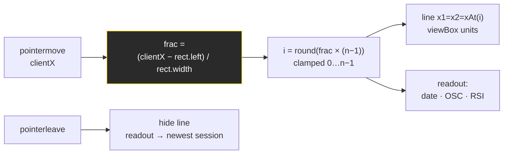
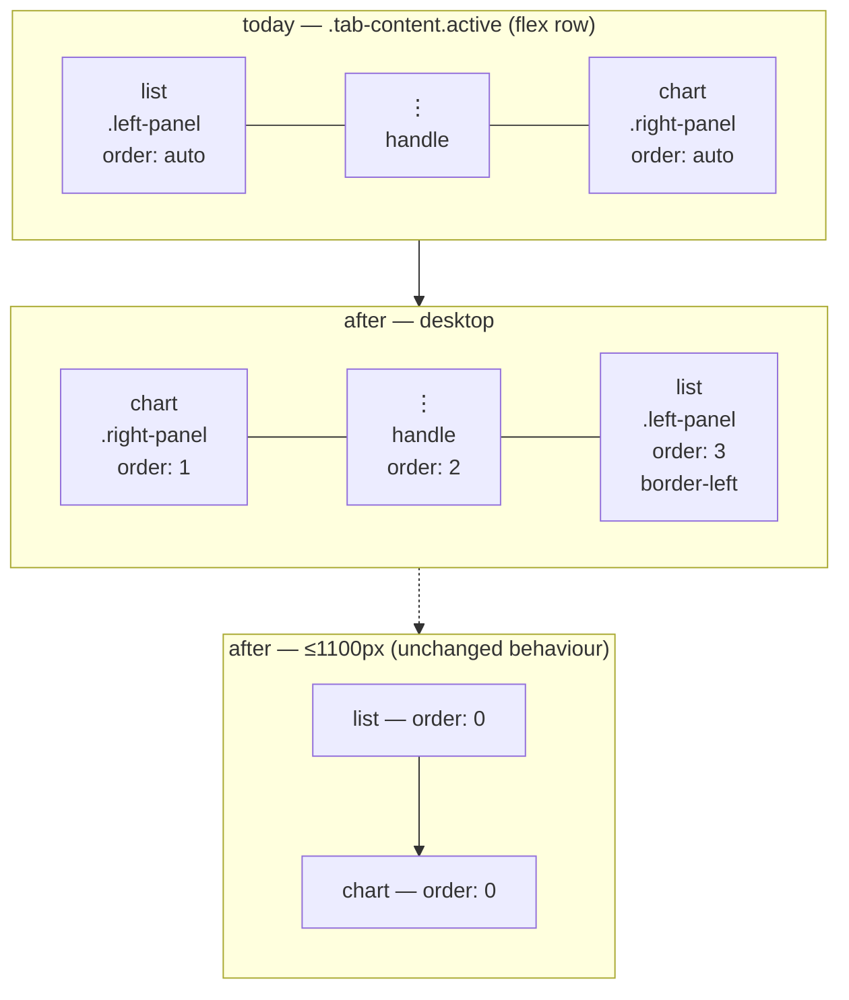

# feat: NASI crosshair inspection and chart-left dashboard layout

## Goal Capsule

Three dashboard-only changes, all inside `docs/`:

1. Make the NASI panel's chart inspectable — a thin vertical crosshair that follows the pointer and a date + values readout where the footer legend is today. Move the whole Market Breadth & Sentiment card to the top of the Overview left panel.
2. Flip panel sides on all 13 side-by-side tabs so the chart is on the left and the ticker list on the right.
3. Give the six list-heavy tabs a per-tab default width wide enough to show their full table, measured rather than guessed.

No Python, no data pipeline, no exporter changes. `docs/index.html`, `docs/style.css`, `docs/app.js`, plus two new Python guard tests and a CLAUDE.md refresh.

---

## Problem Frame

**The NASI chart can be looked at but not read.** The panel plots 378 sessions of the summation index and its RSI, and the header shows today's OSC and RSI — but there is no way to ask "what was the RSI on that trough in July?" The user has to eyeball a 40px-tall pane. Meanwhile the footer spends a full row on static text (date range, MA key, oversold key, an origin-relative caveat) that is read once and never again.

**Every list tab puts the list where the eye starts and the chart where it ends.** The chart is the thing being studied; the list is the index into it. On all 13 tabs the layout is backwards for that workflow.

**Five of six list tables are clipped at today's 400px default.** Measured natural widths at a 1600px viewport: Volume 562px, Lev ETF 539px, Industry 524px, EP 450px, VARS 445px, Momentum 389px. The panel's content box is ~366px after padding and scrollbar, so columns run off the edge on every one of them except Parabolic (286px). Users drag the handle every session to see columns that should have been visible by default.

---

## Requirements

| ID | Requirement |
|----|-------------|
| R1 | Hovering the NASI chart draws a thin vertical line at the nearest session to the pointer. |
| R2 | A readout under the chart shows the hovered session's date in yellow, and its oscillator and RSI in bright white. |
| R3 | The current footer row (date range, `10-day MA` key, `RSI ≤ 10 oversold · dashed 12 = major-low band`, `summation shape only — level is origin-relative`) is removed to make room for R2. |
| R4 | With the pointer off the chart, the readout shows the newest session, preserving the as-of date the removed range line carried. |
| R5 | The Market Breadth & Sentiment card (breadth tiles + NASI panel) is the first card in Overview's macro pane (`#macro-left`), above US Index Futures & VIX. "First" means top-of-column; R6 independently moves that whole column to the right of the screen, and the two do not conflict. |
| R6 | On Overview, Themes, Themes Viz, VARS, VARS Viz, Momentum, Momentum Viz, Volume, Volume Viz, Industry, Lev ETF, EP and Parabolic, the chart pane renders left and the list pane renders right. |
| R7 | The resize handle still widens the pane the pointer moves toward, in the new orientation. |
| R8 | VARS, Momentum, Volume, Industry, Lev ETF and EP each default to a width that shows their full table without horizontal clipping at a 1280px-or-wider viewport. |
| R9 | Below the 1100px breakpoint the panes keep stacking list-above-chart, as today. |
| R10 | V/A cutoff dimming, radar chip clamping, arrow-key ticker travel, the NASI resize redraw, and the selected-ticker highlight all behave as they do today. |

---

## Key Technical Decisions

**KTD1 — The crosshair reports oscillator and RSI, never the summation level.** *(session-settled: user-directed — chosen over summation + RSI: the summation level is origin-relative and unusable as a figure.)* Governs R2. CLAUDE.md's NASI section is explicit: the summation is a running total with an arbitrary origin, reads ≈ −6,400 where StockCharts reads −139, and must never be surfaced as a headline number. The header already shows OSC + RSI for exactly this reason, and both are vendor-comparable (ours +29.03 / 9.89 vs StockCharts +27.91 / 8.85). The crosshair mirrors that pair at the hovered date. The white summation line stays plotted for shape; its value is never printed.

**KTD2 — Derive the oscillator in the browser from adjacent summation values.** `docs/data/nasi.json` history points carry only `date`, `summation`, `summation_ma`, `rsi` — `oscillator` exists on `current` alone. Since `summation = cumsum(oscillator)`, `oscillator[i] = summation[i] − summation[i−1]`. Verified against the live file: the derived last value is 24.85, matching `current.oscillator` exactly. CLAUDE.md pins this invariant (`diff(summation) == oscillator`) and `tests/test_nasdaq_mcclellan.py` already tests it.

The alternative — adding `oscillator` to each history point in `src/data_collection/compute_nasi.py` — is rejected on deployment lag, not correctness. Code-fix PRs reset `docs/data/`, so a new field would not appear until the next daily workflow run, leaving the readout showing `—` for OSC in the interim. Client-side derivation ships working on merge. Index 0 has no predecessor and renders `—`.

Round the derived value to 2 decimals before display. The stored summations are themselves 2dp, so the raw subtraction carries float noise — `−6304.07 − (−6328.92)` evaluates to `24.849999999999454`, not `24.85`. Presentation must match the header's two-decimal figure exactly, or the same session reads differently in two places on one panel.

**KTD3 — Per-tab widths for the six listed tabs; the other seven keep 400px.** *(session-settled: user-directed — chosen over one shared width sized to the widest table: a global 610px would cost Momentum ~170px of chart it does not need.)* Governs R8. Column counts genuinely differ — Volume carries 9, Momentum 7, Parabolic 5.

**KTD4 — Swap sides with CSS `order`, not by reordering the DOM.** Governs R6. Three `order` declarations plus a mobile reset covers all 13 tabs; moving DOM would mean editing 13 near-identical HTML blocks. Accepted trade-off: DOM order (list → handle → chart) no longer matches visual order, so keyboard tab order reaches the list before the chart. That is the same relative order as today and no worse for the list-then-inspect workflow.

**KTD5 — The drag arithmetic must invert.** Governs R7. `initResizablePanels` computes `newWidth = startWidth + dx` on the assumption that the sized pane sits left of the handle. Once it sits right, dragging right must *shrink* it, so the term becomes `startWidth − dx`. This fails silently and inverted if missed — the divider chases the pointer backwards — and no existing test covers it.

**KTD6 — The crosshair line lives inside the SVG; the readout lives outside it.** `renderNasiChart` starts with `svg.innerHTML = ''`, so any SVG child is destroyed on every redraw, and redraws fire on panel drag, window resize and the `ResizeObserver` backstop. The line is therefore created as part of the render (hidden until hovered) and re-acquired by the pointer handler; the readout is footer DOM and survives untouched.

**KTD7 — Map pointer X through `getBoundingClientRect`, not viewBox units.** The SVG is `viewBox="0 0 600 152"` with `preserveAspectRatio="none"`, so viewBox units and CSS pixels diverge at every width except exactly 600. The handler converts clientX to a 0–1 fraction of the measured rect, picks the nearest index, then positions the line at `xAt(index)` in viewBox units. This is the same live-scale hazard the existing oversold-marker code documents when it divides `rx` by `sx`.

---

## High-Level Technical Design

**Crosshair data flow.** Five stages between pointer and pixels, with the rect measurement as the load-bearing step:

`rect.width` is read per event rather than cached — the panel is drag-resizable, so a cached width goes stale mid-session.

**Panel order, before and after.** The DOM stays as it is; only `order` changes, and the mobile query resets it:

---

## Implementation Units

### U1. NASI crosshair line and readout

**Goal:** Replace the static footer row with a live date/OSC/RSI readout driven by a vertical crosshair.

**Requirements:** R1, R2, R3, R4. Implements KTD1, KTD2, KTD6, KTD7.

**Dependencies:** none.

**Files:**
- `docs/index.html` — replace the `.nasi-foot` contents (currently `#nasi-range` plus the `.nasi-legend` block) with readout spans for date, OSC and RSI.
- `docs/app.js` — `renderNasiChart` (append the hidden crosshair line), new pointer handlers, new oscillator derivation, and the `#nasi-range` write in the fetch handler.
- `docs/style.css` — `.nasi-foot` layout, plus readout colour rules.
- `tests/test_nasi_crosshair_markup.py` — new.

**Approach:**
1. Derive an oscillator series once per history load: `osc[i] = summation[i] − summation[i−1]`, `null` at index 0 and wherever either summation is null. Cache it beside `nasiHistory` so pointer moves do no arithmetic beyond a lookup.
2. In `renderNasiChart`, append the crosshair `<line>` last so it draws above the plotted paths, spanning `NASI_GEO.top` to `NASI_GEO.rsiBot`, with `vector-effect: non-scaling-stroke` (same reason the existing strokes carry it) and `visibility: hidden`.
3. Attach `pointermove` and `pointerleave` to the SVG. `pointermove` maps to an index per KTD7, moves the line, sets visibility, and writes the readout. `pointerleave` hides the line and restores the newest-session readout. Guard on `nasiHistory` being loaded — the panel renders before the fetch resolves, and a hover in that window must no-op rather than throw.
4. Make the whole SVG box hittable. Plotted paths are `fill: none`, so they generate pointer events only on the stroke itself; the two panes are separated by a 14px gap and the RSI pane ends 4px above the box. Give the SVG `pointer-events: all` (or append a transparent full-box `<rect>` as the first child) so the readout tracks continuously instead of dropping out over empty bands.
5. The SVG carries `role="img"` with an `aria-label`, which declares it non-interactive. Adding hover inspection makes that stale — either move the interactive affordance to a wrapping element or update the role. Keep the existing `aria-label` text either way; it is the only description of the chart for assistive tech.
6. Remove the `#nasi-range` text write in the fetch `.then` and replace it with the initial newest-session readout render, so R4 holds before the first hover.
7. Style the readout: date `var(--yellow)`, OSC and RSI `var(--text)` at the panel's existing figure weight. Keep the OSC sign colouring out of it — bright white is the requirement, and the header already carries pos/neg colour.

**Patterns to follow:** the existing `add`/`line` helpers and `NASI_GEO` geometry in `renderNasiChart`; the live-scale comment block above the oversold ellipses for why client rect must be measured, not assumed; `--yellow` / `--ydim` as used by `.active-ticker`.

**Test scenarios** (`tests/test_nasi_crosshair_markup.py`, mirroring the string/DOM-parse style of `tests/test_dashboard_filter_markup.py` — the repo has no JS test tooling):
- The `.nasi-foot` block in `docs/index.html` contains readout elements with stable IDs for date, OSC and RSI.
- The removed strings (`summation shape only`, `major-low band`, `10-day MA`) no longer appear in `docs/index.html`.
- `docs/app.js` contains no assignment writing `summation` or `summation_ma` into a readout element — the guard for KTD1, so a later edit cannot quietly start printing the origin-relative level.
- The oscillator derivation subtracts consecutive `summation` values rather than reading an `oscillator` key off a history point (which does not exist in the data file).
- `docs/style.css` colours the date element with `var(--yellow)`.

Browser scenarios, verified against the running dashboard:
- Hovering mid-chart draws one vertical line and the readout shows that session's date, OSC and RSI.
- Moving the pointer across the full width steps the line monotonically and never leaves the plot area.
- Hovering at the extreme left edge selects index 0 and renders OSC as `—` (no predecessor) with a real date and RSI.
- Hovering the extreme right edge shows `2026-08-12`, `+24.85`, `48.34` — matching the header exactly, including decimal places.
- Hovering before `nasi.json` resolves is a no-op: no crosshair, no console error, and the readout populates normally once data lands.
- Leaving the chart hides the line and restores the newest session.
- Dragging the panel resize handle while the readout is populated leaves the readout intact and redraws the line at the correct new x-scale.

**Verification:** Screenshot of the panel mid-hover showing a yellow date and two white figures; the header's OSC/RSI and the right-edge hover agree.

---

### U2. Move Market Breadth & Sentiment to the top of the Overview panel

**Goal:** Breadth and NASI are the first thing on the Overview tab.

**Requirements:** R5.

**Dependencies:** U1 (both edit the same card; sequencing avoids a conflict).

**Files:** `docs/index.html`.

**Approach:** Move the `Market Breadth & Sentiment` card — the `.card` wrapper holding `#breadth-container` and `#nasi-panel` — so it is the first child of `#macro-left`, ahead of the US Index Futures & VIX card. Pure relocation: no markup, ID or class changes inside the block, so every `getElementById` in `docs/app.js` keeps resolving.

**Test expectation: none** — a DOM reorder with no behavioural change. U1's markup test already pins the readout elements wherever the card sits.

**Verification:** Overview loads with breadth tiles and the NASI panel at the top of the panel; futures, crypto, metals, energy, yields and dollar follow in their existing order; the NASI chart still renders (its `ResizeObserver` attaches by ID, not position).

---

### U3. Swap chart and list sides across all 13 tabs

**Goal:** Chart left, list right, everywhere the two sit side by side.

**Requirements:** R6, R7, R9, R10. Implements KTD4, KTD5.

**Dependencies:** none (independent of U1/U2; sequence after them only to keep the diff readable).

**Files:**
- `docs/style.css` — `.left-panel`, `.right-panel`, `.resize-handle`, and the `max-width: 1100px` block.
- `docs/app.js` — `initResizablePanels`.
- `tests/test_dashboard_panel_layout.py` — new.

**Approach:**
1. Add `order: 3` to `.left-panel`, `order: 2` to `.resize-handle`, `order: 1` to `.right-panel`.
2. Flip the list pane's divider: `.left-panel` swaps `border-right` for `border-left`. The `≤1100px` block already replaces it with `border-bottom` and needs no change beyond step 4.
3. Invert the drag arithmetic in `initResizablePanels` per KTD5: `startWidth - dx`. Leave the `Math.max(250, …)` and `window.innerWidth - 300` clamps as they are — both still express the same limits.
4. In the `≤1100px` block, reset all three `order` values to `0` so stacked mobile keeps list above chart (R9).
5. Update the comment above `.left-panel` — it currently describes a left-hand table panel and is load-bearing documentation for the width floor.

**Execution note:** Verify the drag direction by hand in the browser before moving on. It is the one change here that is invisible in a screenshot and wrong in a way that reads as "the handle is broken".

**Patterns to follow:** the existing commented-CSS convention in `docs/style.css`, where each non-obvious rule carries its derivation.

**Test scenarios** (`tests/test_dashboard_panel_layout.py`):
- `docs/style.css` gives `.right-panel` a lower `order` than `.resize-handle`, which is lower than `.left-panel` — the ordering invariant, asserted as a relation rather than three literals so a future renumber does not fail spuriously.
- `.left-panel` declares `border-left` and no longer declares `border-right` outside the responsive block.
- The `max-width: 1100px` block resets `order` for all three selectors, so mobile stacking cannot silently invert.
- `initResizablePanels` in `docs/app.js` computes the new width by subtracting `dx`, not adding it — the KTD5 guard.

Browser scenarios:
- Each of the 13 tabs renders the chart pane on the left and the list pane on the right.
- Dragging the handle right widens the chart and narrows the list; dragging left does the reverse.
- The drag still respects both clamps at the extremes.
- At a 900px viewport the panes stack with the list above the chart and the handle hidden.
- On Themes, radar chips still clamp to two rows and the `+N more` count is unchanged after a drag (guards `syncRadarClamps`).
- On the Overview tab, dragging redraws the NASI chart at the new scale with the oversold markers still round.

**Verification:** Screenshots of one table tab, one Viz tab and Overview showing chart-left; a drag in each direction behaving correctly; a 900px-wide screenshot showing list-above-chart.

---

### U4. Per-tab default widths for the six list-heavy tabs

**Goal:** Each listed tab opens wide enough to show its whole table.

**Requirements:** R8. Implements KTD3.

**Dependencies:** U3 (widths are only meaningful once the pane has moved).

**Files:** `docs/style.css`, `tests/test_dashboard_panel_layout.py` (extends U3's file).

**Approach:**
1. Add six ID-scoped width rules alongside the existing `#macro-left` override. Starting values from the measurement below; re-measure after U3 lands and adjust if the swap shifts anything.
2. Leave `.left-panel { width: max(20%, 400px) }` as the default for the seven unlisted tabs, and leave `#macro-left { width: 42% }` alone — Overview swaps sides but is not in the widen list.
3. Leave `min-width: 256px` untouched. It is the drag floor, not the default, and the resize handle still needs the room to trade list width for chart width.

Sizing is natural table width plus 28px panel padding, ~6px scrollbar and 2px card border, rounded up for slack:

| Tab | Selector | Measured table | Default width |
|-----|----------|---------------|---------------|
| Volume | `#volume-left` | 562px | 610px |
| Lev ETF | `#etf-left` | 539px | 585px |
| Industry | `#industry-left` | 524px | 570px |
| EP | `#ep-left` | 450px | 500px |
| VARS | `#vars-left` | 445px | 490px |
| Momentum | `#momentum-left` | 389px | 440px |

Every value clears the 385px floor the time-travel bar needs, so no bar re-wraps.

Natural width is data-dependent — `td` is `white-space: nowrap`, so a longer ticker or a larger figure widens the table. These numbers come from the committed fixture, where many Volume and VARS leaf tables hold only 1–3 rows and both EP tables hold one. Treat them as a floor, re-measure against a populated dataset, and keep the slack.

**Test scenarios** (extending `tests/test_dashboard_panel_layout.py`):
- All six ID selectors carry an explicit `width` in `docs/style.css`.
- Each of the six widths is at least 385px — the documented time-travel-bar floor, so a later trim cannot re-wrap a bar.
- `.left-panel` keeps `min-width: 256px`, so the drag range is not accidentally narrowed by the new defaults.

Browser scenarios, at a 1280px viewport and again at 1600px:
- On each of the six tabs, the widest table's `scrollWidth` does not exceed its container's `clientWidth` — no clipped column.
- Parabolic and Themes still open at 400px.
- Each of the six leaves at least 600px for the chart pane at 1280px.
- EP is measured with both the afternoon and morning tables populated, since its committed fixture is thin.

**Verification:** A per-tab measurement pass reporting table width against container width for all six, with zero overflow; screenshots of Volume (widest) and Momentum (narrowest) showing full tables and a usable chart.

---

### U5. Update CLAUDE.md for the new layout

**Goal:** The project instructions describe the dashboard that now exists.

**Requirements:** supports R6, R8; keeps KTD1's rule enforceable by the next reader.

**Dependencies:** U1, U3, U4.

**Files:** `CLAUDE.md`.

**Approach:** Three edits, all in sections that currently assert something the change makes false:
1. **V / A Filter Cutoffs** — the paragraph deriving `.left-panel { width: max(20%, 400px) }` from a measured 385px floor. Keep the floor and its derivation; add that six tabs now carry per-tab widths, and that the floor still binds them.
2. **Dashboard Time Travel** — reword the left/right panel references for the new orientation.
3. **NASI** — extend the "never surface the summation level" rule to say the crosshair reports OSC and RSI for the same reason, and that the oscillator is derived client-side from `diff(summation)` because the history points do not carry it.

**Test expectation: none** — documentation.

**Verification:** No sentence in CLAUDE.md still describes the list pane as left-hand or the default width as uniformly 400px.

---

## Scope Boundaries

**In scope:** `docs/index.html`, `docs/style.css`, `docs/app.js`, two new Python guard tests, `CLAUDE.md`.

**Out of scope:**
- Any Python, exporter or data-pipeline change. KTD2 exists specifically so `src/data_collection/compute_nasi.py` stays untouched.
- Regenerating `docs/data/*.json`. Per the repo's PR convention, code-fix PRs do not carry regenerated data; run the export locally if needed and `git checkout -- docs/data/` before committing.
- The TradingView chart embed. The `studies` array and its 5-entry cap are not touched.
- Crosshair on any other chart. This is the NASI panel only.

### Deferred to Follow-Up Work
- **Renaming `.left-panel` / `.right-panel`.** After U3 the names describe DOM position, not screen position, which will mislead. A rename touches 13 HTML blocks, ~20 CSS rules, several `docs/app.js` queries and two existing tests — a mechanical change with real regression surface that deserves its own PR rather than riding along with a behavioural one.
- **Horizontal crosshair / value-axis readout.** The request is a vertical line; a horizontal companion is a separate design question.
- **Persisting a dragged panel width.** The repo deliberately uses no browser storage, so this would be a new architectural decision.

---

## Risks

| Risk | Mitigation |
|------|-----------|
| The mobile `order` reset is forgotten and stacked layout silently inverts to chart-above-list. | U3 step 4, plus a test asserting the reset exists and a 900px browser check. |
| The drag sign flip is missed; the handle chases the pointer backwards. | KTD5 called out explicitly, an `Execution note` on U3 requiring a manual drag check, and a source-level test. |
| A later edit starts printing the summation level in the readout, breaking the CLAUDE.md rule. | U1's test asserts no readout assignment reads `summation`, and U5 writes the rule into the NASI section. |
| Measured widths shift once the pane moves or on a heavier data day. | Widths carry slack above measurement; U4 re-measures after U3 lands, and EP is re-checked with both tables populated since its committed fixture is thin. |
| The crosshair line is wiped by a redraw and never returns. | KTD6 makes the line part of the render rather than a one-time append; U1 tests a drag-then-hover sequence. |

---

## Verification Contract

1. `uv run python -m unittest discover -s tests` passes, including the two new guard files.
2. The dashboard serves from the `dashboard` launch config, with no new console errors or failed requests.
3. All 13 tabs render chart-left, list-right; the handle drags correctly in both directions on a sample of three.
4. All six widened tabs show their full table with zero horizontal overflow at 1280px and 1600px.
5. NASI hover produces a vertical line and a yellow-date / white-figures readout that agrees with the header at the newest session.
6. At 900px the panes stack list-above-chart with the handle hidden.

## Definition of Done

R1–R10 hold. The Verification Contract passes end to end. CLAUDE.md no longer describes the old orientation or a uniform 400px default. `docs/data/` carries no incidental changes.

---

## Open Questions

- **Readout placement when the panel is dragged very narrow.** Three values in one row may wrap below roughly 300px. Deferred to implementation — decide between wrapping and abbreviating once the row is on screen; the panel's 256px `min-width` bounds the worst case.

## Sources & Research

- Measured live against the running dashboard at 1600×900 on 2026-08-12: natural table widths per tab, and the `diff(summation)` check reproducing `current.oscillator` at 24.85.
- `CLAUDE.md` — NASI section (origin-relative summation, `diff(summation) == oscillator`), V/A Filter Cutoffs (the 385px left-panel floor derivation), Dashboard Time Travel.
- `tests/test_dashboard_filter_markup.py` and `tests/test_dashboard_chart_config.py` — the established pattern for guarding `docs/` assets with Python parser tests, and the stated reason (no JS test tooling in this repo).
- No external research: this is layout and interaction work in a codebase with strong local patterns for both.
