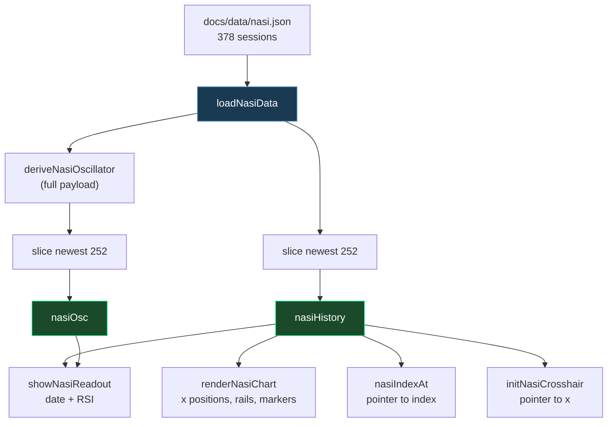

# NASI Overbought Rail and One-Year Chart Window - Plan

## Goal Capsule

Give the Overview tab's NASI panel an overbought counterpart to its existing oversold marking, and narrow the plotted window to one year.

Three units, in `docs/` and `tests/` plus a `CLAUDE.md` refresh:

1. Bound the chart to the newest 252 sessions (~1 year), replacing the ~18-month span.
2. Draw a rail at RSI 80 and a red marker on every session at or above 80.
3. Record both rules, and the 80 level's provenance, where the next editor will find them.

No Python pipeline change. `src/data_collection/compute_nasi.py` keeps its 378-session export.

**Authority hierarchy:** R-IDs win on behavior. KTD-IDs win on mechanism inside those constraints. Units override neither.

**Stop conditions:** stop and ask if the chart-side window turns out to break the crosshair index space in a way KTD1 does not cover, or if a marker or rail cannot render inside the RSI pane's 40 viewBox units.

**Tail ownership:** this run owns commit, PR, merge, and branch cleanup.

---

## Product Contract

### Summary

Add an RSI-80 rail and red overbought markers to the NASI panel's RSI pane, mirroring the amber-10 rail and green oversold markers already there, and cut the plotted history from ~18 months to one year.

### Problem Frame

The NASI panel reads only one direction. The RSI pane shades a band below 10, draws a rail there, and drops a green marker on every session that reaches it — the exhaustion signal that has marked each major Nasdaq low. The other end of the same series is unmarked, even though `NASI_OVERBOUGHT = 80` already exists in code and already colors the header RSI red. Inside the year this plan plots, RSI spent 18 consecutive sessions at or above 80 — 2026-04-17 to 2026-05-12, peaking at 87.78 — and none of it is visible on a 40px-tall pane.

One year is the span the user reads at. Narrowing to it costs two things, both accepted rather than solved.

First, the exporter's own comment argues for 18 months: RSI(14) troughs recur about once a year, so a window holding a single trough "shows a squiggle rather than a pattern". The 252-session window holds two sub-10 troughs today (November 2025 and July 2026) and first holds only one around mid-November 2026, when the November 2025 trough rolls out.

Second, the shipped payload carries five overbought runs and the window keeps only the most recent. The RSI 91.05 peak belongs to May 2025 and leaves the chart.

### Key Decisions

- KD1. Mark every session inside the overbought band, not only the bar that crosses into it. *(session-settled: user-directed — chosen over a strict crossing test: the existing sub-10 rule is also a level test, and the panel reports a phase rather than a signal date.)* Governs R2, R3.
- KD2. The one-year window is a chart-side view decision; the exporter keeps its 378-session payload. *(session-settled: user-directed — chosen over trimming `EXPORT_SESSIONS`: code PRs reset `docs/data/`, so an exporter-only change would leave the deployed chart at 18 months until the next daily workflow run.)* Governs R4, R6.

### Requirements

**Overbought marking**

- R1. The RSI pane draws a horizontal rail at RSI 80.
- R2. Every session whose RSI is at or above 80 carries a red marker on the RSI track.
- R3. The overbought rail and markers mirror the existing sub-10 rail and markers: same marker geometry, same draw order relative to the RSI track and the crosshair.

**Chart window**

- R4. The chart plots the newest 252 trading sessions, replacing the current ~18-month span.
- R5. The crosshair reports the hovered session's own date, oscillator, and RSI after the window narrows.
- R6. `src/data_collection/compute_nasi.py` keeps `EXPORT_SESSIONS = 378`.

**Durability**

- R7. The level rule (KD1) and the chart-side window (KD2) are pinned by an automated guard test, and stated in `CLAUDE.md` and the `.nasi-panel` palette comment.
- R8. The 80 level is recorded as an uncalibrated convention, never checked against an external `$NASI` reference, unlike the 10 rail.

### Scope Boundaries

- `NASI_OVERSOLD` (10) and `NASI_LOW_BAND` (12) keep their current values and rendering. R4 leaves 2026-03-30 (10.95) as the only visible low that bottomed between 10 and 12; the other four dated lows in the `NASI_LOW_BAND` comment fall outside the window or below 10.
- R4 leaves one overbought run on the chart — April–May 2026. The other four in the payload fall outside the window.
- No shaded fill on the overbought side; the amber band below 10 stays the pane's only fill.
- The header readout, the crosshair pointer mechanics, and the breadth tiles above the panel are untouched.
- `docs/data/nasi.json` is not regenerated. Per repo convention, code-fix PRs reset `docs/data/`.

#### Deferred to Follow-Up Work

- Trimming `EXPORT_SESSIONS` toward the displayed window, if the retained 18 months ever proves unused. It is retention headroom today.
- Re-checking the 80 level against an external `$NASI` reference the way the 10 rail was checked in August 2026 (R8 records that this has not happened).
- Labelling the bands on screen. The panel has carried no legend since the crosshair readout replaced the footer row, so marker colour is the only key. Naming the band beside the RSI value in the hover readout would fix it; deferred as a scope call, not a defect.

---

## Planning Contract

### Key Technical Decisions

- KTD1. Slice the fetched history in `loadNasiData`, before `nasiHistory` is assigned. *(session-settled: user-directed — chosen over slicing inside `renderNasiChart`: see KD2.)* Four call sites share one index space: `renderNasiChart` plots at it, `nasiIndexAt` and `initNasiCrosshair` divide by it, and `showNasiReadout` indexes into it. Slicing at render time alone would leave the pointer math counting 378 positions across a 252-point plot, so the crosshair would name the wrong session. Covers R4, R5.
- KTD2. Derive the oscillator from the whole payload, then slice `nasiOsc` by the same window as `nasiHistory`. The arrays are already documented as parallel; deriving first also leaves the oldest visible session with a real oscillator instead of an em dash. Covers R5.
- KTD3. Reuse `NASI_OVERBOUGHT`; do not add a second 80. The constant already drives the header RSI's red `.overbought` class, so one owner keeps the header and the rail from drifting. Covers R1.
- KTD4. One marker loop emits both marker colors. The `rx: 2 / sx` live-scale geometry is the trap in this function — a `<circle>` deforms under `preserveAspectRatio="none"` — and a single loop keeps that lesson at one site while making it impossible for the two band rules to drift apart. Covers R2, R3.
- KTD5. Both rails are solid `--amber`; the marker colour carries the signal. *(session-settled: user-directed — chosen over a solid red rail: red markers centred on a red rail read as one thickened line.)* The 80 rail lands at y 116 and the qualifying markers span y 112.9–117.5, so they overlap it. The oversold side already pairs an amber rail with green markers, and position separates the two thresholds — they sit 28 viewBox units apart. Covers R1, R3.

### High-Level Technical Design

The load-bearing shape is not the drawing — it is where the window is applied. Four call sites share one index space, and keeping them on one array is what keeps the crosshair honest.



Both slices use the same window expression and happen at the same place. Applying the window anywhere downstream of `nasiHistory` — or leaving one call site on the fetched payload — desyncs the pointer math from the plot, and nothing on screen says so. The crosshair simply reports a neighbouring session's numbers.

---

## Implementation Units

### U1. Bound the chart to the newest 252 sessions

**Goal:** the panel plots one year of sessions, and the crosshair still names the session under the pointer.

**Requirements:** R4, R5, R6, R7 — via KD2, KTD1, KTD2.

**Dependencies:** none. Shares `docs/app.js` and the guard test with U2, so the two land in sequence rather than in parallel.

**Files:**
- `docs/app.js` — new session constant beside the other NASI constants; the slice and the two call sites in `loadNasiData`.
- `tests/test_nasi_crosshair_markup.py` — guards for the window, the parallel slice, and the call sites.

**Approach:**
1. Add a `NASI_CHART_SESSIONS` constant (252) next to `NASI_OVERBOUGHT`, with a comment naming why the window is chart-side and the export is not (cite KD2).
2. In `loadNasiData`, keep the fetched payload whole, derive the oscillator from it, then take the newest `NASI_CHART_SESSIONS` entries into both `nasiHistory` and `nasiOsc` using the same expression.
3. Repoint the two calls at the tail of `loadNasiData` to the sliced array: `renderNasiChart` and the first-paint `showNasiReadout` index currently both read the unsliced local, so leaving them alone would plot 378 sessions against 252-session pointer math.
4. Leave the bodies of `renderNasiChart`, `nasiIndexAt`, `showNasiReadout`, and `initNasiCrosshair` unchanged. The last three read the module-level `nasiHistory`; only `renderNasiChart` takes its history as a parameter, so only its argument changes.

**Patterns to follow:** `SESSION_HISTORY_DAYS` in the same file, a client-side window that mirrors a server-side one; the existing `nasiOsc` "Parallel to nasiHistory" comment, which this unit must keep true.

**Test scenarios:**
- `loadNasiData` bounds the rendered history against a named session constant, not a bare numeric literal.
- Both `nasiHistory` and `nasiOsc` are bounded by that same constant — the guard fails if only one of them is.
- `deriveNasiOscillator` is called on the unsliced payload, so the oldest visible session still resolves an oscillator.
- `loadNasiData` passes the sliced history to `renderNasiChart` and derives the first-paint readout index from that same sliced array, so the plot and the pointer math can never count different numbers of sessions.
- The window constant is a client-side value in `docs/app.js`; `compute_nasi.py` still declares `EXPORT_SESSIONS = 378`.

**Verification:** the chart's leftmost session sits about one year before the newest. Hovering the leftmost column reports that date with a numeric OSC, not an em dash. Hovering the rightmost column reports the newest session, matching the header's OSC and RSI. The summation pane rescales vertically, because its y-range is computed from the visible points — expected, not a regression.

---

### U2. Overbought rail and red markers in the RSI pane

**Goal:** an RSI-80 rail plus a red marker on every session at or above 80.

**Requirements:** R1, R2, R3, R7 — via KD1, KTD3, KTD4, KTD5.

**Dependencies:** U1 — no code dependency, but both edit `docs/app.js` and the same guard test.

**Files:**
- `docs/app.js` — `renderNasiChart`.
- `tests/test_nasi_crosshair_markup.py` — guards for the rail, the level rule, and the marker geometry.

**Approach:**
1. Draw a third rail at `NASI_OVERBOUGHT`, solid `--amber` like the 10 rail, before the RSI track so the track draws over it. The existing rail loop picks stroke and dash from a two-way `lvl === NASI_OVERSOLD` ternary, so a third level needs a different branch shape — appending to the level array alone yields a dashed `--border2` rail. The dashed `--border2` treatment stays exclusive to the 12 major-low band.
2. Replace the oversold-only marker loop with one loop that emits a `--green` marker at or below `NASI_OVERSOLD`, a `--red` marker at or above `NASI_OVERBOUGHT`, and nothing between.
3. Keep the `rx: 2 / sx` and `ry: 2` ellipse geometry and the comment block that explains why it is not a `<circle>`.
4. Leave the amber oversold band as the pane's only fill, and keep the crosshair appended last.

**Patterns to follow:** the existing rail loop and the live-scale comment block above the oversold markers, which the merged loop inherits.

**Test scenarios:**
- `renderNasiChart` draws a rail at `NASI_OVERBOUGHT`, referenced by constant rather than a literal 80.
- The overbought marker test compares the session's own RSI against `NASI_OVERBOUGHT` — it does not compare against the previous session's RSI. This pins KD1 against a later "make it a proper crossing" edit.
- The marker loop emits both `--green` and `--red`, so one band rule cannot be changed without the other being visible in the same block.
- `renderNasiChart` creates markers as `ellipse` elements with `rx` divided by the measured x-scale, and creates no `circle` element. Assert against the element-creation call form, not the bare word: the retained geometry comment names `<circle>` twice and `_extract_function` returns comments verbatim, so a substring check fails on the comment it is meant to protect.

**Verification:** on the Overview tab the RSI pane shows an amber rail near the top of the pane and a red band with rounded ends across April–May 2026, with the shorter green bands at the November 2025 and July 2026 troughs unchanged. The 18 qualifying sessions render as one continuous ~27px bar at the default panel width, not as separate dots — markers are 4 CSS px wide at ~1.35 px per session. To check the ellipse geometry, read a marker's computed `rx` in the browser inspector, multiply by the SVG's x-scale, and confirm it equals `ry` in CSS pixels at two panel widths.

---

### U3. Record the rules and the 80 level's provenance

**Goal:** the level rule, the chart-side window, and the 80 level's lack of external calibration survive a future editor who reads only the code.

**Requirements:** R7, R8.

**Dependencies:** U1, U2.

**Files:**
- `CLAUDE.md` — the NASI section and the `docs/data/nasi.json` row of the Key Data Stores table.
- `docs/app.js` — the `NASI_OVERBOUGHT` comment.
- `docs/style.css` — the `.nasi-panel` palette comment.

**Approach:**
1. In the NASI section, state that the RSI pane carries an oversold rail at 10 and an overbought rail at 80, and that both mark every session inside the band rather than the crossing bar, because the panel reports phases.
2. State that 80 is a conventional level that has never been checked against an external `$NASI` reference, unlike 10 — which carries a dated StockCharts comparison. Mirror that note on the `NASI_OVERBOUGHT` declaration, which today carries no comment at all while its two neighbours carry several lines each.
3. State that the plotted window is 252 sessions and is applied chart-side while the export stays 378, and why — the same deployment-lag reasoning that already justifies deriving the oscillator instead of adding a field.
4. Update the `docs/data/nasi.json` table row so the 378-session figure reads as the retained payload, with the chart's one-year window named separately. This row is where the exporter's stale 18-month claim is reconciled; `compute_nasi.py` itself stays unmodified.
5. Extend the `.nasi-panel` palette comment to state the pane's colour rule: `--amber` for both threshold rails, `--green` and `--red` for the markers that carry the signal. The existing line names `--amber` for the oversold band only and `--green`/`--red` for the header stats.

**Test scenarios:** `Test expectation: none -- documentation and comments; no behavior changes.`

**Verification:** the full test suite stays green. The NASI section names both rails, the level rule, both window figures, and 80's uncalibrated status.

---

## Verification Contract

```bash
uv run python -m unittest discover -s tests
```

All 302 existing tests plus the guards added in U1 and U2 pass. `tests/test_nasi_crosshair_markup.py` and `tests/test_nasdaq_mcclellan.py` must both stay green — the first pins the panel's markup invariants, the second pins the RSI-versus-summation invariance the panel depends on.

Browser verification is required, because the change is visual and no JS test tooling exists in this repo. Serve `docs/` locally, open the Overview tab, and confirm:

- The RSI pane shows amber rails at 10 and 80, and the dashed grey rail at 12 is unchanged.
- A red band with rounded ends spans April–May 2026; the green bands remain at the November 2025 and July 2026 troughs. Adjacent sessions merge — expect bands, not separate dots.
- The chart's leftmost session is about one year before the newest.
- Hovering the leftmost and rightmost columns reports those two dates, with a numeric OSC at both ends.
- Dragging the divider between the panels preserves marker shape: computed `rx` times the SVG x-scale equals `ry` in CSS pixels at two different widths.

Do not commit regenerated data. If any exporter runs locally, reset with `git checkout -- docs/data/`.

---

## Definition of Done

**Global**

- R1 through R8 hold.
- `uv run python -m unittest discover -s tests` passes.
- Browser verification above is confirmed with a screenshot.
- `docs/data/` carries no changes in the diff.
- `src/data_collection/compute_nasi.py` is unmodified.
- No abandoned or experimental code remains in the diff.

**Per unit**

- U1: the chart plots 252 sessions; the crosshair names the correct session at both ends of the window; the parallel-slice and call-site guards pass.
- U2: the 80 rail and red level markers render; the merged marker loop keeps the ellipse geometry; the level-rule guard passes.
- U3: `CLAUDE.md` names both rails, the level rule, both window figures, and 80's uncalibrated status; the `NASI_OVERBOUGHT` declaration carries that same note; the `.nasi-panel` palette comment states the rails-are-amber, markers-carry-the-signal rule, distinct from its existing `--green/--red for direction` note about the header stats.

---

## Sources & Research

- `docs/app.js:34-42` — NASI thresholds. `NASI_OVERBOUGHT = 80` is already declared and already drives `nasiRsiState`, so U2 adds no new number. It is also the only one of the four with no rationale comment, which R8 addresses.
- `docs/app.js:653-698` — `loadNasiData` and `deriveNasiOscillator`; the slice site for U1. Note lines 676-677: `renderNasiChart(hist)` and `showNasiReadout(hist.length - 1)` both take the unsliced local, which is why U1 step 3 exists.
- `docs/app.js:796-838` — the RSI pane block U2 extends: the oversold band rect, the rail loop with its two-way ternary, the RSI track, the marker loop, and the crosshair append.
- `docs/app.js:840-892` — `nasiIndexAt`, `showNasiReadout`, `initNasiCrosshair`; three of the four call sites that make KTD1 load-bearing.
- `src/data_collection/compute_nasi.py:46-51` — `EXPORT_SESSIONS = 378` and the comment arguing for 18 months on single-trough grounds. Left unchanged under KD2 and R6; U3 reconciles the claim in `CLAUDE.md`'s data-store row rather than in the Python file.
- `docs/style.css:944-946` — `.nasi-stat-val.overbought` is already `--red`, which is where the marker colour comes from. The `.nasi-panel` palette comment at 888-891 already names `--red` for the header stats, so U3's edit must name the marker role specifically.
- Measured against the shipped `docs/data/nasi.json` (378 sessions, 2025-02-11 to 2026-08-13): the newest 252 sessions span 2025-08-13 to 2026-08-13 and peak at RSI 87.78; 18 of them read at or above 80 (2026-04-17 to 2026-05-12, one contiguous run) and 8 read at or below 10, in two runs. A strict crossing test would yield 1 and 2 markers. The shipped chart draws 8 green markers, which confirms the existing sub-10 rule is a level test and grounds KD1.
- Geometry measured for U2's verification: `yRsi(80)` is 116 and the qualifying markers span y 112.9–115.5, so with `ry: 2` they overlap the rail. At the default panel width sessions sit ~1.35 CSS px apart against 4 CSS px markers, so contiguous runs render as bands.
- `docs/plans/2026-08-12-001-feat-dashboard-layout-nasi-crosshair-plan.md` — the prior NASI plan; source of the live-scale marker geometry and the crosshair-inside-render invariants this plan must not break, and the change that removed the panel's footer legend.
