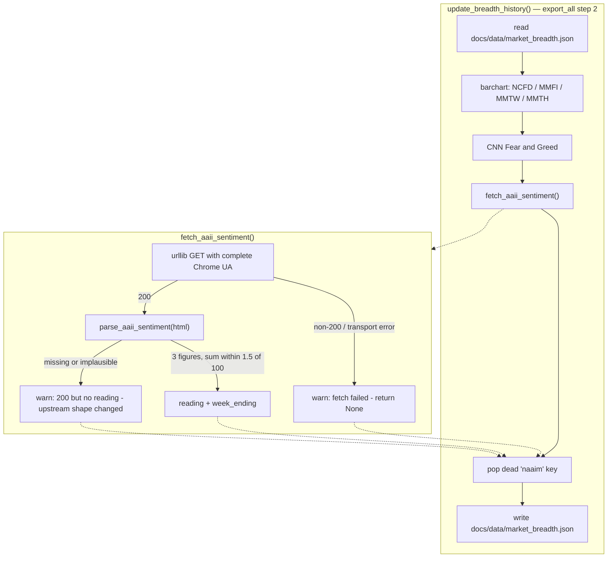

# AAII Sentiment Tile and NASI Oversold Rail - Plan

## Goal Capsule

- **Objective:** Replace the dead NAAIM exposure tile on the Overview tab with an AAII Sentiment tile, and move the NASI RSI oversold rail from 10 to 11.
- **Authority:** Requirements (R-IDs) win on behavior. Key Technical Decisions (KTD-IDs) win on mechanism. `CLAUDE.md` wins on repo convention; where this plan and `CLAUDE.md` disagree, U4 updates `CLAUDE.md` rather than the plan bending.
- **Execution profile:** Two independent changes on one branch. U1 → U2 are sequential (payload shape then render). U3 is independent of both. U4 documents U1 and U3.
- **Stop conditions:** Stop and ask if the AAII page stops returning 200 to a complete browser User-Agent, or if the `ssv2-` class hooks are gone from the live markup. Both mean the source shape changed since this plan was researched and the parse target must be re-derived.
- **Tail ownership:** `ce-work` owns commit, push and PR.

---

## Product Contract

### Summary

The Overview tab's Market Breadth & Sentiment card carries a NAAIM Exposure tile whose number no longer moves — the current reading is paywalled and the scraper returns a stale figure with nothing on screen to say so. This plan retires that tile and puts an AAII Sentiment tile in the same grid slot, showing bullish / neutral / bearish percentages and the survey's week-ending date. The date is the staleness defence the NAAIM tile lacked.

Separately, the NASI RSI pane's oversold rail moves from 10 to 11, and the dashed 12 rail is removed. Our summation-RSI series reads about 1.0–1.1 points above StockCharts `$NASI` at a trough, so an 11 rail on our series marks what a 10 rail marks on theirs. The 12 rail becomes redundant at 11 and would render as the same line.

### Problem Frame

Two unrelated defects on one dashboard card.

The NAAIM tile is dead. `fetch_naaim_exposure` scrapes a chart-data array out of `naaim.org`, and the newest value in that array is now behind a membership wall. `update_breadth_history` only overwrites `history['naaim']` when the fetch succeeds, so a failed or stale fetch leaves the previous number in place. The tile has no date and no history strip, so a frozen value is indistinguishable from an unchanged market.

The NASI oversold rail at 10 sits inside the noise band of its own series. `compute_nasi.py` refreshes a trailing 90 calendar days of Nasdaq advance/decline data on every run, so historical RSI values get revised. Across the last 14 daily commits, 2026-07-30 read 9.84, 9.86, 9.87, 9.88, 9.94, 9.96, 10.02 and 10.15 — crossing the rail in both directions. Its green marker appears and disappears between deploys with nothing on screen to explain it. The same drift never touches an 11 rail for that session.

### Key Decisions

- **The AAII tile shows the three raw survey figures, not a derived Bull−Bear spread.** (session-settled: user-directed — chosen over a spread headline: the spread hides which side moved.) Governs R2.
- **The tile carries the survey's week-ending date.** (session-settled: user-approved — chosen over matching the other tiles' date-less shape: AAII refreshes weekly, so without a date a broken fetch looks exactly like a normal week.) Governs R3, R5.
- **The dashed 12 rail is removed rather than kept or relocated.** (session-settled: user-approved — chosen over keeping both rails or moving the second rail to 13: at 11 the two rails render as one line, and 13 has never been calibrated against anything.) Governs R8.

### Requirements

**AAII sentiment tile**

- R1. The Overview card's second tile is labelled `AAII Sentiment` and occupies the grid slot NAAIM held. The grid stays six tiles in three rows; no other tile moves.
- R2. The tile shows bullish, neutral and bearish percentages as three separate figures, each under its own short label.
- R3. The tile shows the survey's week-ending date beneath the figures.
- R4. The three figures render in the neutral value colour. No figure and no tile state is tinted by a sentiment threshold.
- R5. When the payload carries figures but no week-ending date, the tile names the gap in words rather than rendering an empty line.
- R6. Every `naaim` reference is removed from the export, the markup, the render path, and the published payload. The export deletes the dead `naaim` key from `docs/data/market_breadth.json` on its next run.

**AAII data collection**

- R7. `update_breadth_history` writes an `aaii` block to `docs/data/market_breadth.json` carrying `bullish`, `neutral`, `bearish` and `week_ending`.
- R8. A reading is emitted only when all three percentages parse and their sum falls within 1.5 points of 100. A partial or implausible parse emits nothing.
- R9. A fetch failure and a parse failure log distinguishable warnings. A 200 response that yields no reading is logged as an upstream-shape signal, not as a fetch problem.
- R10. A failed AAII fetch does not fail the export. Breadth collection stays non-critical, as the barchart and CNN fetches already are.

**NASI oversold rail**

- R11. The NASI RSI oversold level is 11. The amber rail, the shaded band, the green session markers and the header tint all move with it.
- R12. The RSI pane draws exactly two rails: oversold and overbought. Both are amber.
- R13. `NASI_LOW_BAND` and its rail are removed. No dangling constant remains in `docs/app.js`.

### Success Criteria

- On the plotted 252-session window, green markers appear at 2026-03-30 and across 2026-07-29 to 2026-07-31, and the November 2025 run extends back to start at 2025-11-14 instead of 2025-11-17.
- A live `fetch_aaii_sentiment()` call returns the current week's three figures and its week-ending date.
- `uv run python -m unittest discover -s tests` passes.

### Scope Boundaries

**Deferred to follow-up work**

- Tinting the AAII tile at contrarian extremes. This needs a calibrated threshold, and the repo already carries one uncalibrated level (`NASI_OVERBOUGHT = 80`) flagged as a convention. Do not add a second one without a reference series to check it against.
- An AAII history series, sparkline or chart. The tile is a single-week readout like its siblings.
- Auto-dimming or flagging a stale AAII reading by age. R3's visible date is the agreed staleness signal for this plan.
- Completing the truncated shared `market_breadth.user_agent` value and collapsing it with the new AAII key. The shared value works for barchart today; changing a working scraper's UA carries risk with no benefit to this work.

**Outside this plan**

- Re-verifying `NASI_OVERBOUGHT = 80`. It has never been checked against an external reference, and this plan gives it no new authority.
- Any change to the NASI issue universe, the RSI math, or `NASI_CHART_SESSIONS`.
- Any change to the NCFD, MMFI, MMTW, MMTH or CNN Fear & Greed tiles.

### Sources

- AAII source page: <https://www.aaii.com/sentimentsurvey>. Public, no login. Verified 2026-08-27.
- Vendor comparison for the NASI offset: `CLAUDE.md` NASI section — ours 9.97 vs StockCharts 8.85 on 2026-07-30; ours 9.89 vs their 8.85 on the second dated pair.
- Silent-source learning: `docs/solutions/logic-errors/api-returns-null-for-fields-it-does-not-have.md`. A source that fails quietly is indistinguishable from a quiet reading; the surface must name the cause.
- Parser test precedent: `tests/test_fetch_fundamental_data.py` — fixture HTML plus a faked response, no network in the test.

---

## Planning Contract

### Key Technical Decisions

- KTD1. **The AAII fetch uses `urllib` with a complete Chrome User-Agent, not Playwright.** The User-Agent is the only header that decides the outcome. Measured five header combinations on 2026-08-27: the repo's existing `market_breadth.user_agent` (`Mozilla/5.0 (Windows NT 10.0; Win64; x64) AppleWebKit/537.36`) returns 403 with or without a full header set, while the same string completed with `(KHTML, like Gecko) Chrome/126.0.0.0 Safari/537.36` returns 200 on its own. Headless Chromium via Playwright also returns 403, so the route used for barchart and CNN is worse here, not better.

- KTD2. **The AAII User-Agent gets its own config key rather than reusing or editing the shared one.** The shared `market_breadth.user_agent` is truncated and cannot reach AAII, but it works for barchart. `aaii_user_agent` and `aaii_url` join the existing `market_breadth` block. Collapsing the two keys is in Scope Boundaries as deferred.

- KTD3. **Fetch and parse are separate functions.** `fetch_aaii_sentiment()` performs the request; `parse_aaii_sentiment(html)` is pure and returns a reading or `None`. This mirrors `tests/test_fetch_fundamental_data.py`, which is the repo's only precedent for testing a scraper, and it is what makes R8 and R9 testable without network.

- KTD4. **The parse targets the `ssv2-gauge` region's own class hooks.** `ssv2-snum bull|neut|bear` carries the three current-week figures; `ssv2-gauge-week` carries `Week ending August 26, 2026`. The historical averages sit in a sibling `ssv2-savg` class and also sum to 100, so a sum check alone cannot separate them — the class hook is what does. The page's schema.org block advertises a CSV download at `/sentimentsurvey/sent_results`, but that URL serves HTML carrying none of the current-week values; do not build against it.

- KTD5. **`ssv2` is a version prefix, so the parse is expected to break eventually.** A `ssv3` redesign renames every hook at once. R9's split warning is the mitigation: a 200 response that parses to nothing is the upstream-redesign signal, and it must not read as a fetch problem. This is the same failure shape as the Finviz ticker-parsing regression and the `Value.Traded` outage in `CLAUDE.md`.

- KTD6. **The AAII figures render uncoloured.** The card's existing tiles tint by contrarian meaning — a low NCFD is green. Applying that logic to AAII would make high bearish sentiment green, which inverts the plain reading of the label next to it. Colouring by the label instead would assert a directional read this plan has not calibrated. Governs R4.

- KTD7. **The tile uses its own three-column block instead of `.breadth-value`.** (session-settled: user-approved — chosen over spanning the card's full width, and over shrinking every tile to match: a full-width AAII tile leaves the other five as two rows plus an orphan.) `.breadth-value` is 28px with -1.2px tracking; the tile has about 140px of text room at the panel's 400px default width, and three figures at that size do not fit. A dedicated class avoids an override fight with the 28px rule. Governs R2.

- KTD8. **The branch does not commit a hand-edited `docs/data/market_breadth.json`.** The repo's PR convention resets `docs/data/` on code PRs, so the tile shows em dashes until the next daily workflow run republishes the payload with an `aaii` block. This is the same accepted deployment lag `CLAUDE.md` records for the `V` cutoff and the derived NASI oscillator.

- KTD9. **The oversold rail moves to 11 by changing one constant.** `NASI_OVERSOLD` is already the single source for the rail, the band rectangle, the marker test and `nasiRsiState`. No other edit is needed for R11. Do not introduce a second threshold for any of the four.

- KTD10. **The `NASI_LOW_BAND` comment's calibration history moves onto `NASI_OVERSOLD`.** The five dated lows the 12 band was drawn for are the record of why a floor above 10 was needed; deleting the constant must not delete that evidence. Governs R13.

- KTD11. **The AAII fetch lives in `src/reporting/export_dashboard_data.py`, not `src/data_collection/`.** `CLAUDE.md`'s module layout assigns external data collection to `src/data_collection/`, which reads like the right home. It is not where the sibling code is: `fetch_barchart_breadth`, `fetch_cnn_fear_greed` and `fetch_naaim_exposure` all live next to `update_breadth_history` in the reporting module. Following the local precedent keeps the four breadth fetches together and keeps this plan's diff to one Python file. Moving all four is a separate refactor and is not this plan's work.

### High-Level Technical Design

The AAII path replaces one branch inside the existing breadth export. Nothing about the surrounding flow changes.

The two warning paths in `fetch` are the load-bearing part. They are separate because a 403 and a silent parse miss demand different responses, and collapsing them is what let the NAAIM tile sit stale.

The NASI change has no flow shape — it is one constant and one deleted rail. No diagram.

### Assumptions

- The AAII page keeps returning 200 to a complete desktop Chrome User-Agent from GitHub Actions runners. Verified from a local Windows host on 2026-08-27; not verified from CI. If CI is blocked where local is not, the block is IP-based and the fix is a different fetch route, not a different header.
- The `ssv2-` class hooks describe the current redesign and are stable in the short term. KTD5 covers the failure.
- `docs/data/market_breadth.json` remains the file the Overview tab reads for breadth. No other consumer of the `naaim` key exists — a repo-wide search found references in exactly four tracked files, all touched by this plan.

### Risks & Dependencies

- **The AAII scrape breaks silently.** Highest-likelihood risk. The `ssv2` prefix names a redesign that will be superseded. Mitigated by R9's split warning and by R3's visible date, which surfaces a frozen value on the dashboard itself rather than in a log nobody reads.
- **The AAII page carries an Akamai-style bot sensor** (an obfuscated script tag sits in the `<head>` of `/sentimentsurvey/sent_results`). Today a complete User-Agent clears it. A future tightening would return 403, which R9's fetch-failure warning names correctly.
- **Moving the oversold rail changes a signal the user trades on.** The change is a widening: every session marked at 10 stays marked at 11. Nothing that currently reads as oversold stops reading as oversold.

---

## Implementation Units

### U1. AAII fetch and parse in the breadth export

- **Goal:** `update_breadth_history` writes an `aaii` block and stops writing `naaim`.
- **Requirements:** R6, R7, R8, R9, R10
- **Dependencies:** none
- **Files:**
  - `src/reporting/export_dashboard_data.py` — delete `fetch_naaim_exposure`; add `fetch_aaii_sentiment` and `parse_aaii_sentiment`; replace the NAAIM block in `update_breadth_history` and pop the dead key.
  - `config/workflow_config.yaml` — add `aaii_url` and `aaii_user_agent` under `market_breadth`.
  - `tests/test_aaii_sentiment.py` — new.
- **Approach:**
  1. Add `aaii_url: "https://www.aaii.com/sentimentsurvey"` and `aaii_user_agent` (a complete Chrome UA, per KTD1) to the `market_breadth` config block. Leave `user_agent` untouched.
  2. Write `parse_aaii_sentiment(html)` as a pure function returning `{'bullish', 'neutral', 'bearish', 'week_ending'}` or `None`, targeting the `ssv2-snum` and `ssv2-gauge-week` hooks named in KTD4. Normalise the week label to an ISO date; leave `week_ending` as `None` when only the label is missing.
  3. Write `fetch_aaii_sentiment()` around it, following the request shape `fetch_naaim_exposure` used. Emit the two distinguishable warnings R9 requires.
  4. In `update_breadth_history`, replace the NAAIM block with the AAII call, and add `history.pop('naaim', None)` so R6's dead key clears on the next run.
  5. Delete `fetch_naaim_exposure`.
- **Patterns to follow:** `fetch_cnn_fear_greed` for the return-a-dict-or-`None` shape and the non-fatal `except`. `fetch_barchart_breadth` for reading the URL and User-Agent from `CONFIG["market_breadth"]`.
- **Execution note:** Capture the live page to a fixture first, then write the parser against the fixture. The fixture is what makes the R8 and R9 scenarios testable and what a future `ssv3` break will be diffed against.
- **Test scenarios:**
  - A fixture of the current markup parses to bullish 32.9, neutral 22.6, bearish 44.4 and `week_ending` 2026-08-26.
  - A fixture missing the bearish figure returns `None`. A two-of-three reading is never emitted.
  - A fixture whose only percentage hooks are `ssv2-savg` (the historical averages, which also sum to 100) returns `None`. Confirms the class hook, not the sum check, is what separates them.
  - A fixture with all `ssv2-` prefixes renamed to `ssv3-` returns `None`. Confirms a redesign fails loudly rather than producing a partial reading.
  - A fixture with the three figures present but no `ssv2-gauge-week` element returns the figures with `week_ending` as `None`.
  - A fixture whose three figures sum to 60 returns `None`.
  - Integration: `update_breadth_history` run against a payload that already carries a `naaim` key writes a file with no `naaim` key. Covers R6's dead-key clear, which no parser test reaches.
  - Integration: `update_breadth_history` completes and writes the other breadth keys when the AAII fetch returns `None`. Covers R10 — a dead source must not fail the export, and this is the path a future `ssv3` rename takes.
- **Verification:** `uv run python -m unittest tests.test_aaii_sentiment` passes. A live call returns the current week's figures and date.

### U2. AAII tile markup, render and styles

- **Goal:** The Overview card renders the AAII tile in NAAIM's slot.
- **Requirements:** R1, R2, R3, R4, R5, R6
- **Dependencies:** U1
- **Files:**
  - `docs/index.html` — replace the NAAIM tile block.
  - `docs/app.js` — replace the NAAIM block in `loadBreadthData`.
  - `docs/style.css` — add the three-column figures block per KTD7.
  - `tests/test_dashboard_breadth_markup.py` — new.
- **Approach:**
  1. Replace the NAAIM tile in `docs/index.html` with an `AAII Sentiment` tile: a three-column figures block, each column carrying a figure and a short label, plus a `.breadth-sub` element for the week-ending date.
  2. Add the CSS for the figures block. It is a sibling of `.breadth-value`, not a modifier of it, so the 28px rule does not apply. Size the figures to fit the roughly 140px of text room a half-width tile has at the panel's 400px default.
  3. Replace the NAAIM block in `loadBreadthData` with one that writes the three figures and the date. Follow R5 for the missing-date case.
  4. Leave the rest of `loadBreadthData` alone. The `['ncfd', 'mmtw', 'mmfi', 'mmth']` loop and the Fear & Greed block are untouched.
- **Patterns to follow:** The Fear & Greed tile is the existing precedent for a tile with a `.breadth-sub` line beneath its value. `docs/app.js`'s NASI `showNasiReadout` is the precedent for naming an absent value in words rather than leaving a blank.
- **Test scenarios:**
  - Every element id `loadBreadthData` writes for the AAII tile exists in `docs/index.html`. A missing id renders a silently blank tile with no console error.
  - No `naaim` identifier survives in `docs/index.html` or `docs/app.js`.
  - The breadth grid still holds six `.breadth-item` blocks, so the two-column layout stays even.
- **Verification:** `uv run python -m unittest tests.test_dashboard_breadth_markup` passes. In the browser, the Overview tab shows three figures with labels and a week-ending date after a live export run.

### U3. NASI oversold rail to 11; remove the 12 rail

- **Goal:** The RSI pane marks oversold at 11 and draws two rails.
- **Requirements:** R11, R12, R13
- **Dependencies:** none
- **Files:**
  - `docs/app.js` — `NASI_OVERSOLD`, the `NASI_LOW_BAND` constant and comment, the rails array in `renderNasiChart`.
  - `docs/style.css` — the RSI-pane rail comment above `.nasi-panel`.
  - `tests/test_nasi_crosshair_markup.py` — extend.
- **Approach:**
  1. Set `NASI_OVERSOLD` to 11. Rewrite its comment to carry the vendor offset (ours reads about 1.0–1.1 above StockCharts at a trough, so 11 here is their 10) and the revision drift that makes 10 unstable (2026-07-30 ranged 9.84–10.15 across 14 daily commits).
  2. Fold the five dated lows from the `NASI_LOW_BAND` comment into the `NASI_OVERSOLD` comment per KTD10, then delete the constant and its comment.
  3. Remove the `NASI_LOW_BAND` entry from the rails array. The array is left with the two amber entries.
  4. Update the `docs/style.css` comment that names the rails as "10 and 80" and claims the dashed `--border2` treatment is exclusive to the 12 band. The dashed treatment is still used by the zero line in the summation pane, so the correction is about the RSI pane specifically.
- **Patterns to follow:** The existing rails array and marker loop. KTD9 — one constant feeds all four consumers; do not add a second.
- **Test scenarios:**
  - `NASI_OVERSOLD` is 11 in `docs/app.js`. Pinned the way `NASI_CHART_SESSIONS` (252) and `EXPORT_SESSIONS` (378) are already pinned.
  - The rails array in `renderNasiChart` has exactly two entries and both are `var(--amber)`. Guards R12 against a third rail returning under a different name.
  - `NASI_LOW_BAND` does not appear anywhere in `docs/app.js`.
  - The existing 21 tests in the file still pass. None of them pin the value 10, so the change must not require editing them.
- **Verification:** `uv run python -m unittest tests.test_nasi_crosshair_markup` passes. In the browser, the RSI pane shows two amber rails and green markers at 2026-03-30 and across 2026-07-29 to 2026-07-31.

### U4. Documentation

- **Goal:** `CLAUDE.md` describes the rail at 11 and records the AAII fetch trap.
- **Requirements:** R11, R12, R13 (documentation side)
- **Dependencies:** U1, U3
- **Files:** `CLAUDE.md`
- **Approach:**
  1. Update the NASI paragraph at `CLAUDE.md:204` — `NASI_OVERSOLD` is 11, with the vendor-offset and revision-drift reasoning from U3.
  2. Update the both-ends paragraph at `CLAUDE.md:206` — the amber rail sits at 11, and the pane draws two rails.
  3. Fix the closing sentence of the chart-window paragraph at `CLAUDE.md:210`. It currently says the dashed 12 rail labels one visible low. The 12 rail is gone, and at 11 the marked episodes in the plotted window are the same three the 12 band caught.
  4. Add a short AAII note to the market-breadth part of the pipeline description: the complete-User-Agent requirement from KTD1, the `ssv2` version-prefix fragility from KTD5, and the fact that the advertised CSV endpoint does not carry the current week.
- **Approach note:** Keep each edit to the surrounding paragraph's voice and length. `CLAUDE.md` records traps and their evidence, not change logs.
- **Test scenarios:** `Test expectation: none -- documentation only, no behavior change.`
- **Verification:** No sentence in `CLAUDE.md` still refers to a rail at 10 or to `NASI_LOW_BAND`.

---

## Verification Contract

| Gate | Command | Applies to |
|---|---|---|
| Full suite | `uv run python -m unittest discover -s tests` | All units |
| AAII parser | `uv run python -m unittest tests.test_aaii_sentiment -v` | U1 |
| Breadth markup | `uv run python -m unittest tests.test_dashboard_breadth_markup -v` | U2 |
| NASI markup | `uv run python -m unittest tests.test_nasi_crosshair_markup -v` | U3 |
| Live AAII fetch | `uv run python -c "from src.reporting.export_dashboard_data import fetch_aaii_sentiment; print(fetch_aaii_sentiment())"` | U1 |
| Export smoke | `uv run python -m src.reporting.export_dashboard_data` | U1, U2 |

The NASI suite passes green today at 21 tests. That is the baseline U3 must not regress.

**Browser verification order matters.** The export smoke run rewrites `docs/data/market_breadth.json` with the `aaii` block. Verify the tile in the browser **before** running `git checkout -- docs/data/`, because after the reset the payload carries `naaim` again and the tile correctly shows em dashes. Reset only once the visual check has passed, per the repo's PR convention that code PRs do not commit regenerated `docs/data/*.json`.

Browser checks on the Overview tab:

- The second tile reads `AAII Sentiment` with three labelled figures and a week-ending date.
- The breadth grid is still six tiles in three even rows.
- The NASI RSI pane shows two amber rails.
- Green markers appear at 2026-03-30 and across 2026-07-29 to 2026-07-31.

---

## Definition of Done

**Global**

- Every requirement R1 through R13 is satisfied or explicitly deferred in writing.
- `uv run python -m unittest discover -s tests` passes.
- No `naaim` identifier remains in `src/`, `docs/index.html`, `docs/app.js` or `docs/style.css`. The key in `docs/data/market_breadth.json` clears on the next workflow run via U1's pop.
- `docs/data/` is reset before commit, per the repo's PR convention.
- No abandoned attempt is left in the diff — no disabled NAAIM function, no commented-out `NASI_LOW_BAND`, no unused config key.

**Per unit**

| Unit | Done when |
|---|---|
| U1 | A live fetch returns the current week's figures and date; all six parser scenarios pass; the dead key is popped. |
| U2 | The tile renders three labelled figures and a date after a live export; the grid is still six tiles. |
| U3 | `NASI_OVERSOLD` is 11; two amber rails render; `NASI_LOW_BAND` is gone; the 21 existing tests still pass. |
| U4 | No `CLAUDE.md` sentence refers to a rail at 10 or to `NASI_LOW_BAND`; the AAII fetch trap is recorded. |

---

## Appendix

### Measured impact of the 10 to 11 move

Counted against `docs/data/nasi.json` as of the 2026-08-26 session, over the plotted 252-session window (2025-08-26 to 2026-08-26).

| Threshold | Marked sessions | Marked runs | Episodes |
|---|---|---|---|
| 10 | 7 | 2 | 2025-11-17→24; 2026-07-31 |
| 11 | 11 | 3 | 2025-11-14→24; 2026-03-30; 2026-07-29→31 |
| 12 | 12 | 3 | 2025-11-14→24; 2026-03-30; 2026-07-29→08-03 |

11 adds 2026-03-30 (RSI 10.95, the SPY year low) and extends the July 2026 episode from one session to three. 11 and 12 mark the same three episodes in this window, which is why the 12 rail is redundant rather than merely crowded.

### Why the two rails would merge

`docs/index.html` sets the chart `viewBox` to `0 0 600 152` and `docs/style.css` sets `.nasi-chart` height to 152px, so the vertical scale is 1:1. The RSI pane spans y 108 to 148 — 40 units for 0 to 100 RSI, or 0.4 CSS px per RSI point. Rails at 11 and 12 would sit 0.4px apart, each drawn with a 1px non-scaling stroke. This is the same merge failure the existing rail-colour rule guards against on the overbought side.

### RSI revision drift at 2026-07-30

`compute_nasi.py` refreshes a trailing 90 calendar days of advance/decline data on every run, so past sessions get revised. Reading 2026-07-30's RSI out of `docs/data/nasi.json` at each of the last 14 commits that touched the file, newest first: 10.02, 9.96, 9.96, 9.94, 9.86, 10.15, 9.84, 9.84, 9.86, 9.87, 9.88, 9.87, 9.88, 9.87. The session crosses a rail at 10 in both directions and is currently unmarked. It never approaches a rail at 11.

### AAII header test, 2026-08-27

Six requests against `https://www.aaii.com/sentimentsurvey` — five `urllib` header combinations plus a headless-Chromium control.

| Request | Result |
|---|---|
| Repo's `market_breadth.user_agent`, alone | 403 |
| Repo's UA plus Accept / Accept-Language / Sec-Fetch headers | 403 |
| Complete Chrome UA, alone | 200 |
| Complete Chrome UA plus the full header set | 200 |
| Complete Chrome UA plus Accept-Language only | 200 |
| Headless Chromium via Playwright, default UA | 403 |

The User-Agent decides; nothing else changes the outcome.
