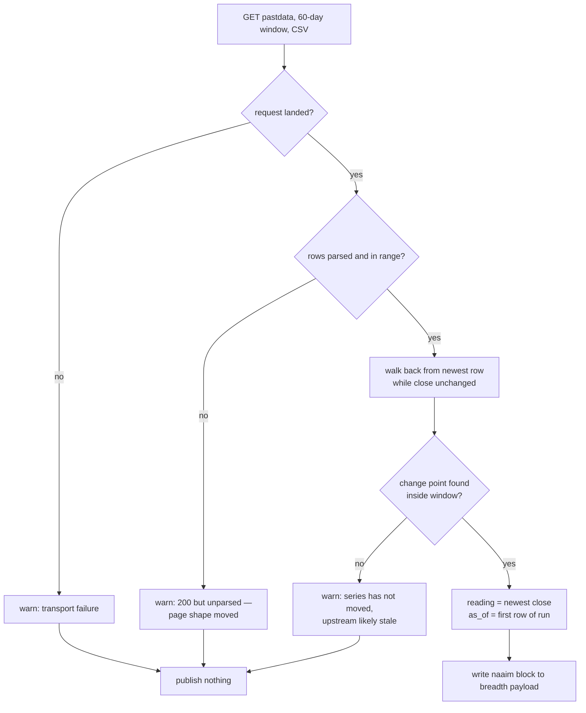

# NAAIM Exposure Tile from StockCharts - Plan

## Goal Capsule

- **Objective:** Publish the NAAIM Exposure Index from StockCharts' quote service and render it as a seventh tile on the Overview tab's Market Breadth & Sentiment card, re-cutting the tile grid into a sentiment row of three above a breadth row of four.
- **Authority:** Requirements (R-IDs) win on behavior. Key Technical Decisions (KTD-IDs) win on mechanism. `CLAUDE.md` wins on repo convention; where this plan and `CLAUDE.md` disagree, U6 updates `CLAUDE.md` rather than the plan bending.
- **Execution profile:** U1 → U2 is the export chain. U3 → U4 → U5 is the dashboard chain. The two chains are independent and can land in either order. U6 documents both. Three existing tests pin the pre-change state and will fail the moment U2 or U3 lands — two assert NAAIM's absence, the third asserts a six-tile grid. U2 and U5 own retiring them, so do not expect a green suite between those units.
- **Stop conditions:** Stop and ask if `/quotebrain/pastdata` stops returning 200 to a browser User-Agent, if its CSV header row no longer reads `Date, Open, High, Low, Close, Volume`, or if the returned series shows no value change across the whole fetch window. All three mean the source shape moved since this plan was researched.
- **Tail ownership:** `ce-work` owns commit, push and PR.

---

## Product Contract

### Summary

The Overview tab lost its NAAIM Exposure tile in August 2026 when the reading moved behind a membership wall on `naaim.org`. The number is still published — StockCharts carries it as the `!NAAIM` symbol, and the JSON service behind its own charts serves it without a login. This plan restores the tile from that source and re-cuts the card's tile grid so seven tiles fill two rows exactly where six fill three today: the three sentiment tiles across the top, the four breadth percentages beneath them.

The tile carries a survey date, and that date is the point of the exercise. StockCharts repeats one weekly NAAIM reading onto every trading day and stamps each copy with that day's date, so the feed's own timestamp says "today" six days after the survey. Trusting it would rebuild the exact failure that killed the tile the first time — a frozen number with nothing on screen to say so.

### Problem Frame

**What the reading is.** NAAIM surveys its member firms — active investment managers running real client money — on their aggregate equity exposure, and publishes one number weekly. It sits beside the card's two existing gauges without duplicating either: CNN Fear & Greed is a composite of market internals, AAII is retail opinion, and NAAIM is what professionals actually have on. That distinction is why the tile is wanted alongside AAII rather than instead of it, and it is the fact a future reader needs when this endpoint eventually moves and someone has to weigh repairing it against dropping the tile.

**Why the old tile died.** It did not break loudly. `update_breadth_history` only overwrites keys it successfully fetches, so when the `naaim.org` scrape started failing, the previous value survived every subsequent run. The tile had no date, so 79.70% stood on screen indefinitely and read as an unchanged market. The AAII tile that replaced it was built with a week-ending line specifically to close that gap.

Restoring NAAIM re-opens the same gap in a new form. The old failure was a dead fetch behind a live-looking number; the new risk is a live fetch behind a stale-but-freshly-dated number. StockCharts' quote endpoint returns `"time": "2026-09-01 16:00:00"` alongside a close of 102.66 that has not moved since the Wednesday 2026-08-26 survey. Nothing in that response marks the difference.

### Key Decisions

- **The source is the StockCharts quote service, not `naaim.org`.** (session-settled: user-directed — chosen over NAAIM's own site, whose current reading sits behind a membership wall and whose page exposes no CSV or JSON.) Governs R1.
- **NAAIM is added beside the AAII tile, not in its place.** (session-settled: user-directed — chosen over restoring it in AAII's slot: both readings are wanted, which is what forces the grid re-cut.) Governs R6.
- **The tile is re-cut as a sentiment row of three above a breadth row of four.** (session-settled: user-approved — chosen over leaving the six tiles untouched and giving NAAIM a full-width row of its own: that option changes no existing tile but does not rearrange the six.) Governs R6, R7.
- **The NAAIM figure carries no directional colour tint.** (session-settled: user-approved — chosen over tinting green at low exposure and red at high, matching NCFD and MMFI: those tiles tint off levels this repo has calibrated, and NAAIM has none.) Governs R5.
- **A dead fetch keeps the last reading and lets its survey date age, rather than clearing the tile.** (session-settled: user-approved — chosen over wiping the key so the tile shows em dashes: the original disaster was a frozen number with *no* date, and the date is what fixes it. This also keeps NAAIM behaving like the AAII tile beside it.) Governs R4, R9.
- **Below the width where the seven-tile shape stops fitting, the grid falls back to the current two-column shape.** (session-settled: user-approved — chosen over building the two-rows-of-two layout outright, and over accepting clipped tiles at narrow widths.) Governs R6, R10.

### Requirements

- **R1.** The daily export publishes the current NAAIM Exposure Index reading into the breadth payload the Overview card reads.
- **R2.** The published reading carries the date of the survey it belongs to, derived from when the value last changed — never from the feed's own bar timestamp.
- **R3.** A transport failure and a 200-that-parses-to-nothing log as distinct warnings, and neither aborts the daily export.
- **R4.** When the payload carries no NAAIM block at all — the first run, or the window after a `docs/data/` reset — the tile keeps its placeholder em dashes and says nothing about the reading.
- **R5.** The NAAIM figure renders in the card's neutral text colour, with no directional tint.
- **R6.** The card's seven tiles fill both grid rows exactly across the panel's supported width range, with no ragged half-row, and stack to one column on narrow screens.
- **R7.** The AAII tile's rendered width does not regress from its current half-panel width.
- **R8.** When the fetch window contains no value change at all, the export treats that as an upstream-staleness signal rather than publishing a reading dated to the window's first day.
- **R9.** When a fetch fails after a reading has already published, the previous reading and its survey date remain on the tile unchanged. The ageing date is the staleness signal; nothing overwrites it with a fresher-looking one.
- **R10.** Every tile's value, label and sub-line render on one line without clipping at the narrowest width where the seven-tile shape applies.

### Success Criteria

- The published `as_of` equals the first date of the newest constant run in the fetched series, is never the current session's date on a non-survey day, and the value matches what the quote endpoint returns in the same minute.
- Replacing the source with a fixture whose survey is six days old still renders that older date, not the current session's date.
- Simulating a failed fetch against a payload that already carries a reading leaves that reading and its date untouched (R9); removing the key entirely renders em dashes (R4).
- No tile's value, label or sub-line clips at the narrowest width where the seven-tile shape applies.
- The full unit suite passes.

### Scope Boundaries

In scope: the fetch, the payload key, the tile, the grid re-cut, the three tests that pin the pre-change state, and the `CLAUDE.md` sections this work invalidates.

**Deferred for later**

- A NAAIM history strip or sparkline. The other breadth tiles carry a five-reading history array; NAAIM steps weekly, so five readings is over a month and the strip would mislead more than it informs.
- A charted NAAIM series in the NASI pane or elsewhere.
- Fetching `$NASI` from the same endpoint to calibrate the uncalibrated `NASI_OVERBOUGHT = 80` rail. U6 records that the route now exists; building it is separate work.
- A `docs/solutions/` entry for the forward-fill trap. It is the same family as `docs/solutions/logic-errors/api-returns-null-for-fields-it-does-not-have.md` and would fit the store, but writing it is `ce-compound`'s job after this lands.

**Outside this work**

- Any change to the AAII tile's figures, tint rule, or week-ending line.
- Any change to the barchart or CNN fetches.

### Sources

- Endpoint behavior, cadence, and history depth measured directly against `stockcharts.com` on 2026-09-01; see Appendix.
- `docs/plans/2026-08-27-2001-feat-aaii-sentiment-nasi-oversold-plan.md` — the sibling plan that retired NAAIM and built the AAII tile this one mirrors.
- `docs/solutions/logic-errors/api-returns-null-for-fields-it-does-not-have.md` — the same failure family: a vendor response that is plausible, well-formed, and indistinguishable from the state it is not.

---

## Planning Contract

### Key Technical Decisions

- **KTD1. One request to the daily-history endpoint, not the quote endpoint.** The quote endpoint (`/quotebrain/quotes`) returns the value in clean JSON but cannot answer R2 — its `time` field is the forward-filled bar date, which reads as today on every day of the survey week. The history endpoint (`/quotebrain/pastdata`) returns the daily series, and the survey date is recoverable from it. Using both would be two requests for one fact the second already contains.
- **KTD2. The survey date is the first day of the current constant run.** Walk the series back from the newest row while the close is unchanged; the last matching row's date is the survey date. On a week where the survey repeats the previous week's number exactly, this reports a date one week old. That is the correct direction to be wrong in — it reads staler than reality, never fresher — and it is rare: 6 exact week-over-week repeats in 1,053 weeks of history (0.57%).
- **KTD3. Request `out=csv`.** `out=json` does not return JSON — it silently serves the same fixed-width text table as `out=text`. The CSV form has a stable `Date, Open, High, Low, Close, Volume` header and needs no column-position parsing.
- **KTD4. Reuse the existing `market_breadth.user_agent`.** Verified against the live endpoint: the repo's truncated string (no `Chrome/` token) returns 200, and curl's default agent returns **404**. Unlike AAII this needs no separate key. The 404 matters more than the reuse: a blocked request looks like a bad symbol rather than a block, so the failure warning must name the User-Agent as a suspect.
- **KTD5. A 12-column grid with unequal spans, not two separate grids.** Twelve is the lowest common multiple of the two row shapes, so one container keeps one gap rhythm and one responsive rule. Sentiment row: Fear & Greed spans 3, AAII spans 6, NAAIM spans 3. Breadth row: four tiles at span 3. AAII keeps span 6 — half the grid, exactly its width today — because it is the one tile already documented as type-constrained. Note that the `.aaii-parts` comment's "~140px of text room" figure is measured against the *shared* 400px panel default, which this card does not use (see KTD9); the span-6 arithmetic preserves AAII's current width at every viewport regardless.
- **KTD6. The NAAIM render branch goes *before* the AAII branch in `loadBreadthData`.** `tests/test_dashboard_breadth_markup.py` slices the "AAII render block" as the text between `data.aaii` and `['ncfd'`, then asserts no colour classes appear in it. A NAAIM branch placed between them falls inside that slice, so an untinted NAAIM passes today but a future tint would fail a test named for AAII. Placing it first keeps the slice honest.
- **KTD7. Fetch a 60-day window and treat a change-free window as a failure.** Sixty calendar days spans roughly eight surveys, so the current run's start is always inside it with wide margin. A window containing no change at all cannot yield a survey date and means the series has stopped moving upstream — R8 makes that a warning and no publish, rather than a reading dated to the window's first day.
- **KTD8. The compact type scale retunes `.breadth-value` itself; it is never a new class on the value element.** `loadBreadthData` rewrites `className` wholesale in two places — `'breadth-value ' + colorClass` for the four breadth tiles and `'breadth-value ' + (…)` for Fear & Greed. Any additional class on that element survives first paint and is wiped the instant the payload arrives, so the numbers would snap back to 28px inside tiles the re-cut just narrowed — and the placeholder em-dash state still looks correct, so a by-eye check passes. Retuning the rule avoids the problem entirely: every element carrying `.breadth-value` is one of the six tiles that need the smaller scale, because AAII uses `.aaii-num` instead. The two `className` assignments then stay exactly as they are and `docs/app.js` stays out of U3's scope.
- **KTD9. The narrow-width fallback keys on panel width, not viewport.** `#macro-left` is `width: 42%` with **no pixel floor** — it does not use the shared `.left-panel { width: max(20%, 400px) }` default — and `initResizablePanels` lets the user drag it to its 256px minimum. Twelve gutters consume a fixed 110px at any width, so a span-3 tile is unusable well before that floor. The existing `max-width: 1100px` block cannot help, because on a wide monitor the viewport stays wide while the panel narrows. Give the card `container-type: inline-size` and wrap the twelve-column template and every span in a `@container` block, so below the threshold the grid falls back to the current two-column shape. The threshold is the panel width at which a span-3 tile drops under the R10 text budget, measured in U3.

### High-Level Technical Design

The daily series is a step function sampled every trading day. The reading is the newest step's height; the survey date is that step's left edge.

```
close
102.66                    ┌──────────────  ← reading (newest row)
                          │
 94.49        ┌───────────┘
              │           ↑
 95.52  ──────┘           └─ survey date = first row of the current run
        ──┬───────┬───────┬───────┬──→  trading days
        8-12    8-19    8-26     9-01
                                (newest)
```

Walking back from the newest row while the close is unchanged finds the left edge. Every step in 2026 to date lands on a Wednesday, which is the survey's publication day — but the derivation does not assume that, and does not need to.



The three warnings are deliberately distinct (R3): a transport failure did not land, a 200-that-parses-to-nothing means the page shape moved, and a change-free window means the series stopped upstream. Collapsing them is what let the original tile's breakage read as an ordinary quiet week.

**`publish nothing` leaves whatever was last published in place** — it does not clear the key. `update_breadth_history` loads the existing payload, assigns only what it fetched, and writes the whole object back, so a prior reading and its survey date survive untouched (R9) and age visibly. Em dashes appear only when no reading was ever published (R4).

### Assumptions

- The daily forward-fill continues. If StockCharts switched to publishing only on survey days, the run-walk still returns the right date — the run would simply be one row long — so this assumption is not load-bearing for correctness, only for the change-free-window alarm's calibration.
- The narrowest width the seven-tile shape must survive is the panel at a 1101px viewport (~462px), just above the point where the existing responsive block stacks the grid. Below the KTD9 threshold the two-column fallback takes over, so no width is left unspecified.

### Implementation Constraints

- `docs/data/` is reset on code-fix PRs, so the tile renders em dashes until the next daily workflow run republishes the payload. That is the R4 empty state working as intended, not a defect to chase.
- Breadth collection is non-critical in the daily workflow. Nothing in this chain may raise; every failure path returns `None` and logs.

---

## Implementation Units

### U1. NAAIM fetch, parse, and survey-date derivation

**Goal:** Turn one HTTP request into `{value, as_of}` or `None`, with the survey date derived from the series rather than read off the feed.

**Requirements:** R1, R2, R3, R8

**Dependencies:** none

**Files:**
- `src/reporting/export_dashboard_data.py` — add `parse_naaim_series`, `derive_naaim_reading`, `fetch_naaim_exposure`
- `config/workflow_config.yaml` — add the endpoint template under `market_breadth`
- `tests/test_naaim_exposure.py` — new

**Approach:**

1. Split the work the way the AAII module does: a pure parse, a pure derivation, and a thin fetch that owns the request and the logging. The parse and the derivation are where every edge case lives, and neither should need a network to test.
2. `parse_naaim_series` takes the CSV body and returns rows oldest-first as `(ISO date, close)`. Reject the whole response rather than returning a partial series when the header is missing or a close does not parse — a half-read series yields a confidently wrong survey date.
3. Add a plausibility guard mirroring AAII's range check. The CSV carries **no instrument identity** — its header is only `Date, Open, High, Low, Close, Volume` — so if `%21NAAIM` ever stops resolving and the endpoint serves any other well-formed daily series, the parse succeeds and the tile publishes a different instrument's number under the NAAIM label. Reject a reading outside NAAIM's published exposure range (about −200 to 200). This is the leg that makes the parse refuse a plausible-but-wrong response, and it is why `parse_aaii_sentiment` has its own range and sum checks.
4. `derive_naaim_reading` implements KTD2: newest close is the reading, then walk back while the close is unchanged and take the last matching row's date. Return `None` when the walk reaches the oldest row without a change (R8).
5. `fetch_naaim_exposure` builds the URL from the config template with a 60-day start (KTD7), sends `market_breadth.user_agent` (KTD4), and logs the three failure modes distinctly per R3. The 404 case is worth naming in the transport warning, because a wrong User-Agent produces one and it reads like a bad symbol.

The endpoint template, as measured on 2026-09-01:

```
https://stockcharts.com/quotebrain/pastdata?ticker=%21NAAIM&start={start}&barwidth=D&out=csv&memberrt=&randomNumber={cachebust}
```

`{start}` is an ISO `YYYY-MM-DD` date; `memberrt` is ignored by the server and stays empty; `{cachebust}` is epoch milliseconds, matching what the site's own bundle sends.

**Patterns to follow:** `fetch_aaii_sentiment` / `parse_aaii_sentiment` in the same file — the split, the never-raise contract, the range guard, and the distinct warning for a fetch that lands but parses to nothing.

**Execution note:** Write the parse and derivation tests first. Both are pure functions over small fixtures, the edge cases below are sharp, and the AAII module set this precedent in the sibling plan.

**Test scenarios:**
- A three-week fixture stepping 95.52 → 94.49 → 102.66 returns 102.66 with the first date of the 102.66 run.
- A fixture whose newest run is one row long returns that row's own date.
- A fixture where the newest week exactly repeats the prior week's close returns the *earlier* run's start date — pins KTD2's documented fail-safe direction so it cannot be "fixed" into looking fresher.
- A fixture with no value change anywhere returns `None` (R8).
- A single-row fixture returns `None` — one row is a run with no discoverable start.
- A well-formed CSV whose closes sit outside the exposure range returns `None` — the wrong-series guard from step 3.
- A CSV with a missing or renamed header row returns `None`.
- A CSV whose close column holds a non-numeric value returns `None` rather than raising (R3 — this function is called outside the request's try block).
- An empty body returns `None`.
- `fetch_naaim_exposure` returns `None` and logs a transport warning when the request raises; returns `None` and logs a distinct shape warning when the body parses to nothing.
- The request carries the configured User-Agent — a regression here yields a 404 that reads as a missing symbol.

**Verification:** The new test module passes, and a one-off live call returns today's reading with a survey date that is a past Wednesday, never the current session's date.

---

### U2. Publish the NAAIM block

**Goal:** Wire the fetch into the breadth payload and stop the export actively deleting the key.

**Requirements:** R1, R3, R9

**Dependencies:** U1

**Files:**
- `src/reporting/export_dashboard_data.py` — `update_breadth_history`
- `tests/test_aaii_sentiment.py` — extend the shared helper, replace the dead-key guard, update the class docstring

**Approach:**

1. Delete `history.pop('naaim', None)` and the comment block explaining the retirement. Call `fetch_naaim_exposure` and assign `history['naaim']` only on a non-`None` return, mirroring the AAII and Fear & Greed lines directly above. Do **not** reintroduce a pop on the failure path: overwrite-on-success-only is exactly what R9 wants, because the surviving block carries its own ageing survey date.
2. `UpdateBreadthHistoryAaiiTests._run_with` patches `fetch_barchart_breadth`, `fetch_cnn_fear_greed` and `fetch_aaii_sentiment` and nothing else. The moment `update_breadth_history` calls `fetch_naaim_exposure`, every test routed through that helper issues a live request to stockcharts.com on each suite run — silently, since the assertions still pass. Add a `naaim_return` parameter defaulting to `None` with a matching patch, which is also what the scenarios below need in order to drive the value.
3. `test_the_dead_naaim_key_is_removed` asserts the opposite of the new behavior and must be replaced, not edited around. Its sibling `test_a_dead_aaii_source_does_not_fail_the_export` is the shape to copy. The class docstring opens "the dead NAAIM key clears" and needs rewriting too.
4. Add NAAIM to the summary line the function prints, so a silent failure is visible in workflow logs.

**Patterns to follow:** the `fetch_cnn_fear_greed` and `fetch_aaii_sentiment` call sites immediately above the removed `pop`.

**Test scenarios:**
- A successful fetch writes the `naaim` block verbatim into the payload.
- A `None` return with **no** prior key leaves the key absent and does not raise (R4) — the other tiles still publish.
- A `None` return with a **prior** `naaim` block leaves that block and its `as_of` untouched (R9). This is the scenario that distinguishes the two empty states, and the one the old dead-key test was pinning the opposite of.
- A pre-existing `naaim` key is overwritten by a fresh reading, not merged.
- The AAII and barchart keys are untouched by the NAAIM path.
- No test in the module reaches the network — the helper patches every fetch `update_breadth_history` calls.

**Verification:** `tests/test_aaii_sentiment.py` passes with the replaced test, and a local export writes a `naaim` block into `docs/data/market_breadth.json`.

---

### U3. Tile markup and the grid re-cut

**Goal:** Seven tiles filling two rows exactly, legible across the panel's supported width range, with the AAII tile no narrower than it is today.

**Requirements:** R4, R6, R7, R10

**Dependencies:** none

**Files:**
- `docs/index.html` — the `#breadth-container` grid
- `docs/style.css` — `.breadth-grid`, `.breadth-value`, `.breadth-label`, `.breadth-sub`, the new `@container` block, and the `max-width: 1100px` block

**Approach:**

1. Add the NAAIM tile with a value element and a sub-line element for the survey date, following the Fear & Greed tile's value-plus-sub shape rather than AAII's three-part shape. Order the markup as the rows read: Fear & Greed, AAII, NAAIM, then NCFD, MMTW, MMFI, MMTH.
2. Move `.breadth-grid` to twelve columns and give each tile its span per KTD5. Keep the existing gap and padding.
3. **Measure before sizing.** The Overview pane is `#macro-left { width: 42% }` with no pixel floor, so it is roughly 462px at a 1101px viewport and grows from there — the shared 400px default does not apply to this card. Compute the span-3 text budget at that narrowest supported width (subtract the panel's 14px padding each side, the grid's 12px, eleven 10px gaps, and the tile's 14px each side), then size the type to it.
4. Retune `.breadth-value` itself rather than adding a class (KTD8), and carry a comment in the `.aaii-parts` spirit explaining why — the next editor's instinct will be a modifier class, and that instinct is wrong here for a reason nothing on screen shows.
5. **The label and sub-line share the shrinking box and need the same budget.** `.breadth-label` must hold "CNN Fear & Greed" on one line, `.breadth-sub` must hold the Fear & Greed rating (`EXTREME GREED`) and NAAIM's survey-date line. Sizing only the value ships a card whose labels wrap to two and three lines, which is the ragged row R6 exists to prevent.
6. Add `container-type: inline-size` to the card and wrap the twelve-column template and every span in a `@container` block per KTD9, so below the measured threshold the grid falls back to the current two-column shape.
7. The `max-width: 1100px` block collapses the grid with `grid-template-columns: 1fr`. Column spans survive that collapse and would break the stack, so the spans must be reset there too.

**Patterns to follow:** the `.aaii-parts` comment block in `docs/style.css` — it documents *why* a tile carries its own type scale, and the retuned scale needs the same treatment for the same reason.

**Test scenarios:** covered by U5, which owns the markup guards.

**Verification:** At a 1101px viewport no tile's value, label or sub-line wraps or clips, and both rows are flush. Dragging the panel wider keeps both rows intact; dragging it narrower crosses cleanly into the two-column fallback with no clipped state in between. Below the responsive breakpoint all seven tiles stack in one column.

---

### U4. Render the NAAIM tile

**Goal:** Write the reading and its survey date into the tile, untinted, with a real empty state.

**Requirements:** R1, R2, R4, R5, R9

**Dependencies:** U3

**Files:**
- `docs/app.js` — `loadBreadthData`

**Approach:**

1. Place the NAAIM branch **before** the `data.aaii` branch (KTD6).
2. Guard on the block's presence the way the AAII branch does, so a payload without the key leaves the markup em dashes standing (R4).
3. Render the figure as `value.toFixed(2) + '%'` with no colour class (R5). Two decimals rather than the other tiles' one because NAAIM steps weekly and the second decimal genuinely separates surveys; the `%` suffix matches every other figure on the card and the retired tile's own `79.70%`. A negative reading prints its sign as-is. This is the one tile in the card whose render must *not* touch `className` on the value element — and per KTD8 the other five keep their existing `className` assignments unchanged.
4. Print the survey date as a labelled line beneath the figure. When the block carries a reading but no date, name the gap in words rather than leaving the line blank — the AAII branch's `week ending unknown` sets the wording pattern, and the reasoning is identical: an absent date is the only thing separating a frozen feed from an ordinary mid-week view.
5. The date formatter that AAII uses splits the ISO string by hand rather than constructing a `Date`, because a bare date parses as UTC midnight and shows the previous day to every viewer west of Greenwich. NAAIM needs the same handling; share the helper rather than writing a second one.

**Patterns to follow:** the `data.aaii` branch immediately below, and `formatAaiiWeek` for the date handling.

**Test scenarios:** covered by U5.

**Verification:** With a fixture payload the tile shows the figure and its survey date; with the key removed it shows em dashes and no date line; the figure carries no colour class in either case.

---

### U5. Update the dashboard markup guards

**Goal:** Replace the assertions that pin NAAIM's absence and the six-tile grid with assertions that pin the new shape.

**Requirements:** R4, R5, R6

**Dependencies:** U3, U4

**Files:**
- `tests/test_dashboard_breadth_markup.py`

**Approach:**

1. `test_the_retired_naaim_tile_is_gone` asserts no file mentions `naaim`. Replace it with the paired id tests the AAII tile already has — every id the render writes exists in the markup, and every id in the markup has a writer. That pairing is what catches the silent failure the module's docstring describes.
2. `EXPECTED_BREADTH_TILES = 6` and `test_the_breadth_grid_keeps_an_even_tile_count` encode the old invariant, and the constant's comment states it: two columns, so an odd count leaves a ragged half-row. The count becomes seven and the invariant becomes the row split — three sentiment tiles then four breadth tiles, filling twelve columns each. Rewrite the comment; a bare number bump would leave the file explaining a rule it no longer enforces. Note that the existing count uses the exact-match regex `class="breadth-item"`, so if U3 adds span classes inline the regex silently matches zero — keep the span on a separate hook or widen the pattern.
3. Add a tint guard for NAAIM mirroring the AAII one, and keep it scoped to its own render block so the two tiles' guards stay independent.

**Patterns to follow:** `_aaii_render_block` and `test_the_aaii_figures_are_not_tinted_by_sentiment` in the same file.

**Test scenarios:**
- Every NAAIM element id the render writes exists in the markup.
- Every NAAIM id in the markup has a writer in the render.
- The tile count matches the new row split, and the counting regex still matches the tiles after U3's span changes.
- The NAAIM render block assigns no colour class and no `--green` / `--red`.
- The existing AAII guards still pass unchanged — proves KTD6's ordering kept the AAII slice clean.

**Verification:** `uv run python -m unittest discover -s tests` passes in full.

---

### U6. Documentation

**Goal:** Record what the reading is, how it is fetched, and the two standing `CLAUDE.md` claims this work invalidates.

**Requirements:** R2, R6

**Dependencies:** U1, U2, U3

**Files:**
- `CLAUDE.md` — the AAII section, a new NAAIM section, the NASI section, the dashboard-layout notes, the data-store table, and the config notes

**Approach:**

1. The AAII section opens by saying NAAIM was retired because its reading moved behind a membership wall. That is still true of `naaim.org` and is the reason AAII exists, so it stays — but it now needs the correction that the number is available elsewhere, with a pointer to the new section.
2. Add a NAAIM section carrying what is invisible from the code: what the index measures and what it adds beside the card's two other gauges (so a future reader can weigh repair against removal when the endpoint moves), the endpoint and its parameters, the forward-fill trap and why the date is derived rather than read, the wrong-series range guard, and the 404-not-403 User-Agent gate. State plainly that reading the feed's own timestamp is the obvious-looking change and is wrong.
3. **Correct the NASI section.** It currently reads "StockCharts is JS-walled … Do not add a scraper for this." The Appendix disproves the first half: the JS shell is a shell, and `/quotebrain` serves the series behind it anonymously. Record that, and note `$NASI` through the same endpoint as the untried external reference the uncalibrated `NASI_OVERBOUGHT = 80` rail needs. Documentation only — building that fetch is deferred.
4. **Correct the panel-width notes.** The dashboard-layout section documents the shared `max(20%, 400px)` default and six table-tab overrides but never mentions Overview, which is `#macro-left { width: 42% }` with no floor. Add it, since every width judgment on this card depends on it.
5. Record the grid invariant: twelve columns, unequal spans, why AAII keeps span 6, and the container-query fallback threshold.

**Test expectation:** none — documentation only.

**Verification:** A reader who has never seen this plan can tell from `CLAUDE.md` alone what NAAIM measures, why the survey date is derived from a run walk, and that the StockCharts route exists.

---

## Verification Contract

```bash
uv run python -m unittest discover -s tests
```

```bash
uv run python -m src.reporting.export_dashboard_data
```

- The unit suite passes in full. Between U2 and U5 it will not — three tests pin the pre-change state by design.
- The local export writes a `naaim` block whose `as_of` is a past Wednesday and never the current session's date. Expect the most recent Wednesday, except on the ~0.6% of weeks where the reading exactly repeats the prior week's, when KTD2 reports the earlier Wednesday by design — that is not a failure.
- No test in the suite reaches stockcharts.com.
- After verifying the export, reset the regenerated data with `git checkout -- docs/data/` before committing — code-fix PRs do not carry regenerated payloads.
- Visual check at a 1101px viewport: both rows flush, no clipped value, label or sub-line, no half-row. Drag the panel to its 256px minimum and confirm the two-column fallback engages without an intermediate clipped state. Repeat below the responsive breakpoint.

## Definition of Done

- All ten requirements hold.
- The tile shows the current reading with a survey date that does not advance on non-survey days, and that survives a failed fetch unchanged.
- The two tests that pinned NAAIM's absence and the one that pinned the six-tile grid are replaced, not disabled or deleted outright.
- `CLAUDE.md` explains the derived date well enough that a future editor does not simplify it into reading the feed's timestamp, and no longer claims StockCharts is unreachable.
- `docs/data/` carries no plan-generated changes in the commit.
- No exploratory scripts, fixtures, or commented-out approaches remain in the diff.

## Appendix

### Endpoint measurements, 2026-09-01

All against `stockcharts.com`, anonymous, no cookies. The reading that day was **102.66**, survey date **2026-08-26**; the next survey landed 2026-09-02, so these figures date the measurement rather than describing a steady state.

| Check | Result |
|---|---|
| `/sc3/ui/?s=%21NAAIM` | 2,665-byte JS shell; the number is not in the HTML |
| `/quotebrain/quotes?s=%21NAAIM&f=json&randomNumber=<ms>` | `"name":"NAAIM Exposure Index"`, `"close":102.66`, `"time":"2026-09-01 16:00:00"` |
| `/quotebrain/pastdata?ticker=%21NAAIM&start=<ISO>&barwidth=D&out=csv&memberrt=&randomNumber=<ms>` | `Date, Open, High, Low, Close, Volume`; daily rows |
| History depth | Back to July 2006 (~1,053 weekly observations) |
| `out=json` | Returns the fixed-width text table, not JSON |
| `memberrt` | Ignored; empty works |
| Default curl User-Agent | **404** |
| `market_breadth.user_agent` (no `Chrome/` token) | 200 |
| `robots.txt` | `/quotebrain/` not disallowed; no crawl-delay |

Cadence: every value change **in 2026 to date** lands on a Wednesday, weekly, without exception. Between changes the value is copied to every trading day. Note the asymmetry in the evidence — the tie rate below draws on all 1,053 weeks, the cadence claim on 2026 alone. The derivation deliberately does not depend on the cadence holding.

Corroboration: the series reads 79.700 for the week of 2026-07-29 — the value the retired tile froze at, per `CLAUDE.md`. Same series.

Tie risk for KTD2: 6 exact week-over-week repeats in 1,053 weeks (0.57%).

### Alternative considered: leave the six tiles at two columns

Give NAAIM a full-width row beneath the existing three rows. No existing tile changes width, so no type scale moves and the AAII constraint never comes up. Rejected because it adds a tile without rearranging the six, which is the shape the work asked for.

### Alternative held in reserve: two rows of two for the breadth tiles

If the four-across row reads too dense once built, keep the sentiment row of three and split the four breadth tiles into two rows of two at their current half-panel width and 28px type. This trades a third grid row for keeping every breadth number at full size. It is **not** a one-line revert — taking it means four edits: the two breadth spans, restoring `.breadth-value` to 28px, the `@container` threshold (which the wider tiles change), and U5's row-split assertion. Whoever takes it should change all four, or the numbers stay small while the layout changes around them.
