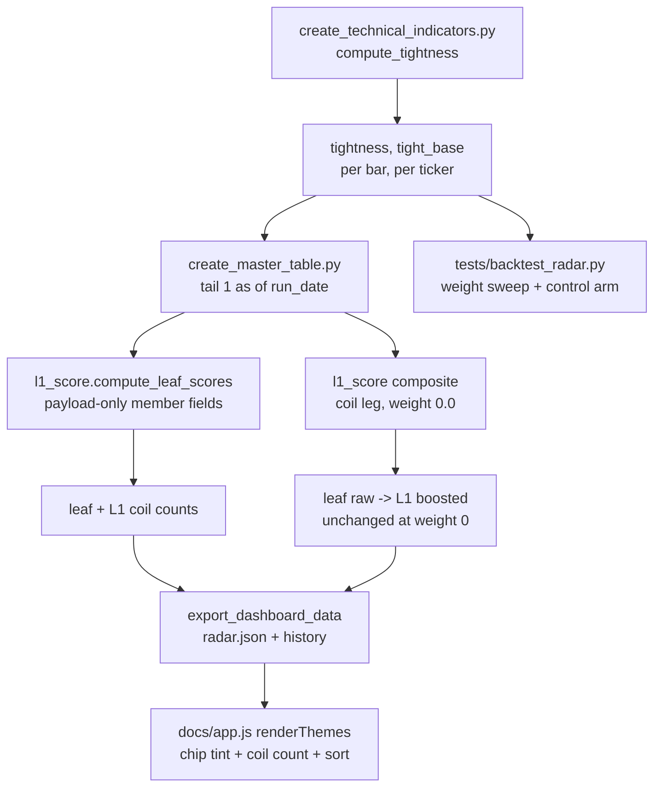
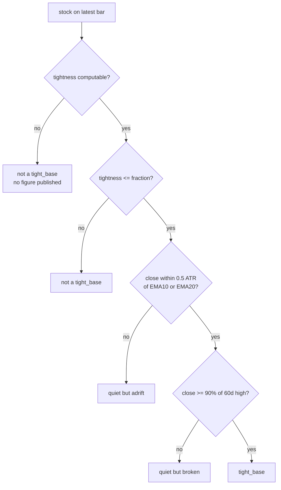

# Tight-Base (Coil) Signal for the L1 Radar - Plan

> # ⛔ SUPERSEDED — read this before any line below it
>
> **This plan describes a design that was replaced twice during implementation. Every parameter and both mechanisms changed. The code is authoritative; treat the body below as the record of how the work started, not of what exists.**
>
> | This plan says | What shipped |
> |---|---|
> | tightness = 4-session mean of per-bar \|close-to-close change\| ÷ ADR% (R1, R3, Appendix A) | **range of the last 3 CLOSES** ÷ mean ÷ ADR% |
> | three conjuncts incl. close within 0.5 ATR of EMA10/20 (R2, both mermaid diagrams) | **two conjuncts** — no moving-average test at all |
> | location gate `0.85 × 60-day high` | **`0.70 × 50-day high`** (a rolling max of HIGHS, not closes) |
> | coil leg is a graded percentile (KTD4) | **binary**, 100 or 0 |
> | composite 0.5 rs / 0.5 vars, coil weight **0.0** | **0.4 / 0.4 / 0.2**, plus a theme-level **`coil_gamma: 0.5`** the plan never contemplated |
> | flag fires on 1.5-10% | **~8.9%** |
> | located-coil theme IC +0.060 | **+0.030** |
>
> **The plan's central finding still stands and is the reason the feature is shaped as it is:** a period-high test carrying *no tightness at all* scores a theme-level IC of **+0.169** against ~+0.03 for the flag. The location half carries the edge. That control was never run when this plan was written — running it is what stopped a ranking claim from shipping.
>
> Both items this note previously listed as "did not ship" **did ship** in commit `0cf55c5`: the pinned coil strip above the theme blocks, and the manual acceptance check (now in the Verification Contract below). The coil sort ships ranking by **share** with a minimum count.
>
> Current documentation lives in `CLAUDE.md` → "Coil Marker" and `tests/RADAR_BACKTEST_FINDINGS.md` §9.0 and §9.6-§9.7. Prefer both over this file.

## Goal Capsule

- **Objective:** A trader scanning the Themes tab can see which stocks have gone quiet in a tight range near their highs, and which themes have several such stocks at once, without that information depending on where the theme sits in the ranking.
- **Means:** A per-stock `tightness` measure and a qualified `tight_base` flag computed in the indicator pipeline, carried through the master table into the radar payload as display data, rendered as a chip tint and a per-theme coil count, plus an opt-in sort. A composite leg exists but ships at weight zero (KTD3, KTD4).
- **Authority:** Requirements (R-IDs) win on behavior. Key Technical Decisions (KTD-IDs) win on mechanism. `CLAUDE.md` wins on repo convention; where this plan and `CLAUDE.md` disagree, U7 updates `CLAUDE.md` rather than the plan bending.
- **Execution profile:** U1 → U2 are the indicator chain and must land first. U3 depends on both. U4 → U5 is the export-then-dashboard chain. U6 is measurement and depends only on U3. U7 documents the result. U6 gates any change to the shipped weight, and its control arm also gates the "coil" label itself — so U5 waits on U6 rather than running beside it.
- **Stop conditions:** Stop and ask if U6's measurement contradicts the Appendix findings — specifically if the near-high-only control arm matches or beats the full coil definition, which would mean the signal is location and not tightness, and R7/R8 should be re-cut before the display ships a "coil" label. Stop if `tight_base` fires on more than 10% or fewer than 1.5% of the radar universe on a normal session. The pooled `tight_base` share in Appendix A is 4.2%; the 13.9% and 15.3-23.5% figures there belong to the tightness leg alone, before the two location conjuncts cut the population by roughly four, and do not describe this flag.
- **Tail ownership:** `ce-work` owns commit, push and PR.

---

## Product Contract

### Summary

The Themes tab ranks themes by strength. On 2026-09-11 Cybersecurity sat at rank 11, having oscillated between 6 and 16 across the whole base — rank 8 as recently as 2026-09-10. Over the next session its members ran +9.8% on average and it moved to rank 5. The members had been coiling — CRWD, FTNT, S and PANW each averaged daily moves under 30% of their own ADR% for four sessions, putting them in the tightest 3-9% of the liquid tagged universe. That information existed in the price data and appeared nowhere on the board.

This plan computes it and shows it. A stock in a tight range that is still riding its 10/20-day averages and sitting within 10% of its 60-day high gets a visible mark; a theme reports how many of its members are in that state; and the user can sort the board by that count when they want the coil lens instead of the strength lens.

It deliberately does **not** change the default ranking. Measurement over 165 sessions found two different things, and the distinction matters: weighting *bare* tightness degrades the board monotonically, while weighting the *located* coil changes nothing measurable — the whole 0-0.30 sweep spans 0.0036 of mean IC, far inside the noise band of a single estimate (Appendix A). So the weight ships at zero because no weight earned its place, not because the located form was shown to be harmful. The mechanism is built and wired at zero so the question stays answerable, and U6 supplies the harness to answer it.

### Problem Frame

The radar answers "which themes are strongest today". The user's entry rule needs a second question answered: "which themes look ready to move". Those are different, and the board only carries the first.

The gap is not a ranking error. Cybersecurity at rank 11 was a correct strength reading — its members had low RS precisely because they had been going sideways. Strength and readiness pull in opposite directions during a base, so no reweighting of a strength score recovers readiness; it has to be measured separately and shown separately.

A rank nudge would also not have solved the reported failure, and the rank history is what proves it. The strength lens put Cybersecurity inside the top 10 on eight of the eleven sessions of the base and outside it on three, with nothing distinguishing the two states — it was rank 8 the day before the move and still went unnoticed. The gap is not that the theme was invisible; it is that nothing on the board said its members were coiling, at any rank. That is why the deliverable is a mark rather than a reordering.

### Key Decisions

- **Tightness is displayed, not ranked, until measurement says otherwise.** Chosen over weighting it into the composite immediately, because the located form's weight sweep measured nothing distinguishable from zero while the display change costs the ranking nothing — it adds information without removing any. Governs R1, R7, R8, R9.
- **The signal requires location, not just quiet.** A tight range is only a coil when the stock is near its highs and on its averages; without that conjunct it is a stock nobody wants. This reverses the literal request, which described tightness alone. Governs R2, R3.
- **The user gets the boost as a sort they choose, not a bias they inherit.** Chosen over a permanent ranking change, so the default board keeps the measured-best ordering while the coil lens stays one click away. Governs R9.

### Requirements

**Detection**

- R1. Every stock in the radar universe carries a `tightness` figure: the trailing-window mean of its per-bar absolute close-to-close change divided by that bar's ADR%. Lower is tighter. A bar with no ADR%, a zero ADR%, or too little history contributes no ratio, and a window missing any ratio carries no figure rather than a default. The mean is taken over per-bar ratios, not by dividing a windowed mean change by a single ADR% — `adr_pct` is itself a 20-session rolling mean and moves within the window, so the two are not equivalent, and the Appendix calibration used the per-bar form.
- R2. A stock is a `tight_base` when all three hold on the latest bar: `tightness` at or below the configured fraction, close within half an ATR of its 10- or 20-day EMA, and close at or above a configured fraction of its 60-day high (90% by default).
- R3. The window is 4 sessions and the fraction is 0.30 by default, both configurable. Every parameter that defines the flag is read from config, never hardcoded at a call site.
- R4. `tightness` and `tight_base` are computed once, in the indicator pipeline, and travel through the per-session master table so a back-dated session reports the flag as it stood on that session — not as it stands today.

**Theme aggregation**

- R5. Every scored leaf reports how many of its universe members are a `tight_base`, and how many members it scored.
- R6. Every L1 reports the same two counts over its distinct members. A stock tagged into two leaves of one L1 counts once.

**Display and ranking**

- R7. The default ordering of L1s and leaves is unchanged by this work.
- R8. A stock that is a `tight_base` is visually distinguished on the Themes tab in a way that does not change the width of its chip, and that remains distinguishable in every state the chip can be in: screened, unscreened, selected, and dimmed by a cutoff. Unscreened is the state that matters most — a coiling stock has low RS by construction, which is what keeps it out of the screeners, so most coiled chips render at the unscreened chip's reduced opacity.
- R9. The Themes tab offers an ordering by coil count that the user turns on, defaulting off. Turning it on reorders only; it never rescores, never changes any displayed score, and never changes which stocks are shown.
- R10. A leaf's coil count is shown alongside its existing member count, so a theme with several coiled members is readable without expanding it.

**Measurement**

- R11. The radar backtest harness can score a coil-weighted composite against forward returns, sweep the weight, and report a near-high-only control arm alongside it.
- R12. The measurement reports two axes — correlation with forward excess return, and correlation with a per-stock attribute that carries no direction — and records what the run does not establish.

### Success Criteria

- On the 2026-09-11 session, Cybersecurity's L1 coil count is at least 4, and CRWD, FTNT, S and PANW each carry `tight_base`. Read this as an in-sample reproduction check, not as validation: the 4-session window was selected on this cohort's own percentiles (Appendix A), so the tightness leg of the test cannot fail and only the two location conjuncts are genuinely at risk. A failure means a wiring bug, not a wrong parameter.
- The flag fires on 1.5-10% of the radar universe on a normal session, around the 4.2% Appendix A measured for the full three-conjunct definition. Outside that band it is either noise or a curiosity.
- The default L1 ordering on the newest session is byte-identical before and after the change, with the coil weight at zero.

### Scope Boundaries

**Deferred to follow-up work**

- Turning the coil weight on. U6 produces the evidence; acting on it is a separate config change with its own review, following the precedent set for the composite weights.
- The same marker on the VARS, Momentum, Volume and Parabolic tabs. The metric will be available to them once it is in the master table, but each tab's payload and renderer is its own change — and the first three load their master parquet with `.fillna(0)`, which would turn a missing `tightness` into the tightest possible reading. That work must map zero back to missing before it renders anything, the way `filter_metrics` already does for the V/A cutoffs (KTD8).

**Outside this product's identity**

- A coiled-stock screener. `coiled_theme` already exists as a standalone screener outside the daily workflow and scores this idea differently; this plan does not revive, replace, or align with it.
- Breakout detection or alerting. The board marks the coil; the user watches for the break.

### Sources

- `tests/RADAR_BACKTEST_FINDINGS.md` — the pre-registered protocol, win rule, and bias caveats this plan's measurement unit reuses.
- `docs/solutions/conventions/self-referential-signal-validation.md` — the two-axis scoring requirement in R12 and the "record what it does not establish" rule come from here.
- `src/themes/l1_score.py` — `compute_leaf_scores` already carries `avg_dollar_vol` and `adr_pct` as payload-only member fields with an inline comment saying they take no part in scoring. That is the precedent R1/R5 follow.
- `docs/data/radar_history.json` — the 2026-09-11 and 2026-09-14 entries that establish the rank 11 → 5 move.

---

## Planning Contract

### Key Technical Decisions

- KTD1. **`tightness` is close-to-close, not the existing `tight_day` body measure.** `tight_day` is `|close − open|` on a single bar and says nothing about a multi-day range; a stock that gaps up and closes at its open has a tiny body and a large move. The user's description — "the daily price change is a fraction of their ADR%" — is close-to-close, and a base is defined by net drift, not candle shape. Both measures stay; they answer different questions.
- KTD2. **The two location conjuncts reuse existing columns.** `close_to_ma` already exists with exactly the needed definition, and `max60` already exists from the min/max lookback loop. Only `tightness` is a genuinely new computation. Deriving the location test inline at scoring time instead would put a second definition of "near the highs" in the codebase — the duplication that `compute_inside_day` was extracted to end.
- KTD3. **Coil enters the composite as a fourth weighted leg at weight 0.0, not as a separate boost term.** The composite already normalizes named weights and the backtest harness already sweeps that map, so a fourth leg is measurable by the existing grid with no new arithmetic. It also serves both halves of the request through one mechanism: a per-stock bonus raises the leaf's mean-of-top-M, which rolls up to the L1, so theme-level breadth emerges rather than needing a second term. The `fast: 0.0` leg is the precedent for shipping a wired-but-inert leg.
- KTD4. **The leg is graded and location-gated: the cross-sectional percentile of `−tightness`, multiplied by the location gate.** A bare threshold puts a cliff in the middle of a continuous quantity. Gating by location rather than blending it keeps the leg meaning "how coiled", so a sweep of the weight is interpretable. The binary form is a sweep arm in U6, not the default.
- KTD5. **The chip marker is a background tint, strong enough to survive the opacity states.** Colour is taken by the green day-pattern flag, yellow by selection and blue by screened and hover; background is unused on chips. It is also the only treatment that composes with all four existing states at once and cannot change chip width, which `syncRadarClamps` measures to derive the "+N more" count. The constraint that decides the tint's strength: `opacity` on the chip multiplies the tint along with everything else, and the unscreened and dimmed states set 0.55 and 0.4, so a tint chosen to look right on a screened chip renders at under half that on the majority of coiled chips. Pick the value against the 0.4 case, not the 1.0 case.
- KTD6. **The sort control lives in the Themes tab body, not the time-travel bar.** The list panel's 400px default width is measured from the widest time-travel bar, and `CLAUDE.md` requires re-measuring that floor whenever a control is added to it. A tab-local control avoids the re-measure, and the sort applies to one tab only, so the shared bar is the wrong home for it regardless.
- KTD7. **A stock with no computable `tightness` is not a `tight_base`, and is not counted as "not coiled" silently.** The flag fails closed like `si_gate`, because it asserts that a base happened. The payload carries the metric itself, so the count is derived from stocks that were actually measured rather than inferred from an absence.
- KTD8. **`tightness` must never reach a consumer that fills NaN with zero.** The measure is inverted — lower is tighter — so a zero-filled absence reads as *perfectly coiled*, the strongest possible reading, and would promote stocks with no data. This is the mirror image of the documented V/A case, where a zero-filled `avg_dollar_vol` reads as illiquid and merely dims a row. The radar path is safe as it stands: `_build_radar_snapshot` loads the master parquet without `.fillna(0)` and its docstring says so deliberately. The three snapshot builders behind the Momentum, VARS and Volume tabs *do* fill, which is why carrying the marker to those tabs is deferred rather than folded in here — see Scope Boundaries.

### High-Level Technical Design

Where the new data enters and what consumes it:

The decision the detector makes per stock:

### Assumptions

- The 4-session window and 0.30 fraction are calibrated on Jan-Sep 2026 and one liquidity band. They are config values precisely because a different regime may want different ones.
- `close_to_ma` and `max60` reach the master parquet unchanged, because the master table is the last bar of the indicator frame and carries every column. `tests/test_master_parquet_roundtrip.py` does **not** currently assert dtype preservation for a boolean column — it covers file selection, a numeric read-back and the date string — so U2 adds that coverage rather than leaning on it.
- Point-in-time correctness comes from the master parquet, not from the `day_flags` path. `load_ticker_color_flags` reads only `df.iloc[-1]`, so the existing green colouring applies today's flag to every historical session; the new fields must not travel that way.

### Sequencing

U1 and U2 are the indicator chain and land first, in that order. U3 needs both. U4 then U5 is the export-then-dashboard chain and must land in that order, because the dashboard reads fields the export writes. U6 needs only U3, and must land before U5: its control arm decides whether the label U5 renders is the right one, and the plan's own ticker-level numbers make a null result plausible — location alone captured 91% of the coil's edge. Ordering U6 ahead of U5 costs nothing, because U6 does not depend on U4, and it removes the rework.

One practical consequence of that ordering: U6 cannot produce a figure until enough historical master parquets carry `tightness` and `tight_base`, which means regenerating them after U1-U3 land. `tests/backtest_radar.py` prices that regeneration at a few hours. Budget it before U5 rather than discovering it there.

U7 lands last and records what U6 found.

A note on deployment lag: code-fix PRs reset `docs/data/`, so the new payload fields are absent until the next daily workflow run. U5 must render an absent coil count as absent rather than as zero — a theme with no data must not claim it has no coiled members.

---

## Implementation Units

### U1. `tightness` column in the indicator pipeline

- **Goal:** Compute the trailing-window mean of `|daily close-to-close change| ÷ ADR%` for every ticker, as a reusable helper plus a pipeline column.
- **Requirements:** R1, R3, R4
- **Dependencies:** none
- **Files:** `src/indicators/create_technical_indicators.py`, `config/workflow_config.yaml`, `tests/test_tightness.py`
- **Approach:**
  1. Add `compute_tightness(close, adr_pct, window)` beside `compute_inside_day` and `compute_drop_15d`, returning a float Series aligned to the input.
  2. The numerator is `close.pct_change().abs()`; the denominator is the existing `adr_pct` column. Require the full window (`min_periods=window`) so a partial base never reports as a complete one.
  3. Call it in the per-ticker loop after `adr_pct` is assigned, writing `daily['tightness']`.
  4. Read the window from a new `tightness:` config block; the helper takes it as an argument so tests pin behavior without touching config.
- **Patterns to follow:** `compute_drop_15d` — a module-level helper with a docstring explaining why the obvious per-bar form is not equivalent, called from the loop, pinned by its own test file.
- **Test scenarios:**
  - A ticker whose closes are flat for the whole window reports `tightness` of 0.
  - A ticker whose every daily move equals its ADR% reports approximately 1.0.
  - A ticker with fewer bars than the window reports NaN, not a partial-window value.
  - A bar where `adr_pct` is NaN (fewer than 10 sessions of range history) reports NaN rather than an infinity.
  - A bar where `adr_pct` is 0 reports NaN rather than an infinity — a stock that has not moved at all has no meaningful ratio.
  - The figure is invariant to the direction of the moves: a sequence and its sign-flipped counterpart produce identical values.
  - Widening the window cannot turn a NaN into a value at an index where the shorter window already had enough history.
- **Verification:** The new column is present on every ticker frame after a pipeline run, and the flat-series and unit-ratio cases return the analytically correct figures.

### U2. `tight_base` flag from tightness plus location

- **Goal:** Combine `tightness` with the two existing location columns into one boolean the rest of the system reads.
- **Requirements:** R2, R3, R4
- **Dependencies:** U1
- **Files:** `src/indicators/create_technical_indicators.py`, `config/workflow_config.yaml`, `tests/test_tightness.py`, `tests/test_master_parquet_roundtrip.py`
- **Approach:**
  1. Add `compute_tight_base(tightness, close, max60, close_to_ma, fraction, high_frac)` returning a boolean Series.
  2. The three conjuncts are `tightness <= fraction`, `close_to_ma`, and `close >= high_frac * max60`. NaN in any input yields False, never a pandas NA that propagates downstream as truthy.
  3. Call it after `close_to_ma` is assigned, writing `daily['tight_base']`.
  4. Add `fraction` and `high_frac` to the `tightness:` config block.
- **Patterns to follow:** `compute_inside_day` — one helper serving every call site so the definition cannot drift, with the reasoning for each clause in the docstring.
- **Test scenarios:**
  - All three conjuncts true yields True.
  - Each conjunct false in turn, with the other two true, yields False — three separate cases, so a dropped clause cannot pass.
  - NaN `tightness` yields False, not NA.
  - NaN `max60` (a listing younger than the lookback) yields False.
  - A stock exactly at the fraction and exactly at 90% of its 60-day high qualifies — both comparisons are inclusive, matching the `compute_inside_day` precedent that a tie is a coil, not a miss.
  - The returned Series has boolean dtype and the input's index, so a parquet round-trip cannot turn it into an object column.
  - A master frame carrying `tight_base` survives `su.save_df_to_parquet` / `load_df_from_parquet` with `bool` dtype intact — new coverage in `tests/test_master_parquet_roundtrip.py`, which today asserts nothing about booleans.
- **Verification:** The boolean column reads back as `bool` from a written master parquet, and the radar path — which loads that parquet without `.fillna(0)` — sees NaN `tightness` as NaN rather than zero (KTD8).

### U3. Radar payload and the zero-weight coil leg

- **Goal:** Carry the per-stock figures into the radar payload as display data, report per-leaf and per-L1 coil counts, and wire the composite leg at weight zero.
- **Requirements:** R1, R5, R6, R7, R11
- **Dependencies:** U1, U2
- **Files:** `src/themes/l1_score.py`, `config/workflow_config.yaml`, `tests/test_l1_score.py`
- **Approach:**
  1. In `build_radar_universe`, compute `coil_leg` as the cross-sectional percentile of `−tightness` across the universe, scaled 0-100, multiplied by `tight_base` as a 0/1 gate. A stock with no `tightness` scores `missing_default`, consistent with every other leg.
  2. Add `coil: 0.0` to `composite_weights` in `DEFAULTS` and in the config block. `build_radar_universe` names each weight explicitly rather than iterating the map, so add `w_coil` beside `w_rs`/`w_vars`/`w_fast`, include it in `total` and in the zero-total fallback, and add the `w_coil * df['coil_leg']` term to the composite.
  3. In `compute_leaf_scores`, carry `tightness` and `tight_base` onto each member dict beside `avg_dollar_vol` and `adr_pct`, with the same payload-only comment.
  4. Add `n_coiled` to each leaf alongside `breadth`, counting universe members whose `tight_base` is true.
  5. In `rollup_l1s`, add `n_coiled` per L1 over the distinct member set, mirroring how `n_members` is already derived from a set union.
  6. Add the new params to the `params` block of the returned snapshot, as every other tunable already is.
- **Patterns to follow:** the `avg_dollar_vol` / `adr_pct` member fields in `compute_leaf_scores` and their inline comment; the `n_members` set-union in `rollup_l1s`; the `fast: 0.0` leg for a wired-but-inert weight.
- **Test scenarios:**
  - With `coil` weight 0.0, composites are identical to the pre-change values for the same input — the leg is provably inert.
  - With `coil` weight non-zero, a coiled stock's composite exceeds an otherwise-identical uncoiled stock's.
  - A leaf with three coiled members of five reports `n_coiled` 3 and `breadth` 5.
  - A stock tagged into two leaves of one L1 counts once toward that L1's `n_coiled`.
  - A stock with `tight_base` false but a very low `tightness` does not count — the location gate is load-bearing.
  - A universe where no stock has a `tightness` column at all still scores, with every `coil_leg` at the neutral default and every `n_coiled` zero.
  - A stock whose `tightness` is NaN scores the neutral default on the coil leg and is not a `tight_base` — it must not be treated as tightest (KTD8).
  - A stock whose `tightness` is exactly 0.0 with the location conjuncts true is a `tight_base`. Zero is a real reading on the radar path, which does not zero-fill; the ambiguity KTD8 warns about belongs to the deferred tabs that do.
  - Default L1 ordering is unchanged against a fixture that produced a known ordering before the change.
- **Verification:** Re-running the radar over an unchanged master table with the shipped config produces the same L1 ranks and boosted scores as before the change.

### U4. Export the new fields

- **Goal:** Publish `tightness`, `tight_base` and the coil counts in `radar.json` and `radar_history.json`.
- **Requirements:** R5, R6, R10
- **Dependencies:** U3
- **Files:** `src/reporting/export_dashboard_data.py`, `tests/test_export_radar.py`
- **Approach:**
  1. In `_build_radar_snapshot`, add `tightness` (rounded) and `coiled` to each ticker dict, and `n_coiled` to each leaf and L1 entry.
  2. Round `tightness` the way `adr_pct` and `vars` already are, via the existing `_round_or_none` helper, so a missing figure serializes as null rather than NaN.
  3. Change nothing about history trimming or the chip cap — the new fields ride the existing structures.
- **Patterns to follow:** the existing `dollar_vol` / `adr_pct` / `vars` fields in the same ticker-dict construction, including their null handling.
- **Test scenarios:**
  - A member with no `tightness` serializes as null, not NaN — NaN is not valid JSON and would break the page rather than degrade it.
  - `coiled` serializes as a JSON boolean, not as a numpy bool that json cannot encode.
  - Leaf and L1 `n_coiled` survive the history-entry trimming that caps L1s and chips.
  - A snapshot built from a master table with no tightness columns omits the fields cleanly rather than raising.
- **Verification:** A locally built `radar.json` contains the new fields on the newest session, and `radar_history.json` carries them on trimmed entries too.

### U5. Themes tab: chip tint, coil count, opt-in sort

- **Goal:** Make the coil visible at any rank, and let the user reorder by it.
- **Requirements:** R7, R8, R9, R10
- **Dependencies:** U4, U6 (U6's control arm gates whether the "coil" label is the right one to render)
- **Files:** `docs/app.js`, `docs/index.html`, `docs/style.css`, `tests/test_dashboard_coil_markup.py`
- **Approach:**
  1. In `renderThemes`, push a coil class onto the chip class list when the member's `coiled` is true, and extend the chip tooltip with the tightness figure.
  2. Add the leaf's coil count to the leaf metadata line beside `N=`, rendered only when the count is above zero and the field is present. An absent field renders nothing — not a zero. Give it its own class rather than folding it into `.radar-n`, which is 10px `--text3` — the dimmest treatment on the row, chosen to de-emphasize supporting metadata, and the wrong home for the one signal this feature exists to surface. Style it after the existing `.hot-badge`, which is the established treatment for a glanceable L1-level signal.
  3. Add the L1's coil count to the L1 header's score line, under the same present-and-non-zero rule and the same badge treatment rather than `.theme-score`'s de-emphasized styling.
  4. Add a tab-local control above the L1 blocks that reorders L1s and leaves by coil signal descending, falling back to the existing order within ties. It sets a module-level flag and re-renders from the same snapshot; it touches no score and no filter. Specify it concretely: a labelled toggle button following the pattern of the existing V/A cutoff controls for type and sizing, with an off state that reads as off at a glance and an on state carrying the same amber the cutoff controls own, so the user can tell the board is re-ordered rather than re-scored.
  5. Style the coil class as a background tint only, placed after the four existing chip-state rules, with a comment recording why it is a background and not a colour or border, and why its value is chosen against the 0.4-opacity dimmed case (KTD5).
- **Patterns to follow:** the `day-pattern-green` chip class for how a flag reaches the class list; the ordering-and-comment discipline on `.radar-chip.active-ticker` and `.radar-chip.filtered-out`; `tests/test_dashboard_filter_markup.py` for how a markup test pins a cross-file join.
- **Test scenarios:**
  - The coil rule sets no layout-affecting property — the test asserts the declaration block contains no `font-weight`, `padding`, `margin`, `border-width`, or `font-size`, because chip width feeds the `syncRadarClamps` measurement.
  - The coil rule appears after `.radar-chip.chip-screened`, `.radar-chip.chip-quiet`, `.radar-chip.filtered-out` and `.radar-chip.active-ticker` in `style.css`.
  - A coiled chip that is also selected still shows the selection treatment; a coiled chip that is also dimmed still reads as dimmed.
  - A coiled chip still reads as coiled in the unscreened state and in the dimmed state, not only at full opacity. The chip's `opacity` multiplies the tint, so this is the scenario that catches a tint chosen against the screened case; assert the composited result stays distinct at both 0.55 and 0.4.
  - A leaf whose payload has no coil field renders no coil marker at all, distinct from a leaf whose count is zero.
  - The sort toggle changes only the order of rendered blocks: the same set of L1s, leaves and chips appears, and every displayed score is unchanged.
  - With the toggle off, the rendered order matches the payload order.
  - The toggle's re-render leaves the active V/A cutoffs applied, since `applyTickerFilters` runs at the end of `renderThemes`.
- **Verification:** With a locally built payload, the Cybersecurity block on the 2026-09-11 session shows a coil count of at least 4 and its coiled members are tinted; toggling the sort moves it above themes with fewer coiled members and leaves every score untouched.

### U6. Measure the coil leg in the radar backtest harness

- **Goal:** Answer whether the coil weight should be non-zero, using the repo's own pre-registered protocol and a control arm that can disprove the signal.
- **Requirements:** R11, R12
- **Dependencies:** U3
- **Files:** `tests/backtest_radar.py`, `tests/RADAR_BACKTEST_FINDINGS.md`, `tests/test_backtest_radar.py`
- **Approach:**
  1. Add coil-bearing presets to the weight grid. `apply_weights` in the harness is a second copy of the production formula and `WEIGHT_GRID`'s entries are positional 3-tuples, so widen both to four legs and update the hardcoded tuple in `mode_episodes_scan` to match — otherwise every coil weight sweeps to an identical result and the measurement returns a false negative.
  2. Add a control arm that gates on `close >= high_frac * max60` **only** — no tightness test and no EMA test — matching Appendix A's "near 60d high alone" row, so the sweep reports whether tightness adds anything over location alone. Using both location conjuncts here would not reproduce that control and would make the comparison uninterpretable.
  3. Add the static-bias axis: alongside forward-return correlation, report correlation against each stock's own ADR% percentile, an attribute that carries no direction. A coil leg that mostly tracks low volatility is measuring the stock, not the setup. Note when interpreting it that `tightness` already divides by ADR%, so a low reading may reflect that normalization rather than an absence of contamination — the protocol section states which reading would actually disqualify the leg before any number is produced.
  4. Write the protocol into `RADAR_BACKTEST_FINDINGS.md` as a new pre-registered section **before** running any sweep, following the existing document's own convention, including the win rule and the caveats the run cannot clear. Report a moving-block bootstrap CI for every IC, as §1 of that document requires — a bare mean is what Appendix A could not defend.
  5. Carry the parameter-selection history into the pre-registered section as a stated caveat: the window, fraction and high threshold were chosen from the same Jan-Sep 2026 window after comparing three windows, five ticker-level definitions and three theme-level constructs. Score a held-out span so at least one arm is out-of-sample; if no holdout is available, state that the run establishes reproduction, not confirmation.
- **Execution note:** Write the pre-registered protocol section and land it before producing any sweep numbers. The existing findings document states its protocol was written first, and that ordering is the only thing that makes the result credible.
- **Patterns to follow:** `tests/RADAR_BACKTEST_FINDINGS.md` §1-2 for the pre-registration and caveat shape; `docs/solutions/conventions/self-referential-signal-validation.md` for the two-axis requirement and the obligation to record what the run does not establish.
- **Test scenarios:**
  - The new weight presets normalize to the same total as the existing ones, so a coil-bearing config is comparable to `no_fast`.
  - The control arm and the coil arm score the same sessions, so their ICs are directly comparable rather than computed over different windows.
  - A synthetic universe where the coil flag is pure noise produces an IC indistinguishable from zero — the harness can return a negative result.
  - The static-bias axis returns a finite figure on a universe where every stock shares one ADR%, rather than dividing by a zero standard deviation.
- **Verification:** `--mode weights` runs end to end with the coil presets and prints the coil arm, the control arm, and both axes; the findings document carries the protocol section with its results and its stated limits.

### U7. Record the convention

- **Goal:** Put the non-obvious rules where the next editor will hit them.
- **Requirements:** R2, R7, R12
- **Dependencies:** U5, U6
- **Files:** `CLAUDE.md`, `CONCEPTS.md`
- **Approach:**
  1. Add a `CLAUDE.md` subsection under the L1 Radar covering: why the location conjunct is not optional, with the measured figures for both definitions and each one's interval; that the weight ships at zero because the located sweep measured nothing distinguishable from zero, **not** because weighting was shown to be harmful — the harmful result belongs to the bare definition, and conflating the two would tell the next reader the question is closed when it is open; that the chip marker must stay layout-neutral and why its tint is sized against the dimmed state; that a zero-filled `tightness` reads as maximally coiled and which builders fill (KTD8); that the `tight_base` share is ~4% and the ~14% figure is the tightness leg alone; and what U6's measurement does not establish.
  2. Add `CONCEPTS.md` entries for tightness and tight base, matching the existing entry format, as domain terms with project-specific meaning.
  3. State the parameter provenance — 4 sessions and 0.30 are calibrated to this universe and this window, not universal constants — in the same shape as the existing note on the NASI oversold rail.
- **Patterns to follow:** the NASI oversold-rail paragraph in `CLAUDE.md`, which records a calibrated number, what it was calibrated against, and why a neighbouring value is wrong.
- **Test scenarios:** Test expectation: none -- documentation only, no behavioral change.
- **Verification:** A reader who has not seen this plan can tell from `CLAUDE.md` alone why bare tightness is not used and why the weight is zero.

---

## Verification Contract

**Prerequisite for every gate below the unit tests.** `screening_output/` and `data/price_daily*.pkl` are never committed and are absent from a fresh checkout, so the radar gates need local pipeline data first: `download_price_daily.py`, then `create_technical_indicators.py`, then `create_master_table.py --days 130`. Without it `export_radar` prints "No master parquet found, skipping radar export" and returns cleanly — the gate goes green having proved nothing.

| Gate | Command | Applies to | Passes when |
|---|---|---|---|
| Unit tests | `uv run python -m unittest discover -s tests` | U1-U6 | all green |
| Tag audit unaffected | `uv run python tools/audit_theme_tags.py` | U3 | exit 0 |
| Export smoke | `uv run python -m src.reporting.export_dashboard_data` then `git checkout -- docs/data/` | U4, U5 | the run prints a radar line with a non-zero L1 count, and `docs/data/radar.json` carries `tightness` on its members — not merely that the command exits 0 |
| Weight sweep | `cd tests && uv run python backtest_radar.py --mode weights` | U6 | the coil arm, the control arm and both axes all print, each IC with its bootstrap interval |

Two repo rules apply to the export smoke run. Code-fix PRs do not include regenerated `docs/data/*.json`, so reset them after checking. `screening_output/` is never committed.

The ordering invariant in R7 is the gate that matters most: with the coil weight at zero, the newest session's L1 ranks and boosted scores must be unchanged. Check it by diffing a radar snapshot built before and after the change over the same master table.

### Manual acceptance check — the attention outcome

Every automated gate above tests whether the **detector** fires. None tests whether the user would **notice**, which is the failure the work exists to prevent. That question is about perception and cannot be honestly automated, so it is a human check, run once per meaningful change to the Themes tab:

1. Load the Themes tab on a session where a coiled theme ranks outside the top 10 by strength. 2026-09-11 is the reference case: Cybersecurity ranked 11 with 5 coiled members.
2. Without scrolling, and without clicking any control, answer: **can you tell that a coiled theme exists below the fold, and name it?**
3. It passes only if the answer is yes from the pinned strip alone. The chip tint and the leaf badges do not count here — they live inside a block the reader never reaches, which is precisely why the strip exists.

A build can pass every unit test and fail this. When it fails, the fix is in what renders above the board, not in the detector.

## Definition of Done

- Every requirement R1-R12 is implemented or explicitly deferred in Scope Boundaries.
- `tight_base` fires on 1.5-10% of the radar universe on the newest session, and the 2026-09-11 Cybersecurity case reproduces: at least 4 coiled members, including CRWD, FTNT, S and PANW.
- The default L1 ordering is unchanged with the coil weight at zero, verified by diff rather than by inspection.
- The chip marker carries no layout-affecting property, pinned by a test rather than by review.
- `RADAR_BACKTEST_FINDINGS.md` carries the pre-registered protocol and the measured result, including the control arm and what the run does not establish.
- No exploratory or dead-end code from the measurement work remains in the diff; the harness additions are the only measurement code that ships.

---

## Appendix

### A. Measurements behind the design

Method: ~2,220 tagged tickers priced from yfinance, Sep 2025 - Sep 2026, scored over 165 sessions from 2026-01-02. Tightness is the 4-session mean of `|close-to-close change| ÷ ADR%`. Theme baskets are equal-weight over all members of each L1 with at least 6 priced members above $3, forward returns are excess versus SPY. This is not the shipped scoring path; it is a directional screen that the U6 harness supersedes.

Theme-level rank IC, H=10 sessions:

| construct | mean IC | median | sessions IC>0 |
|---|---|---|---|
| bare tightness breadth | −0.077 | −0.048 | 43% |
| located coil breadth | +0.060 | +0.081 | 62% |
| 3-month strength (reference) | +0.109 | +0.134 | 63% |

These are bare session means with no interval. Under the protocol in `tests/RADAR_BACKTEST_FINDINGS.md` §1, 165 overlapping H=10 windows give roughly 16 independent observations, and the comparable published measurement there — mean IC 0.1014 over 120 sessions — carried a 90% CI of +0.012 to +0.156, a half-width of about 0.072. That is wider than the entire located-coil point estimate. Treat the **sign** as a directional screen and nothing more; U6 supplies the interval. The table also has no location-only row: the theme-level control was never run, so nothing here shows the +0.060 is about coiling rather than about being near the highs.

Ticker-level pooled forward 10-day excess return, against a −0.28% universe baseline:

| definition | share of observations | mean excess | vs baseline |
|---|---|---|---|
| bare tight | 16.8% | −0.94% | −0.66pp |
| tight + near EMA10/20 | 10.4% | −0.82% | −0.55pp |
| tight + near 60d high | 6.8% | +0.03% | +0.31pp |
| tight + near MA + near high | 4.2% | +0.27% | +0.54pp |
| near 60d high alone (control) | 45.6% | +0.21% | +0.49pp |

Simulated L1-level boost, adding a weighted breadth z-score to a strength z-score. The two constructs behave completely differently, and conflating them is what the Summary previously got wrong:

| weight | bare tightness breadth | located coil breadth |
|---|---|---|
| 0.00 | +0.1089 | +0.1093 |
| 0.10 | +0.1046 | +0.1104 |
| 0.20 | +0.0983 | +0.1090 |
| 0.30 | +0.0891 | +0.1068 |
| 0.50 | +0.0676 | not run |

Bare tightness degrades monotonically and materially — that is the result that rules the bare definition out. The located form is flat: its whole 0-0.30 range spans 0.0036, roughly a twentieth of the CI half-width quoted above, so no weight in it is distinguishable from zero in either direction. The located column is why the weight ships at zero, and it says "unproven", not "harmful".

Parameter selection. At a 4-session window the fraction 0.30 flags 13.9% of the liquid tagged universe, and monthly flagged share over Mar-Sep 2026 stays in a 15.3-23.5% band, so a fixed fraction is not a different filter each month the way a fixed volume ratio would be. **Both figures describe the tightness leg alone.** The full three-conjunct `tight_base` flag fires on 4.2% of observations, per the ticker table above — that is the number the stop condition and the Definition of Done are calibrated against, and the 13.9% figure must not be re-derived into them. Windows of 5 and 6 sessions pull the Cybersecurity cohort's median tightness percentile from 30% toward the market median (41% and 36%), which is why the window is 4 and not longer. On 2026-09-11 the cohort ranked: CRWD 2.9th percentile, FTNT 3.7, S 5.7, PANW 9.0, VRNS 10.2, RPD 12.7.

### B. What these measurements do not establish

- One regime. Jan-Sep 2026 only, the same limitation the existing radar findings record.
- Theme tags are today's tags applied to past sessions. The existing harness has a point-in-time replay mode; this screen did not use it.
- No delisted tickers, so survivorship is unaddressed.
- Equal-weight all-member baskets, not the radar's mean-of-top-M composite, and a 3-month relative-performance strength proxy rather than the shipped composite. The U6 harness closes both gaps.
- **The parameters were selected on the window that measured them.** The 4-session window, the 0.30 fraction and the 90% high threshold were chosen from this same Jan-Sep 2026 span after comparing three windows, five ticker-level definitions and three theme-level constructs, and the surviving definition is the one reported. Nothing here is out-of-sample, and no multiple-comparisons correction was applied. U6 re-scores the surviving definition on the data that selected it unless a holdout span is available.
- **The population differs from the one the thresholds gate.** These figures come from ~2,220 yfinance-priced tagged tickers; the radar universe after the $10M dollar-volume, 750k-share and $3 close floors was 1,674 on 2026-09-14. Every flag-share and excess-return figure may shift on that narrower, more liquid population, in a direction this screen does not estimate.
- **The +9.8% cohort move is not reproducible from a committed artifact.** `docs/data/radar_history.json` carries ranks and scores, not member returns, so the size of the missed opportunity — the plan's cost justification — rests on an ad hoc run.
- **The user's actual entry is not modelled.** These figures measure the forward return of holding a coiled stock. The user enters on the breakout day, which is a conditional entry none of this tests. A coil flag can be valuable as a watchlist trigger even where the unconditional forward return is flat — that is the gap the display half of this plan serves and the measurement half cannot settle.
- **No location-only control was run at theme level**, so nothing measured here shows the +0.060 is about coiling rather than about location. At ticker level the two are 0.05pp apart — +0.49pp for near-the-high alone against +0.54pp for the full coil, on eleven times more observations. U6's control arm is the first measurement that can separate them, and it must run before the display ships a "coil" label.
