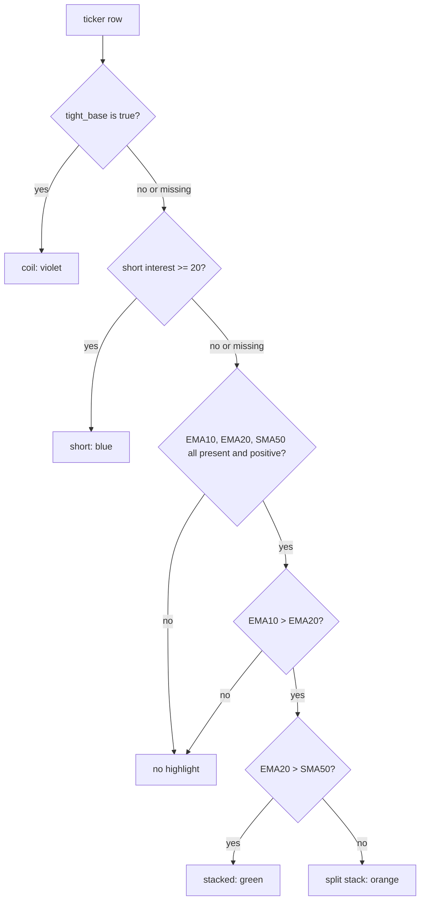

# Ticker Highlight Tiers - Plan

## Goal Capsule

- **Objective:** A trader reading any ticker list on the dashboard sees the highest-priority stage each stock is at — basing, crowded short, stacked averages, or a split stack — **among the rungs whose inputs that tab holds**, without opening its chart or reading a numeric column.
- **Means:** One highlight tier per ticker, computed once on the server and drawn as a background tint behind the symbol (KTD1, KTD2).
- **Authority:** Requirements decide behaviour. Key Technical Decisions decide mechanism inside those requirements. An implementation unit overrides neither.
- **Execution profile:** Write the tier function test-first (U1). The rest is rendering work, proved by markup tests and a local export run.
- **Stop conditions:**
  1. Stop and report if the CSS ordering cannot keep the selected-ticker yellow and the V/A dim winning over the new tints (R10).
  2. Stop if a rung needs a data source this repo does not hold.
  3. Stop and report if the four tints cannot be told apart from each other, and from the existing amber and yellow, on a full board at the default V/A cutoffs. The live-panel screenshots in the Verification Contract are the evidence.
- **Who finishes:** `ce-work` implements every unit and opens one pull request. The daily workflow publishes the payload fields on its next run.

---

## Product Contract

### Summary

Add a four-rung highlight ladder to the dashboard's ticker lists. Each ticker earns at most one background tint: violet for a tight base, blue for a crowded short, green for stacked moving averages, and orange for a stack that sits below the 50-day. The ladder runs on the nine list tabs. A shared function in the indicator module decides the rung, so the nine render sites apply one rule — though not necessarily one answer, since the tabs draw short interest from three sources of differing freshness.

The coil tint exists today, but only on the Themes tab. This work carries it to the other eight list tabs, which is what makes the stated priority meaningful outside Themes.

### Problem Frame

The dashboard shows a trader several hundred tickers across fourteen tabs. To judge one, the trader opens its chart. The data that answers the first question — is this basing, crowded, stacked, or split — already sits in the payload as numbers spread across columns, and on most tabs it is not shown at all.

One marker exists: the violet coil tint on the Themes tab. It works, and it stops at that tab. So the fastest read on the board is available in one place out of fourteen.

### Key Decisions

- KD1. **Coil travels to every list tab.** (session-settled: user-directed — chosen over leaving coil on Themes alone: the stated priority is inert on the other tabs otherwise.) Governs R2, R12.
- KD2. **The four network Viz tabs stay out.** (session-settled: user-directed — chosen over all thirteen tabs: node colour in those graphs already carries theme strength and selection.) Governs R13.
- KD3. **The turning tier takes its own hue, not yellow.** (session-settled: user-directed — chosen over the literal yellow: yellow marks the selected ticker on every tab.) Governs R11.
- KD4. **The ladder's order is a display preference, not a ranking claim.** Nothing here measures whether a coil predicts better than a crowded short, or either better than a stacked average. Two consequences follow and both must survive into the documentation: the short rung restates a figure the Short% column already prints and colour-breaks at the same 20% on five of the nine tabs, and the moving-average rungs are the only rungs carrying information no column on the board holds today. Governs R1.

### Requirements

**The ladder**

- R1. A ticker carries at most one highlight. The first rung it satisfies wins, in this order: coil, short interest, stacked moving averages, split stack.
- R2. The coil rung fires when the ticker sits in a tight base — the same state the Themes tab marks violet today, read from the `tight_base` indicator column.
- R3. The short-interest rung fires when short interest is 20% of float or more. The level is chosen, not measured — the SI tab gates its roster at 12% and the EP screener at 10%, so three numbers describe one idea and none is calibrated.
- R4. The stacked rung fires when EMA10 > EMA20 > SMA50.
- R5. The split-stack rung fires when EMA10 > EMA20 and EMA20 is not above SMA50. It states that condition and nothing more: the same reading covers a stock reclaiming its short-term averages from below and a stock whose 50-day has just been lost, which are opposite trades. No wording in the document, the tooltip, or `CLAUDE.md` may give this rung a direction.
- R6. A ticker that satisfies no rung carries no highlight.
- R7. A rung whose input is missing is skipped, and the ladder moves to the next rung. A skipped rung never blocks a lower one.

**Rendering**

- R8. The highlight draws as a background tint behind the ticker symbol, in the same channel the coil chip uses today.
- R9. The highlight sets no layout-affecting property, and no tier rule sets `color`.
- R10. The existing ticker features keep their appearance and their precedence: the inside-day green text, the screened-chip outline, the selected-ticker yellow, and the V/A dim.
- R11. Each tier uses one colour, and no tier uses the selection yellow.
- R15. Every tinted ticker carries a hover tooltip naming its rung in plain text, so the tiers are separable without colour.

**Coverage**

- R12. The highlight renders on the nine list tabs: Themes, VARS, Momentum, Volume, Industry, Lev ETF, EP, Parabolic, SI.
- R13. The four Viz tabs and Overview render no highlight.
- R14. A tab renders the rungs its data source can supply for that session. A rung with no source is absent, not wrong. The short rung is emitted only for the newest session, because short interest has no per-session history (KTD7).

### Acceptance Examples

- AE1. **Coil outranks a crowded short.** Given a ticker in a tight base with 34% short interest, when the ladder runs, then the ticker renders violet and its tooltip names the coil rung only. Covers R1, R2, R15.
- AE2. **Twenty percent is inside the rung.** Given a ticker with short interest of exactly 20.0 and no tight base, when the ladder runs, then the ticker renders blue. Covers R3.
- AE3. **Unknown short interest falls through.** Given a Themes-tab chip with no fundamentals row and EMA10 > EMA20 > SMA50, when the ladder runs, then the ticker renders green rather than nothing. Covers R7, R4.
- AE4. **A broken short-term stack earns nothing.** Given EMA10 below EMA20, when the ladder runs, then the ticker carries no highlight whatever SMA50 reads. Covers R6.
- AE5. **Selection still wins.** Given a coiled chip that is selected and dimmed by an armed V/A cutoff, when the page renders, then the chip reads as selected at full opacity. Covers R10.
- AE6. **An ETF reaches only the moving-average rungs.** Given a leveraged ETF with EMA10 > EMA20 > SMA50, when the ladder runs, then the ticker renders green and never blue or violet. Covers R14.
- AE7. **A split stack reads either way.** Given EMA10 > EMA20 with EMA20 below SMA50, when the ticker renders orange, then its tooltip states the average positions and asserts no direction. Covers R5, R15.
- AE8. **A missing input demotes permanently, not just once.** Given a Themes chip with 34% short interest, no fundamentals row, and EMA10 > EMA20 > SMA50, when the ladder runs on every session, then the chip renders green every time. Green therefore means "stacked, and no higher rung whose input this tab holds" — never "stacked and not crowded". Covers R7, R14.
- AE9. **A historical session drops the short rung.** Given a time-travel session older than the newest, when the ladder runs, then no ticker renders blue and the rungs drawn from that session's own parquet decide the tint. Covers R14.

### Scope Boundaries

**In scope**

- The nine list tabs named in R12, their producers, the CSS, and the markup tests.
- Carrying the coil rung to the eight list tabs that lack it today.

**Out of scope**

- The four Viz tabs and Overview (KD2).
- Any change to the coil definition, the inside-day green text rule, the V/A cutoffs, or the selection colour.
- A legend or on-screen key for the four tints. The per-ticker tooltip (R15) is not a legend and is in scope.

**Known consequence of the one-tint rule**

The rungs are not mutually exclusive, and only the top one renders. So each tint means "this rung, and no rung above it **whose input this tab holds**" — a negative claim the trader cannot see, and a weaker one than it looks. A coiled stock with 34% short interest draws identically to a plain coil. Worse, the demotion can be permanent rather than incidental: most Themes chips have no fundamentals row, so a genuinely crowded short there renders green every session, and green must never be read as "stacked and not crowded" (AE8). The tooltip names only the rung that won. This is the user's stated design; it is recorded here so the Definition of Done is not read as promising a full stage read.

**Deferred to follow-up work**

- Parabolic rows carry no `ticker_color` today, because `export_parabolic` never receives the day-flag map. The green inside-day text therefore never renders on that tab. This work does not depend on it and does not fix it — but note the consequence: after this ships, green on Parabolic means a stacked average only, while on every other tab it means a stacked average or an inside day.
- Publishing the `tightness` figure to the table tabs so their tooltips can name the band, as the Themes chips do. That needs a zero-to-missing map on the filling builders, which this work avoids by reading the boolean instead.
- Sharing one constant between R3's 20% and the `shortVal >= 20` colour break in `docs/app.js`. They agree today by coincidence of literal, not by construction.

---

## Planning Contract

### Key Technical Decisions

- KTD1. **One tier function lives in `src/indicators/create_technical_indicators.py`, beside `compute_inside_day` and `compute_tight_base`.** Every producer calls it. This is the sharing pattern the repo already uses for `compute_inside_day`, which the indicator pipeline and the ETF recompute both call so the two definitions cannot drift. The EP scan runs in its own lean workflow, so a helper placed in `src/reporting/export_dashboard_data.py` would pull the whole export module into that job.
- KTD2. **The tier is computed on the server and published as one field per ticker, named `highlight`, carrying `coil`, `short`, `ma_up`, `ma_split` or null.** The moving averages are not in any payload today, so a browser-side ladder would need the same payload change and would then hold a second copy of the rule. The field name is a contract nine render sites read, so it is fixed here rather than left to implementation. Governs R1.
- KTD3. **A missing or non-positive rung input is treated as missing, and the ladder continues past it.** Two facts force this. The snapshot builders call `.fillna(0)`, so an absent `sma50` arrives as `0.0`, and `ema20 > 0` would then read as a stacked trend on a stock that has none. And a price-scale figure of zero is impossible for a real security, so zero is a safe sentinel for absent. The rejected alternative — suppressing every highlight for a session whose parquet lacks the tightness columns — was dropped because each rendered tint states a fact that was checked, so a lower rung showing is a degraded priority rather than a false claim. See `docs/solutions/logic-errors/nan-defeats-numeric-guard-chains.md`. Governs R7.
- KTD4. **At the split-stack rung the ladder has already established EMA10 > EMA20, so the rung needs only the EMA20-against-SMA50 comparison, with equality falling to split.** The request stated the rung as two clauses — `EMA20 < SMA50 OR EMA10 < SMA50`. The second is redundant: with EMA10 > EMA20 already true, `EMA10 < SMA50` forces `EMA20 < SMA50`, so the disjunction reduces to its first clause. R5 states the reduced form. A test pins the reduced form against **the request's original two-clause wording**, not against R5 — comparing R5 to itself would prove nothing. Governs R5.
- KTD5. **The tint sits on the ticker span, not the table row.** The row already carries two backgrounds — the selected-row yellow and the V/A dim — and a third would stack against both. The span is also the element the coil chip tints today, so the nine tabs read alike. Governs R8, R10.
- KTD6. **The coil rung keeps the existing `coiled` class and the `--coil` violet; the three new rungs take the classes `hl-short`, `hl-ma-up` and `hl-ma-split`.** Renaming the coil class would break `tests/test_dashboard_coil_markup.py` and the invariants it pins, for no gain. The radar payload keeps its `coiled` boolean as well, because the coil strip, the leaf badges and the share sort all read it. Avoid the name `short-blue` — that class already exists as a text colour for the Short% column.
- KTD7. **Short interest is read once per export run, and the short rung is emitted only for the newest session.** Finviz publishes current short interest with no per-session history, so per-session loading is impossible, and loading the table once outside the session loop keeps the ~124-session rebuild cheap. Labelling the staleness is not enough: the short rung outranks the coil and moving-average rungs, which *are* computed from that session's own parquet, so today's figures would suppress that session's real signal across the whole 180-day window. `CLAUDE.md`'s SI section already classifies this exact shape — today's short interest pinned onto an old price bar — as "a fabricated number, not a stale one". So a historical session renders only the rungs its own parquet supports. Governs R14.
- KTD8. **The tier hues are fixed here, because two of the three families are already owned on the same row.**

  | Rung | Token value | Why this value |
  |---|---|---|
  | `hl-short` | `#3ad1ff`, tint `rgba(58, 209, 255, 0.14)` | Cyan-leaning, deliberately apart from `--accent` (#5566ff, hover text) and `--accent2` (#4455ee, screened-chip border). The screened signal keeps the border channel; the tier owns the background. |
  | `hl-ma-up` | `#00e676`, tint `rgba(0, 230, 118, 0.14)` | The existing green family. A background composes with the inside-day green text, which is the property `tests/test_dashboard_coil_markup.py` already proves for the coil tint. |
  | `hl-ma-split` | `#ff8c3a`, tint `rgba(255, 140, 58, 0.16)` | Orange is the only hue with no owner in `:root`. This is the rung KD3 settled must not be yellow. The value is a starting point, not a measured one. |

  Chip alpha and table alpha differ on purpose: `.radar-chip` multiplies its background by the chip's own opacity, which is why `--coil-dim` runs at 0.30, while a bare `.tn-link` does not. Tune the two independently on a live panel. Governs R11.
- KTD9. **`.tn-link` gains a small horizontal padding cancelled by an equal negative margin.** A background on a bare inline span hugs the glyphs — `.tn-link` carries no padding and no `display: inline-block`, unlike `.radar-chip`, which has `padding: 1px 7px` and is the precedent KTD5 cites. Padding alone would widen the first column on eight tables and invalidate the six panel widths `tests/test_dashboard_panel_layout.py` pins, each measured from natural table width. The negative margin restores the occupied width, so the tint gets a box and the pinned widths hold. `.radar-chip` sets its own padding later in the file and is unaffected. Governs R8, R9.
- KTD10. **The rung is also stated in a hover tooltip at all nine render sites.** The tiers are otherwise colour-only, and green and orange are the two closest hues, so a colour-vision-deficient reader cannot separate the two moving-average rungs. The Themes tab already carries this pattern in its `coilTip` tooltip. This is a per-ticker tooltip, not the legend that Scope Boundaries excludes. Governs R15.

### High-Level Technical Design

The ladder, as one pass per ticker:

Each rung name is the value of the `highlight` field (KTD2): `coil`, `short`, `ma_up`, `ma_split`, or null for no highlight.

Which rungs each tab can reach, and which producer supplies them:

| Tab | Producer | Coil | Short interest | Moving averages |
|---|---|---|---|---|
| Themes | `_build_radar_snapshot` | present | add a lookup (KTD7) | add via a master-row lookup |
| VARS | `_build_vars_snapshot` | add | present | add |
| Momentum | `_build_momentum_136_snapshot` | add | present | add |
| Volume | `_build_volume_snapshot` | add | present | add |
| Parabolic | `_parabolic_item_from_row` | add | present | add |
| SI | `_build_si_snapshot` | add | present | add |
| Industry | `fetch_etf_metrics` | no source | no source | add SMA50 |
| Lev ETF | `fetch_etf_metrics` | no source | no source | add SMA50 |
| EP | scan scripts' row loop | no source | present | add EMA10, EMA20 |

**Five of the six parquet-backed producers hold a master row directly** and can read `ema10`, `ema20`, `sma50` and `tight_base` from it, because `create_master_table.py` copies the whole indicator row for each ticker. **The radar is the exception**: `_build_radar_snapshot` builds its chip dicts from `compute_radar`'s member dicts, which carry only ticker, composite, rs, vars, price, dollar volume, ADR, tightness, coiled and screened — no moving averages. It must build its own ticker-to-row lookup from the `master_df` it already loads, in the shape `_build_si_snapshot` uses. `src/themes/l1_score.py` stays untouched.

`fetch_etf_metrics` already computes EMA10 and EMA20 from its own yfinance pull and needs only SMA50. The EP scans already compute SMA50 and need the two EMAs. ETFs hold no short interest and no tightness, and the EP workflow cannot reach the master parquet, which is local scratch and never committed.

### Assumptions

- Short interest reaches the ladder from **three** sources that share a unit but not a value or a freshness: the EP tables scrape a live Finviz quote page, the Momentum, VARS, Volume, Parabolic and Themes builders read `data/fundamentals.db` at a 7-day cache age, and the SI tab reads the daily Ownership screen in `data/short_interest.json`. All three are a percent of float. A ticker sitting near the 20% line can therefore tint blue on one tab and not on another in the same session.
- Every master parquet inside the 180-day retention window carries `tight_base`, because each workflow run rebuilds 130 sessions with today's indicator schema. The first run after this ships is what populates it.
- The Themes tab will show blue on a minority of chips. The radar scores every tagged ticker, while `data/fundamentals.db` is filled for the screened union only, so most chips have no short-interest row and fall through under R7. The same ticker can therefore read blue on Momentum and green on Themes in one session.

### Risks & Dependencies

- **Green means two things on one row.** `docs/app.js` colours the Short% figure green at `shortVal >= 20` — R3's exact threshold — on five of the nine tabs. So a crowded short will show a green number beside a blue ticker tint, while green behind the ticker means a stacked average. The two live in different columns and the Short% break predates this work, but the collision is real and is not designed away. Judge it on the live panel alongside the density check.
- **The payload fields appear only after the next daily workflow run.** Code pull requests reset `docs/data/`, so nothing renders when the branch merges. R7's fall-through makes that safe: an absent field yields no highlight rather than a wrong one. The `A` cutoff had the same lag and behaved the same way.
- **Orange and amber are seventeen degrees apart in hue.** `--amber` (#ffb300) owns the V/A cutoff controls and the EP tab's `rvol-medium` text, so the two appear on the same EP rows. Both render as warm tints on a near-black background.
- **Green tint under green text.** A ticker can be both an inside day (green text) and moving-average stacked (green tint). The composition is the one the coil test already proves works, but check it on a live panel before merging.
- **Four tints on a dense list can read as noise.** The tints are low-alpha backgrounds in the coil's channel, and the coil tint has held at that weight since it shipped. Stop condition 3 is what this risk is measured against.
- **R3's 20% and the Short% colour break are two separate literals.** Changing either leaves the tint and the number disagreeing on the same row with nothing on screen to show it.
- **Three tabs keep untinted history for up to 180 days.** The six parquet-backed tabs rewrite their history files every run, so they gain the tier on every retained session at once. The Industry, Lev ETF and EP histories accumulate one entry per run and are never rebuilt, so their pre-merge entries stay untinted until they age out.
- **Blue separates little on the two tabs built around short interest.** The EP screener already gates short float above 10% and the SI roster above 12%, so the rung fires on a large share of both tabs. The density risk above is about four tints on a mixed board; this is one tint covering most of a single tab.

### Sources / Research

- `docs/style.css` `:root` holds the palette. Green, blue, yellow, amber, violet and red are all spoken for; no orange token exists. The comment on `--coil` records why violet was chosen and why the alpha is high — the chip's own opacity multiplies it.
- `.radar-chip.coiled` and its four companion rules in `docs/style.css` are the precedent for tint ordering against `chip-screened`, `chip-quiet`, `filtered-out` and `active-ticker`. `tests/test_dashboard_coil_markup.py` pins that ordering, the no-layout-property rule, the never-set-`color` rule, and two literal renderer lines.
- The nine render sites in `docs/app.js`: `renderThemes` (chip class array), `renderMomentum`, `renderVolume`, `renderVARS`, `renderSI`, `renderParabolicTable`, `renderIndustryTable`, `renderETFTable`, and the shared EP row builder used by both EP tables. Eight already read `ticker_color`; the EP site reads nothing.
- `applyTickerFilters` in `docs/app.js` toggles `filtered-out` on whichever element carries `data-dvol` / `data-adr` — the chip on Themes, the `<tr>` on the table tabs.
- `create_master_table.py` copies each ticker's whole indicator row, which is why the master parquet carries every column the ladder needs.
- `export_vars`, `export_momentum_136` and `export_volume` read **per-screener** parquet directories under `screening_output/`, not the master. This is why the Verification Contract's local proof needs more than one throwaway file.
- `src/reporting/ep_scan_export.py` holds a second `calculate_technicals` and row assembly that **nothing imports**. A grep-driven edit can land there, pass review, and change neither published EP payload.
- CLAUDE.md, "Coil Marker" section: records that `tightness` must never reach a consumer that fills NaN with zero, and that this is why the marker never left the Themes tab. Reading the `tight_base` boolean instead sidesteps it, because a filled `False` fails closed. The same section states the standard KD4 follows — a display marker is not a predictive claim.

---

## Implementation Units

### U1. Shared highlight-tier function

- **Goal:** One function decides a ticker's rung from four inputs, so every producer gets the same answer.
- **Requirements:** R1, R2, R3, R4, R5, R6, R7. Instantiates KTD1, KTD3, KTD4.
- **Dependencies:** none
- **Files:**
  - `src/indicators/create_technical_indicators.py` (add the function beside `compute_inside_day` and `compute_tight_base`)
  - `tests/test_highlight_tier.py` (new)
- **Approach:**
  1. Take the four inputs as plain scalars, not a DataFrame row, so the ETF and EP producers can call it without building a frame.
  2. Return one of four tier names or `None`.
  3. Treat a non-positive or non-finite value as missing for each price-scale input, per KTD3.
  4. Read the tight-base input as a strict boolean, so a filled `False` fails closed.
- **Patterns to follow:** `compute_inside_day` in the same module — one shared definition, two callers, a test pinning the property that stops it narrowing.
- **Execution note:** Write this unit test-first. The ladder is pure logic with named boundaries, and KTD4's reduction needs proving against the request's original wording before anything renders.
- **Test scenarios:**
  - Covers AE1. A tight base with 34% short interest and stacked moving averages returns the coil tier.
  - Covers AE2. Short interest of exactly 20.0 with no tight base returns the short tier; 19.9 does not.
  - Covers AE3. A missing short-interest value with stacked moving averages returns the stacked tier, not `None`.
  - Covers AE4. EMA10 equal to or below EMA20 returns `None` for every SMA50 value.
  - Boundary: with EMA10 above EMA20, SMA50 below EMA20 returns split, SMA50 exactly equal to EMA20 returns split, and SMA50 above EMA20 returns stacked.
  - An `sma50` of `0.0` — the value `.fillna(0)` produces — returns `None` rather than the stacked tier.
  - A non-finite `ema10` returns `None` rather than raising.
  - Equivalence: across a grid of orderings of the three averages, the shipped rung agrees with the request's original two-clause form, `EMA10 > EMA20 AND (EMA20 < SMA50 OR EMA10 < SMA50)`. Write that clause out literally in the test so the comparison is against the request, not against the shipped predicate restated.
- **Verification:** The new test module passes, and the equivalence scenario compares two textually different predicates.

### U2. Publish the tier from the parquet-backed producers

- **Goal:** Six tabs carry the tier in their payload, for the current session and every session in the retention window.
- **Requirements:** R1, R12, R14. Instantiates KTD2, KTD7.
- **Dependencies:** U1
- **Files:**
  - `src/reporting/export_dashboard_data.py` (`_build_radar_snapshot`, `_build_vars_snapshot`, `_build_momentum_136_snapshot`, `_build_volume_snapshot`, `_parabolic_item_from_row`, `_build_si_snapshot`, and `export_radar` for the fundamentals load)
- **Approach:**
  1. Add the tier to each per-ticker dict under the `highlight` key, shared across all six.
  2. In the five producers that already hold a master row, call the U1 function with that row's `tight_base`, the producer's existing short-interest value, and its `ema10` / `ema20` / `sma50`.
  3. In `_build_radar_snapshot`, first build a ticker-to-row lookup from the `master_df` it already loads, in the shape `_build_si_snapshot` uses. The member dicts from `compute_radar` carry no moving averages. Leave `src/themes/l1_score.py` untouched.
  4. Load the fundamentals table once in `export_radar` and pass it into the snapshot builder, per KTD7 — the session loop runs about 124 times. Pass the session date alongside it and supply short interest to the ladder **only for the newest session**, so a historical board renders only the rungs its own parquet supports.
  5. Leave the radar's existing `coiled` boolean, `tightness`, `n_coiled` and the coil sort untouched, per KTD6.
  6. Leave `_build_radar_snapshot`'s no-`fillna` load as it is; its docstring explains why.
- **Patterns to follow:** `filter_metrics` for the shared reader shape; `_build_si_snapshot`'s `bars` lookup for the radar's row join.
- **Test scenarios:**
  - A synthetic master frame with one coiled ticker and one stacked ticker produces the two expected tier values in the radar snapshot.
  - The radar snapshot's tier for a ticker matches the tier the VARS snapshot gives the same ticker on the same frame, proving the radar's row lookup found the same row.
  - A ticker whose master row has `sma50` filled to `0.0` by the builder's `.fillna(0)` carries no tier.
  - A radar snapshot still reports the same `n_coiled` and the same coil-strip ordering as before the change, on the same input.
  - A ticker absent from the fundamentals table still receives a moving-average tier.
  - Covers AE9. A ticker with 34% short interest carries the short tier in the newest session's snapshot and a moving-average tier — or none — in every older session's snapshot built from the same fundamentals table.
- **Verification:** The local export proof in the Verification Contract shows the field in all six payloads, and the existing export tests still pass.

### U3. Publish the tier from the ETF and Industry fetch

- **Goal:** The two ETF tabs carry the moving-average rungs.
- **Requirements:** R14, R12
- **Dependencies:** U1
- **Files:**
  - `src/reporting/export_dashboard_data.py` (`fetch_etf_metrics`, `enrich_etf_with_metrics`)
- **Approach:**
  1. Compute SMA50 from the same close series that already produces EMA10 and EMA20, using the indicator pipeline's window and minimum-period settings.
  2. Call the U1 function with no short-interest and no tight-base input, so only the moving-average rungs can fire.
  3. Carry the tier through `enrich_etf_with_metrics` beside `vars` and `color`.
  4. Keep the early-skip condition honest: a row with a tier but no VARS and no colour must still reach the payload.
- **Patterns to follow:** the existing VARS and colour computation in the same function, which already shares `compute_inside_day` with the indicator pipeline.
- **Test scenarios:**
  - Covers AE6. A synthetic close series with stacked averages yields the stacked tier and never the short or coil tier.
  - A series shorter than the SMA50 minimum period yields no tier rather than raising.
  - A ticker whose only metric is the tier still appears in the returned map.
- **Verification:** A local ETF metrics call on a handful of real symbols returns a tier for the ones whose averages are stacked, and the Industry and Lev ETF payloads carry the field.

### U4. Publish the tier from the EP scan

- **Goal:** Both EP tables carry the short-interest and moving-average rungs.
- **Requirements:** R14, R12
- **Dependencies:** U1
- **Files:**
  - `src/reporting/ep_scan_common.py` (`calculate_technicals` — add EMA10 and EMA20 to the returned dict, nothing else)
  - `src/reporting/ep_scan_afternoon.py` (the per-ticker row-assembly loop)
  - `src/reporting/ep_scan_morning.py` (the per-ticker row-assembly loop)
- **Approach:**
  1. Add EMA10 and EMA20 to `calculate_technicals`, which already holds the close history and computes SMA50.
  2. Pass SMA50 to the ladder **only when the history holds at least 50 bars**, and as missing otherwise. `calculate_technicals` substitutes a mean of whatever bars exist below 50 and returns `None` only below 14, so a recent listing would otherwise get a partial mean labelled SMA50 — finite and positive, which is the one shape KTD3's zero sentinel cannot catch, on exactly the population an earnings-pivot scan surfaces. The partial mean stays available to `atr_multiple`; it just never reaches the ladder.
  3. Call the U1 function in each scan script's row-assembly loop, where the fundamentals short float and the technicals dict are both in scope. `calculate_technicals` never receives the short float, so a ladder call placed there would silently ship EP with the moving-average rungs only.
  4. Keep the import light — the EP workflow is a separate lean CI job, so import the tier function directly rather than pulling in the export module (KTD1). Note that importing from the indicator module still executes `config/settings.py`, which parses the workflow config, loads `.env` and creates several directories as an import side effect; both the CI job and the local launcher set `PYTHONPATH=.`, so it resolves, but the import is not free.
- **Warning:** `src/reporting/ep_scan_export.py` holds an orphaned second copy of `calculate_technicals` and a row assembly that nothing imports. Editing it changes neither published payload and the tests will still pass. Do not touch it.
- **Patterns to follow:** the existing technicals dict in `calculate_technicals`, which already carries `sma50` and `atr_multiple`; the `result = {...}` assembly in each scan script for the ladder call.
- **Test scenarios:**
  - A row with 28% short float and no stacked averages carries the short tier.
  - A row with unknown short float and stacked averages carries the stacked tier.
  - A ticker whose history is too short for SMA50 carries no tier, and the scan still exports the row.
  - Both scan scripts produce the same tier for the same synthetic inputs, so the two loops cannot drift.
- **Verification:** A local run of each scan with `--out-dir` and `--no-discord` writes the field into the sandboxed JSON, and no committed `docs/data/ep_scan_*.json` file changes.

### U5. Highlight colour tokens and CSS rules

- **Goal:** Four tints exist, each one colour, each visible, each leaving layout and the existing markers untouched.
- **Requirements:** R8, R9, R10, R11. Instantiates KTD5, KTD6, KTD8, KTD9.
- **Dependencies:** none
- **Files:**
  - `docs/style.css`
- **Approach:**
  1. Add the three token pairs from KTD8's table beside `--coil` / `--coil-dim`.
  2. Give `.tn-link` a small horizontal padding cancelled by an equal negative margin, per KTD9, so the tint has a box and the pinned panel widths hold.
  3. Write **four** rules for the plain `tn-link`, not three. The only coil background in the stylesheet today is `.radar-chip.coiled`, and `renderThemes` is the sole place the `radar-chip` class is applied — so without a `.tn-link.coiled` rule using `--coil-dim`, the coil class arrives unstyled on the eight table tabs and KD1 ships invisible. Write the three new tier rules for both the chip and the plain span as well.
  4. Place the new rules where the coil rules sit — after `chip-screened` and `chip-quiet`, before the selection rule.
  5. Match the coil rules' opacity handling: restore opacity under `chip-quiet`, and let an armed V/A cutoff win.
  6. Extend the existing selection override so a selected ticker in any tier still reads yellow, matching the specificity note already recorded on the coil pair.
  7. Set no layout-affecting property and no `color` anywhere in these rules.
- **Patterns to follow:** the five `.radar-chip.coiled*` rules and their comments in `docs/style.css` — the same ordering, the same opacity ladder, the same colours-only constraint.
- **Test scenarios:** covered by U6's markup tests, which read this file.
- **Verification:** The four tints are visible on a live panel at every V/A cutoff, a selected ticker in each tier still reads yellow, and the panel-layout test still passes.

### U6. Render the highlight at the nine sites

- **Goal:** Every list tab draws the tier its payload carries, names it in a tooltip, and the markup joins are pinned.
- **Requirements:** R8, R10, R12, R13, R15. Instantiates KTD10.
- **Dependencies:** U2, U3, U4, U5
- **Approach:**
  1. Add one small helper that maps a tier value to its class name, and call it at all nine sites. It emits `hl-short`, `hl-ma-up` or `hl-ma-split` and **pushes nothing when the tier is `coil`**.
  2. On the Themes tab, leave `if (t.coiled) cls.push('coiled');` exactly as it stands. `tests/test_dashboard_coil_markup.py` asserts that literal string, and the Verification Contract requires it to pass unchanged. R1 still holds because the server ladder returns `coil` exactly when `tight_base` is true, so a coiled chip never also reaches a new tier class.
  3. On the EP site, add the class to a span that currently carries none.
  4. Add the rung tooltip at all nine sites, reusing the `coilTip` pattern (KTD10). The split-stack tooltip states the average positions and no direction, per R5.
  5. Add no attribute the filter or the clamp logic reads — `filterAttrs` and `syncRadarClamps` keep their current inputs.
  6. Touch no Viz render path (KD2).
- **Files:**
  - `docs/app.js` (the nine render sites listed in Sources)
  - `tests/test_dashboard_highlight_markup.py` (new)
- **Patterns to follow:** the existing `ticker_color === 'green'` class append at the eight non-EP sites; `tests/test_dashboard_coil_markup.py` for the test shape.
- **Test scenarios:**
  - No highlight rule in `docs/style.css` sets any property from the layout list the coil test already uses.
  - No highlight rule sets `color`, for both the `.radar-chip` and the `.tn-link` forms — mirroring `test_the_coil_tint_cannot_clobber_the_day_pattern_marker`, which matters more here because `.tn-link.day-pattern-green` and `.tn-link.hl-ma-up` are both two-class selectors decided by source order.
  - A `.tn-link.coiled` rule exists and sets a background from `--coil-dim`, so the coil tint renders on the eight table tabs and not only on the Themes chip.
  - Each new rule sits after `chip-screened` and `chip-quiet` in source order.
  - Covers AE5. The selection rule's specificity matches or beats every new tier rule, so a selected, dimmed, tinted chip reads as selected.
  - The V/A dim rule still wins over each tier's opacity restore.
  - All nine render sites emit the tier class and the tooltip, and no Viz render path does.
  - `renderThemes` still contains the literal `if (t.coiled) cls.push('coiled');` line and still reads `coiled` for the tooltip and the coil strip.
  - The chip class list contains at most one tier class for any payload value, and none when the value is `coil`.
  - Covers AE7. The split-stack tooltip states the average positions and contains no directional word.
- **Verification:** The markup test module passes, and `tests/test_dashboard_coil_markup.py` passes unchanged. A local page load against a payload carrying all four tiers shows one tint per ticker, with selection, the screened outline, the inside-day text and the V/A dim all behaving as before.

---

## Verification Contract

- Unit tests: `uv run python -m unittest discover -s tests`. The new modules are `tests/test_highlight_tier.py` and `tests/test_dashboard_highlight_markup.py`.
- The existing markup tests must still pass unchanged: `tests/test_dashboard_coil_markup.py`, `tests/test_dashboard_filter_markup.py`, `tests/test_dashboard_panel_layout.py`.
- **Local export proof.** A throwaway master parquet alone reaches only the radar and parabolic payloads — `export_vars`, `export_momentum_136` and `export_volume` read per-screener directories, and their wrappers take no root override. So write the throwaway frame into `screening_output/master/` **and** into `screening_output/{vars,momentum_136,volspike,denvol}/` under each screener's filename pattern, and place `data/short_interest.json` and a `docs/data/radar.json` in the sandbox before running `uv run python -m src.reporting.export_dashboard_data`. Confirm the `highlight` field appears in all six payloads, not just the two that are reachable by default. Reset the noise with `git checkout -- docs/data/` before committing, per the repository's pull-request convention.
- Local EP proof: run **each** scan script with `--out-dir scripts/local_runs --no-discord` and confirm the field lands in both sandboxed JSON files.
- **Visual proof on a live panel**, four screenshots:
  1. All four tints on one tab at the default V/A cutoffs, on a full board — the evidence for stop condition 3.
  2. A selected ticker inside a tint.
  3. A ticker that is both inside-day (green text) and moving-average stacked (green tint), confirming the text stays readable over the tint.
  4. The EP tab showing the orange tint beside the amber `rvol-medium` text and an armed amber V/A control, confirming the three read as distinct signals rather than merely that the tint is visible.

---

## Definition of Done

**Global**

- Every requirement R1 through R15 is met, or explicitly deferred in Scope Boundaries.
- The pull request carries no regenerated `docs/data/*.json` file.
- No abandoned or experimental code remains in the diff.
- `CLAUDE.md` records the ladder, the priority order, the zero-as-missing rule, and the CSS ordering constraint, in the style of the Coil Marker section. It states, beside the priority order: KD4 — the order is a display preference with no forward-return evidence, and the short rung restates the Short% column's existing 20% colour break on five tabs; that 20% is chosen, not measured, against the SI tab's 12% and the EP screener's 10%; that the split-stack rung asserts no direction; that a tint names the highest rung whose input that tab holds, never the absence of a higher one; and that the short rung is emitted for the newest session only.

**Per unit**

- U1: the tier function is shared, and the equivalence test compares the shipped rung against the request's original two-clause wording rather than against a restatement of itself.
- U2: all six parquet-backed payloads carry the field, the radar resolves its moving averages through its own master-row lookup, and the radar's coil strip, badges and sort are unchanged.
- U3: both ETF tabs carry moving-average tiers and never a short or coil tier.
- U4: both EP tables carry short and moving-average tiers, the tier call sits in each scan script's row loop, `ep_scan_export.py` is untouched, and no committed EP JSON changed.
- U5: four tints exist and all four render on the table tabs as well as on the Themes chip, each colours-only, each with a visible box, ordered against the existing chip rules, with the pinned panel widths intact.
- U6: nine sites render the class and the tooltip, the coil renderer line is byte-identical to what the coil test asserts, no Viz path is touched, and the markup tests pin the joins.
